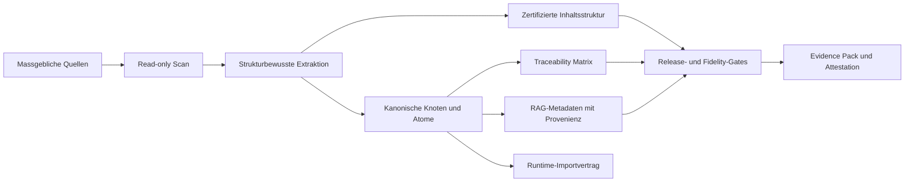

# Nomos

<p align="center">
  <strong>Authority-to-Product Intelligence fuer Software und KI, die ihren kontrollierten Quellen treu bleiben muessen.</strong>
</p>

<p align="center">
  <a href="./README.md">Français</a>
  ·
  <a href="./README.en.md">English</a>
  ·
  <a href="./README.de.md"><strong>Deutsch</strong></a>
</p>

<p align="center">
  
  
  
  
</p>

Nomos transformiert massgebliche Referenzen in kontrollierte, rueckverfolgbare und auditierbare Produktartefakte. Eine solche Referenz kann eine fachliche Wissensbasis, ein Standard, eine Regulierung, eine Qualitaetsprozedur, ein Rechtskorpus, ein technisches Handbuch, ein Regelbuch, eine Produktdoktrin oder jede Dokumentensammlung sein, die definiert, was ein System wissen, sagen oder tun darf.

Kurz gesagt: **Nomos hilft Teams nachzuweisen, was eine Software oder KI weiss, woher dieses Wissen stammt, wie es strukturiert wurde, wie es sich veraendert hat, was ausgelassen wurde, und ob das gelieferte Ergebnis weiterhin zur kontrollierten Referenz passt.**

Nomos ersetzt keine Fachexperten, Rechtsverantwortlichen, Qualitaetsverantwortlichen oder offiziellen Quellen. Nomos liefert die Transformations- und Evidenzschicht, die Anwendungen, Automatisierungen und KI/RAG-Systeme mit freigegebenen Referenzen in Einklang haelt.

> Nomos macht KI nicht "autoritaer". Nomos macht die Verbindung zwischen einer massgeblichen Quelle und den von Software oder KI konsumierten Artefakten explizit, testbar und steuerbar.

## Auf Einen Blick

| Dimension | Aktueller Stand |
|---|---|
| Produkt | Authority-to-product Engine fuer gesteuerte Software, KI und RAG. |
| Release | `v0.1.0-ALPHA`. |
| Aktueller Nachweis | Alpha-POC auf einem echten privaten Corpus, read-only verarbeitet. |
| Nachgewiesene Staerke | Quelle -> Struktur -> kanonische Knoten -> TOC -> source-backed Feed/RAG -> Body Ledger -> Strict Gate -> Attestation. |
| Bekannte Grenze | Die Alpha beweist einen begrenzten Source-to-Feed POC; sie beansprucht noch keine universelle Fidelity oder regulatorische Kundenvalidierung. |
| Naechste Haertung | Wiederholte CI-Evidenz, Attestation `claim_coverage`, zusaetzliche Dokumentformate, Kunden-Validation-Packs. |
| Claim Boundary | Kein zertifiziertes eQMS, kein validiertes GxP-System, keine regulatorische Zertifizierung. |

## Warum Nomos Existiert

Viele Anwendungen und KI-Systeme sind technisch sauber und trotzdem fachlich falsch. Das Problem liegt selten am Framework oder am Modell. Es entsteht durch verdeckte Drift zwischen dem gelieferten System und der Referenz, die es angeblich umsetzt:

- fachliche Regeln werden ohne Quelle in Code kopiert;
- RAG-Chunks haben keine Provenienz;
- UI- oder API-Verhalten basiert auf Beispielen statt auf Doktrin;
- LLM-Antworten vereinfachen kritische Nuancen;
- Quelldokumente werden aktualisiert, ohne nachgelagerte Rueckverfolgbarkeit;
- Tests beweisen technische Ausfuehrung, aber nicht fachliche Autoritaet.

Nomos schliesst diese Luecke, indem der Referenz-Corpus zu einer Produktabhaengigkeit erster Klasse wird.



## Produktpositionierung

Nomos ist nicht nur ein Dokumentparser und nicht nur eine RAG-Pipeline.

Eine klassische RAG-Pipeline indexiert Dokumente. Nomos kontrolliert und beweist die Transformation, bevor Software oder KI sie konsumiert:

- welche massgeblichen Quellen zugelassen wurden;
- ob sie read-only verarbeitet wurden;
- welche Struktur erkannt wurde;
- welche kanonischen Einheiten extrahiert wurden;
- welche Source-Ranges, Zeilen, Hashes und Locators jede Einheit stuetzen;
- was ausgeschlossen, uebersprungen, nicht unterstuetzt oder nur teilweise abgedeckt wurde;
- welche Chunks fuer RAG geeignet sind und welche nur Source-Ledger-Evidenz sind;
- welcher oeffentliche Claim aus der vorhandenen Evidenz vertretbar ist.

Nomos ist damit eine Governance- und Evidenzschicht fuer Software und KI, die auf massgeblichen Quellen beruht.

## Ziel-Use-Cases

Nomos ist fuer Teams gedacht, die source-backed Softwareverhalten, source-backed KI-Antworten oder auditfaehige Evidenz aus komplexen Referenzmaterialien brauchen:

- fachliche Dokumentation in Produktregeln und Runtime-Vertraege umwandeln;
- KI/RAG-Systeme so steuern, dass abgerufene Inhalte source-backed und versioniert sind;
- Traceability-Matrizen aus Standards, Prozeduren, Policies, Gesetzen oder Fachcorpora erzeugen;
- Drift zwischen Dokumentation, Implementierung, Tests und Release-Output erkennen;
- Validation Packs, Supplier Packs oder Evidence Packs fuer High-Integrity-Umgebungen vorbereiten;
- read-only Corpus-Assessments vor Kundenimporten durchfuehren;
- nicht unterstuetzte Abdeckung dokumentieren, statt Fidelity stillschweigend zu ueberverkaufen.

## Was v0.1.0-ALPHA Liefert

Die aktuelle Release liefert eine funktionierende CLI und Evidence-Pipeline fuer canonical-first Projekte:

- Repository-Diagnose und Project-Admission-Checks;
- `strict`, `corpus scan`, `diff`, `manifest`, `validate-sidecar`, `feed`, `body-ledger` und `attest` Befehle;
- read-only Guards fuer Corpus-Verarbeitung;
- `rbok-lawbook` Profil fuer strukturierte Markdown-Referenzcorpora;
- generischer YAML/JSON Structured Scanner mit strukturierten Pfaden und exakten Source-Spans;
- zertifizierte Inhaltsstruktur;
- Source-Spans und typisierte semantische Knoten fuer Tabellen, Links, Callouts, Codebloecke und Bilder;
- Extraktion eines gesteuerten Lexikons;
- source-backed RAG-Metadaten und Runtime-Importartefakte;
- vollstaendiger Source Body Ledger, der semantischen Inhalt, Struktur, Coverage, Unsupported und Binary Bytes trennt;
- Strict Fidelity Gate und Release-Gate-Integration;
- Attestation-Ausgabe im in-toto Stil;
- regulated-by-design Dokumentationsskelett, Evidence Templates und Control Records;
- CI-Workflows fuer Go, CUE, Corpus, RBOK lawbook E2E, Runtime E2E, Fidelity Proof Reports, regulierte Dokumentation und Evidence Pack.

## Alpha-POC-Evidenz

Nomos v0.1.0-ALPHA wurde auf dem echten privaten `realisons-business/01_rbok` Corpus in read-only Clones getestet. RBOK ist der erste Proof-Corpus; er ist nicht der Produktscope.

Drei Evidenzrecords sind relevant:

1. der historische Alpha-Lawbook-Pipeline-Record;
2. das initiale Source-to-Feed Audit, das wichtige semantische Feed-Quality-Gaps sichtbar gemacht hat; und
3. der aktuelle strukturierte Source-to-Feed POC, der diese blocking Gaps im aufgezeichneten Run beseitigt.

Historischer Alpha-Lawbook-Pipeline-Record:

| Evidenzpunkt | Ergebnis |
|---|---:|
| Corpus-Dateien gescannt | 240 |
| Feed-Knoten erzeugt | 7191 |
| Zertifizierte TOC-Eintraege | 1090 |
| Knoten mit Source-Span | 7191 / 7191 |
| Tabellenknoten | 65 |
| Codeblock-Knoten | 25 |
| Link-Knoten | 137 |
| Strict Fidelity Gate | pass, 0 blocking findings, 0 findings |
| Fidelity Proof | `full_fidelity_proven` |
| Source Mutation Check | keine Source-Mutation erkannt |

Dieser Record beweist, dass die aktuelle Pipeline einen echten strukturierten fachlichen Referenzcorpus verarbeiten kann, ohne in das Source-Repository zu schreiben. Er beweist keine universelle Fidelity fuer jedes Dokumentformat oder jeden regulierten Kundenworkflow.

Initiales Source-to-Feed Audit vor FSQ-Haertung:

| Evidenzpunkt | Ergebnis |
|---|---:|
| Deklarierte Corpus-Quellen | 240 |
| Feed-Einheiten erzeugt | 9500 |
| RAG-Chunks erzeugt | 9500 |
| Source-backed Feed-Einheiten | 9500 / 9500 |
| Source-backed RAG-Chunks | 9500 / 9500 |
| Strict Source/Feed Summary | `source_integrity=pass (0 findings); feed_quality=pass (0 findings)` |
| Source Mutation Check | keine Source-Mutation erkannt |

Die direkte Inspektion des erzeugten `feed.json` zeigte, dass dieser Feed semantisch noch nicht als finaler Doktrin-/RAG-Korpus bereit war:

| Feed-Quality-Beobachtung | Ergebnis |
|---|---:|
| Quellen mit erzeugten Einheiten | 88 / 240 |
| `table_cell` Feed-Einheiten | 3230 / 9500 |
| Einheiten mit <= 2 Tokens | 3344 / 9500 |
| Einheiten mit <= 10 Zeichen | 2195 / 9500 |
| Einheiten in duplizierten Textgruppen | 3704 |

Aktueller strukturierter Source-to-Feed POC:

| Evidenzpunkt | Ergebnis |
|---|---:|
| Lokales Evidence Pack | `C:\Dev\nomos-rbok-poc-run-20260504-structured-universal-9` |
| Corpus Commit | `ea003e8fe3c35993731c3708a3787df6a3a690df` |
| Deklarierte Corpus-Quellen | 240 |
| Feed-Einheiten erzeugt | 3024 |
| RAG-Chunks erzeugt | 3024 |
| Source-backed Feed-Einheiten | 3024 / 3024 |
| Source-backed RAG-Chunks | 3024 / 3024 |
| `table_cell` Feed-Einheiten | 0 |
| Einheiten <= 10 Zeichen | 0 |
| Blocking Duplicate Groups | 0 |
| Semantic Quality | `warn`, 0 blocking findings, 6 reviewbare Warnings |
| Body Ledger | 0 uncovered bytes |
| Strict Gate | `pass`, exit code 0 |
| Source Mutation Check | keine Source-Mutation erkannt |

Diese Unterscheidung ist entscheidend. Die aktuelle Alpha beweist verteidigbare Source-to-Artifact-Traceability und einen source-backed Feed/RAG POC, behaelt aber eine strikte Claim Boundary: verbleibende Warnings sind reviewbar, Attestation `claim_coverage` ist noch nicht verdrahtet, und die Evidenz ist auf den aufgezeichneten Corpus, Commit und Build begrenzt. Die naechste Haertung zielt auf CI-Wiederholbarkeit, zusaetzliche Dokumentformate, Kundenvalidierung und breitere Universal-Fidelity-Evidenz.

## Regulated-Ready Posture

Nomos ist fuer Teams gebaut, die in der Naehe regulierter, auditierter oder high-integrity IT-Umgebungen arbeiten. Das Repository enthaelt eine wachsende regulated-by-design Betriebsstruktur:

- Quality Manual und SOP-Baselines;
- Software Development und Validation Lifecycle Dokumente;
- ALCOA+ Evidence-Metadaten;
- Electronic Records und Electronic Signature Policy Baseline;
- GitHub-native Evidence- und QMS-Betriebsmodell;
- AI/RAG Governance Controls;
- Validation-Pack und Supplier-Pack Templates;
- Reference-Basis-Management fuer lizenzierte Standards wie GAMP 5 und ISO-Referenzen.

Der ehrliche Status:

- **implementiert:** evidence-orientiertes Tooling, regulierte Dokumentationsskelette, Gates, Templates und RBOK-POC-Evidenz;
- **teilweise implementiert:** Reference-to-Control Closure, Reife kundenseitiger Validation Packs, langfristige Betriebsrecords;
- **nicht beansprucht:** formale regulatorische Zertifizierung, Part-11-validierter Plattformstatus, GxP-Produktionsvalidierung, NASA/mission-critical Qualifikation oder universelle Rechtskonformitaet.

Siehe [docs/public-claim-boundary.md](docs/public-claim-boundary.md) und [docs/regulated/README.md](docs/regulated/README.md).
Siehe auch [docs/release-v0.1.0-alpha.md](docs/release-v0.1.0-alpha.md) fuer Release Notes und Publication Gate.

## Marktkontext

Nomos liegt an der Schnittstelle mehrerer etablierter Softwarekategorien:

| Marktkategorie | Warum sie relevant ist |
|---|---|
| Regulated Content und Document Control | Organisationen zahlen fuer kontrollierte, reviewbare und auditfaehige Content-Lebenszyklen. |
| QMS und Validation Lifecycle Management | Regulierte Teams brauchen Evidenz, dass Software und Prozesse fit-for-intended-use bleiben. |
| AI Governance und RAG Governance | Unternehmen muessen nachweisen, was KI-Systeme verwenden, zitieren, speichern und beantworten duerfen. |
| Vertical SaaS fuer regulierte Industrien | Spezialisierte Software wird strategisch wertvoll, wenn sie in operative Prozesse eingebettet ist. |

Nuetzliche Referenzen:

- [Veeva QualityDocs](https://www.veeva.com/products/vault-qualitydocs/) positioniert reguliertes Quality Content Management als reife GxP-Softwarekategorie.
- [Veeva Systems Marktkapitalisierung](https://stockanalysis.com/stocks/veev/market-cap/) wurde am 1. Mai 2026 mit rund USD 28.03B angegeben. Veeva ist kein direkter Vergleich fuer Nomos, zeigt aber den moeglichen Wert von Qualitaets-, Content- und Life-Sciences-Software.
- [ValGenesis](https://www.valgenesis.com/) illustriert den Markt fuer Validation Lifecycle Management in GxP- und Life-Sciences-Organisationen.
- [FDA Computer Software Assurance guidance](https://www.fda.gov/regulatory-information/search-fda-guidance-documents/computer-software-assurance-production-and-quality-system-software-0) formalisiert einen risikobasierten Ansatz, um Vertrauen in Software fuer Produktions- und Qualitaetssysteme aufzubauen.
- [21 CFR Part 11](https://www.law.cornell.edu/cfr/text/21/part-11) ist eine Kernreferenz fuer elektronische Records und elektronische Signaturen in FDA-regulierten Kontexten.
- [IAS 38 Intangible Assets](https://www.ifrs.org/issued-standards/list-of-standards/ias-38-intangible-assets/) und [Swiss GAAP FER 10](https://www.fer.ch/en/standards/swiss-gaap-fer-10-immaterielle-werte/) liefern buchhalterischen Kontext fuer intern entwickelte immaterielle Werte.

Fuer Bewertungskontext liegen oeffentliche und private SaaS-Benchmarks 2026 fuer mediane private SaaS-Unternehmen haeufig bei etwa 4-5x ARR, mit grosser Streuung nach Wachstum, Net Revenue Retention, Bruttomarge, Profitabilitaet, Kundenkonzentration und strategischem Wert. Siehe [SaaS Valuation Multiples 2026](https://saasvaluationmultiple.com/). Diese Multiples sind erst mit wiederkehrendem Umsatz sinnvoll; sie rechtfertigen nicht, ein Alpha-Produkt wie ein reifes SaaS-Unternehmen zu bewerten.

## Kommerzielle Und Aktivierbare Position

Nomos sollte in zwei getrennten Perspektiven bewertet werden:

1. **Buchhalterische Aktivierung.** Eine Idee wird nicht aktiviert. Entwicklungskosten koennen nur aktiviert werden, wenn die anwendbaren Kriterien erfuellt sind: technische Machbarkeit, Absicht zur Fertigstellung, Nutzungs- oder Verkaufsfaehigkeit, wahrscheinlicher kuenftiger wirtschaftlicher Nutzen, verfuegbare Ressourcen und verlaessliche Kostenmessung. Geeignete Evidenz kann Entwicklungszeit, Architektur, Tests, Dokumentation, CI, Validation Records und direkt zurechenbares Tooling oder Infrastruktur umfassen.
2. **Business/IP-Bewertung.** Der wirtschaftliche Wert kann ueber den aktivierten Kosten liegen, muss aber durch Reife, Demos, Kundenpiloten, Nutzung, Verteidigbarkeit, Reproduktionsbarrieren, Umsatz oder Letters of Intent gestuetzt sein.

Ein realistischer interner Bewertungsrahmen fuer die aktuelle Reife:

| Reifestufe | Vertretbarer Wertkorridor |
|---|---:|
| Nur Konzept | niedrig; schwer zu verteidigen |
| Technischer POC mit begrenzter Evidenz | CHF 50k-150k |
| Alpha POC mit source-backed Evidenz, Dokumentation, CI und echtem Proof-Corpus | CHF 100k-300k |
| Alpha-Produkt nutzbar auf mehreren komplexen Corpora | CHF 300k-800k |
| Produkt in kritischen Workflow integriert oder durch bezahlten Pilot / LOI gestuetzt | CHF 800k-1.5M+ |
| Produkt mit wiederkehrendem Umsatz | ARR multipliziert mit geeignetem SaaS-Multiple |

Diese Spannen sind keine Finanzberatung und sollten ohne Buchhalter, Auditor oder Corporate-Finance-Beratung nicht als formale Bewertung verwendet werden. Sie sind ein pragmatischer interner Rahmen fuer Produktstrategie, Aktivierungsdiskussionen und Roadmap-Priorisierung.

## Kernkonzepte

- **Authority source:** Dokument, Standard, Regulierung, Vertrag, Katalog, Codebase oder Corpus mit Produktautoritaet.
- **Canonical node:** strukturierte Einheit aus einer Quelle mit Identitaet, Source Path, Source Hash, Locator, Parent Chain, Status und Domain.
- **Certified TOC:** rekonstruierter Dokumentbaum mit verifizierbarem Strukturhash.
- **Traceability matrix:** Verbindung zwischen Quellen, kanonischen Einheiten, Vertraegen, Implementierung, Tests und Evidenz.
- **RAG metadata:** Retrieval-Metadaten, die Quellenidentitaet und Governance-Kontext bewahren.
- **Strict fidelity gate:** Release-Gate, das bei fehlender Evidenz, fehlenden Spans, untypisierter kritischer Struktur, ungueltiger TOC oder blockierenden Evidence-Gaps scheitert.
- **Claim boundary:** oeffentliche Aussage darueber, was die Evidenz stuetzt und was nicht.

## CLI Quick Start

CLI bauen:

```bash
cd cli
go build -o ../nomos .
```

Hilfe anzeigen:

```bash
./nomos help
./nomos corpus help
```

Projekt diagnostizieren:

```bash
./nomos diagnose --root . --format json
```

Corpus-Profil ausfuehren:

```bash
./nomos corpus diagnose --profile rbok-lawbook --root /path/to/01_rbok --format json
./nomos corpus feed \
  --profile rbok-lawbook \
  --root /path/to/01_rbok \
  --artifacts-dir /path/to/out \
  --corpus-id rbok-lawbook \
  --project-id rbok
```

RBOK Lawbook E2E-Skript ausfuehren:

```bash
bash scripts/rbok-lawbook-e2e.sh \
  --corpus /path/to/01_rbok \
  --out /path/to/out
```

Unter Windows ist das lokale E2E-Gate:

```powershell
powershell -NoProfile -ExecutionPolicy Bypass -File scripts\e2e.ps1
```

## Repository-Karte

| Pfad | Zweck |
|---|---|
| `cli/` | Go CLI und Corpus/Fidelity/Compliance Engines. |
| `specs/` | CUE- und JSON-Vertraege fuer Projektmanifeste, Corpus-Evidenz, Feed-Artefakte, TOC, AI/RAG Controls, Provenienz und Validierungsinventar. |
| `docs/` | Methode, Architektur, Operating Model, regulated-readiness Dokumente, ADRs und Validierungsdossiers. |
| `docs/regulated/` | Regulated-by-design Betriebsstruktur und kontrollierte Dokumentationsbaseline. |
| `templates/` | Wiederverwendbare Projekt-, Regulated-, Validation-, Evidence- und Governance-Templates. |
| `examples/` | Domaenenbeispiele fuer die canonical-first Methode. |
| `adapters/` | Adapter-Vertrag und fruehe Adapterprofile fuer Node/TypeScript, Python und JVM. |
| `ci/` | Wiederverwendbare CI-Integrationsdokumentation. |
| `control-plane/` | Optionale Go-Control-Plane-Packages fuer Dashboard, Registry und Storage. |
| `scripts/` | E2E-, Evidence-, regulierte Dokumentations- und Automationshelfer. |
| `reports/` | Generierte lokale Evidence-Artefakte. |
| `references/` | Methodologischer und externer Referenzregister-Inhalt. |

## Quality Gates

Der Release-Prozess nutzt aktuell:

```bash
go test ./...                 # aus cli/
powershell -File scripts/e2e.ps1
python -m unittest discover -s tests -v
```

GitHub Actions fuehren zusaetzlich CI, Corpus-Tests auf Linux/macOS/Windows, RBOK lawbook E2E, RBOK runtime E2E, Fidelity Proof Reports, Regulated Documentation Gate und Regulated Evidence Pack Jobs aus.

## Was Nomos Nicht Beansprucht

Nomos beansprucht nicht, dass eine Quelle wahr, rechtmaessig, vollstaendig, lizenziert oder anwendbar ist. Nomos dokumentiert, woher Quellenmaterial stammt, wie es transformiert wurde, was abgedeckt ist, was uebersprungen wurde, welche Evidenz existiert und was noch Review braucht.

Nomos macht ein LLM nicht autoritaer. In der Zielarchitektur bleiben deterministische Vertraege und source-backed Artefakte autoritativ; LLM- und RAG-Schichten zitieren, erklaeren, suchen und assistieren unter Governance.

Nomos ersetzt keine Validierung. In regulierten Umgebungen brauchen Kunden weiterhin Intended-Use-Definition, Risk Assessment, Validation Planning, Testevidenz, Change Control, Supplier Assessment, Security Review und Approval Records.

Nomos beansprucht aktuell nicht, dass der Alpha-Feed eine perfekte semantische Rekonstruktion jedes unterstuetzten Corpus ist. Die Feed-Quality-Roadmap adressiert explizit nicht unterstuetzte Dokumentformate, verbleibende semantische Warnings, Attestation `claim_coverage`, Kunden-Validation-Packs und CI-Wiederholbarkeit auf privaten Corpora.

## Release Roadmap

| Version | Ziel |
|---|---|
| `v0.1.0-ALPHA` | Canonical Corpus Pipeline, Strict Fidelity Gate, RBOK POC und regulated-readiness Dokumentationsbaseline beweisen. |
| `v0.2.x` | Portable Atomisierung ueber RBOK Markdown hinaus haerten, strukturierte YAML/JSON- und Dokumentadapter-Abdeckung verbessern, Validation Packs erweitern. |
| `v0.3.x` | Adaptervertraege, Evidence Export, Kundenvalidierungsworkflow und RAG-Governance-Interfaces stabilisieren. |
| `v1.0` | Production-grade Release Candidate mit Support Model, Compatibility Policy, Validation Evidence und auditierter Claim Boundary. |

## Governance

Aenderungen, die Claims, Release Gates, Corpus Fidelity, regulated-readiness Posture oder Evidence-Formate betreffen, muessen ueber Issues, PRs, Tests und aktualisierte Dokumentation laufen. Siehe [GOVERNANCE.md](GOVERNANCE.md) und [CONTRIBUTING.md](CONTRIBUTING.md).

## Lizenz Und Kommerzielle Nutzung

Dieses Repository stellt aktuell keine Open-Source-Lizenz bereit. Code, Dokumentation, Templates und Beispiele sind als proprietaer zu behandeln, sofern keine separate schriftliche Lizenz oder kommerzielle Vereinbarung etwas anderes festlegt.
