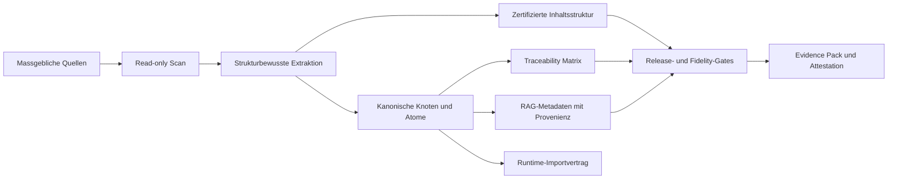

# Nomos

<p align="center">
  <strong>Authority-to-Product Intelligence fuer Software und KI, die ihren kontrollierten Quellen treu bleiben muessen.</strong>
</p>

<p align="center">
  <a href="./README.md">Français</a>
  ·
  <a href="./README.en.md">English</a>
  ·
  <a href="./README.de.md"><strong>Deutsch</strong></a>
</p>

<p align="center">
  
  
  
  
</p>

Nomos transformiert massgebliche Referenzen in kontrollierte, rueckverfolgbare und auditierbare Produktartefakte. Eine solche Referenz kann eine fachliche Wissensbasis, ein Standard, eine Regulierung, eine Qualitaetsprozedur, ein Rechtskorpus, ein technisches Handbuch, ein Regelbuch, eine Produktdoktrin oder jede Dokumentensammlung sein, die definiert, was ein System wissen, sagen oder tun darf.

Kurz gesagt: **Nomos hilft Teams nachzuweisen, was eine Software oder KI weiss, woher dieses Wissen stammt, wie es strukturiert wurde, wie es sich veraendert hat, was ausgelassen wurde, und ob das gelieferte Ergebnis weiterhin zur kontrollierten Referenz passt.**

Nomos ersetzt keine Fachexperten, Rechtsverantwortlichen, Qualitaetsverantwortlichen oder offiziellen Quellen. Nomos liefert die Transformations- und Evidenzschicht, die Anwendungen, Automatisierungen und KI/RAG-Systeme mit freigegebenen Referenzen in Einklang haelt.

> Nomos macht KI nicht "autoritaer". Nomos macht die Verbindung zwischen einer massgeblichen Quelle und den von Software oder KI konsumierten Artefakten explizit, testbar und steuerbar.

## Auf Einen Blick

| Dimension | Aktueller Stand |
|---|---|
| Produkt | Authority-to-product Engine fuer gesteuerte Software, KI und RAG. |
| Release | `v0.1.0-ALPHA`. |
| Aktueller Nachweis | Alpha-POC auf einem echten privaten Corpus, read-only verarbeitet. |
| Nachgewiesene Staerke | Quelle -> Struktur -> kanonische Knoten -> TOC -> source-backed Feed/RAG -> Body Ledger -> Strict Gate -> Attestation; danach, in der Go-Engine: Cite-or-abstain Gate (Faithfulness aus den Spans neu berechnet, nie deklariert), RAG-Evaluationsharness in CI, interoperabler RAG-Export mit nachweisbarer Staleness, reproduzierbarer oeffentlicher Bench des Gates. |
| Faehigkeitsregister | 38 Faehigkeiten in `scripts/vrc_wiring_matrix_registry.json` deklariert; ihr Status wird bei jedem CI-Lauf aus dem Baum BERECHNET (29 real, 4 sidecar, 5 absent, 0 Abweichung) — [`.vrc-wiring-matrix/wiring-matrix.md`](./.vrc-wiring-matrix/wiring-matrix.md). |
| Bekannte Grenze | Die Alpha beweist einen begrenzten Source-to-Feed POC; sie beansprucht noch keine universelle Fidelity oder regulatorische Kundenvalidierung. Der oeffentliche Bench misst das Gate auf neun Items, kein Produkt. |
| Naechste Haertung | Die fuenf `absent` Faehigkeiten des Registers, jede an ein offenes VRC-Issue gebunden: keyless Sigstore, EU-AI-Act-Pack, Regelausfuehrungssubstrat, Querverweisgraph, SKOS/SHACL-Vokabulare; danach Kunden-Validation-Packs und zusaetzliche Dokumentformate. |
| Claim Boundary | Kein zertifiziertes eQMS, kein validiertes GxP-System, keine regulatorische Zertifizierung. |

## Warum Nomos Existiert

Viele Anwendungen und KI-Systeme sind technisch sauber und trotzdem fachlich falsch. Das Problem liegt selten am Framework oder am Modell. Es entsteht durch verdeckte Drift zwischen dem gelieferten System und der Referenz, die es angeblich umsetzt:

- fachliche Regeln werden ohne Quelle in Code kopiert;
- RAG-Chunks haben keine Provenienz;
- UI- oder API-Verhalten basiert auf Beispielen statt auf Doktrin;
- LLM-Antworten vereinfachen kritische Nuancen;
- Quelldokumente werden aktualisiert, ohne nachgelagerte Rueckverfolgbarkeit;
- Tests beweisen technische Ausfuehrung, aber nicht fachliche Autoritaet.

Nomos schliesst diese Luecke, indem der Referenz-Corpus zu einer Produktabhaengigkeit erster Klasse wird.



## Produktpositionierung

Nomos ist nicht nur ein Dokumentparser und nicht nur eine RAG-Pipeline.

Eine klassische RAG-Pipeline indexiert Dokumente. Nomos kontrolliert und beweist die Transformation, bevor Software oder KI sie konsumiert:

- welche massgeblichen Quellen zugelassen wurden;
- ob sie read-only verarbeitet wurden;
- welche Struktur erkannt wurde;
- welche kanonischen Einheiten extrahiert wurden;
- welche Source-Ranges, Zeilen, Hashes und Locators jede Einheit stuetzen;
- was ausgeschlossen, uebersprungen, nicht unterstuetzt oder nur teilweise abgedeckt wurde;
- welche Chunks fuer RAG geeignet sind und welche nur Source-Ledger-Evidenz sind;
- welcher oeffentliche Claim aus der vorhandenen Evidenz vertretbar ist.

Nomos ist damit eine Governance- und Evidenzschicht fuer Software und KI, die auf massgeblichen Quellen beruht.

## Ziel-Use-Cases

Nomos ist fuer Teams gedacht, die source-backed Softwareverhalten, source-backed KI-Antworten oder auditfaehige Evidenz aus komplexen Referenzmaterialien brauchen:

- fachliche Dokumentation in Produktregeln und Runtime-Vertraege umwandeln;
- KI/RAG-Systeme so steuern, dass abgerufene Inhalte source-backed und versioniert sind;
- Traceability-Matrizen aus Standards, Prozeduren, Policies, Gesetzen oder Fachcorpora erzeugen;
- Drift zwischen Dokumentation, Implementierung, Tests und Release-Output erkennen;
- Validation Packs, Supplier Packs oder Evidence Packs fuer High-Integrity-Umgebungen vorbereiten;
- read-only Corpus-Assessments vor Kundenimporten durchfuehren;
- nicht unterstuetzte Abdeckung dokumentieren, statt Fidelity stillschweigend zu ueberverkaufen.

## Was v0.1.0-ALPHA Liefert

Die aktuelle Release liefert eine funktionierende CLI und Evidence-Pipeline fuer canonical-first Projekte:

- Repository-Diagnose und Project-Admission-Checks;
- `strict`, `corpus scan`, `diff`, `manifest`, `validate-sidecar`, `feed`, `body-ledger` und `attest` Befehle;
- read-only Guards fuer Corpus-Verarbeitung;
- `rbok-lawbook` Profil fuer strukturierte Markdown-Referenzcorpora;
- generischer YAML/JSON Structured Scanner mit strukturierten Pfaden und exakten Source-Spans;
- zertifizierte Inhaltsstruktur;
- Source-Spans und typisierte semantische Knoten fuer Tabellen, Links, Callouts, Codebloecke und Bilder;
- Extraktion eines gesteuerten Lexikons;
- source-backed RAG-Metadaten und Runtime-Importartefakte;
- vollstaendiger Source Body Ledger, der semantischen Inhalt, Struktur, Coverage, Unsupported und Binary Bytes trennt;
- Strict Fidelity Gate und Release-Gate-Integration;
- Attestation-Ausgabe im in-toto Stil;
- regulated-by-design Dokumentationsskelett, Evidence Templates und Control Records;
- CI-Workflows fuer Go, CUE, Corpus, RBOK lawbook E2E, Runtime E2E, Fidelity Proof Reports, regulierte Dokumentation und Evidence Pack.

Seit der Alpha hat die Engine die folgenden Faehigkeiten gewonnen. Jede ist ein Eintrag des Faehigkeitsregisters, dessen Status in CI aus Ankern im Baum berechnet wird (Engine, Production-Caller, adversarialer Test, CI-Gate); eine Faehigkeit, die nur ihren Python-Sidecar oder ihr CUE-Schema hat, zaehlt als `sidecar`, nie als `real`:

- **Cite-or-abstain Gate in der Engine** (`nomos answer gate`, VRC-10): Faithfulness aus dem Text der gefundenen Spans neu berechnet, nie aus einem deklarierten Score; eine gefaelschte Zitation, ein Span ohne Text oder eine Antwort ohne Quelle erzwingt Enthaltung; `trust_tier` pro Antwort; steckbarer zweiter NLI-Richter (`--scorer-cmd`, der strengste gewinnt, fail-closed, kein Modell in der Engine); der Python-Evidence-Sidecar konsumiert dieses Urteil statt eines zu erzeugen;
- **RAG-Evaluationsharness** (`nomos answer eval`, VRC-13): Golden Corpus, versionierte Schwellen, `context_recall`, ranggewichtete `context_precision` und `noise_sensitivity`; eine Regression unter die Untergrenze blockiert den PR;
- **oeffentlicher Cite-or-abstain Bench** (`nomos answer bench`, VRC-46): gelabelter Corpus ueber die oeffentlichen Dokumente des Repositorys, datierte Ergebnisse, Reproduktions-Gate in CI (Quellen woertlich und unveraendert, Referenzen verifiziert und datiert, Determinismus, Grenzen, Messung identisch mit der veroeffentlichten);
- **interoperabler RAG-Export** (`nomos rag export|manifest|delta|verify`): indexierbare, zitierbare Chunks fuer jeden RAG-Stack, Index-Fingerprint pro Quelle, exakter Reindexierungsplan, Staleness-Gate, Knowledge-Lens-begrenzter Export mit berechnetem Retrieval-Vertrag;
- **CKM-Atomisierung**: abgeleitete Facetten, Knowledge Lens in Engine und CLI, Canon Promotion (nie `certified`, Vertraulichkeitssilo), Point-in-time-Resolver, Canonical Knowledge Bundle, Facetten-Ontologie-Alignment vom Pack-Gate gerendert;
- **Nachweis und Attestation**: ECDSA P-256 DSSE Signatur, Merkle-Beweise des Body Ledgers emittiert und verifiziert, `claim_coverage` in der Attestation berechnet, in-toto Supply-Chain-Praedikat, Evidence Packs als CycloneDX/SPDX BOMs gegen den Ledger abgeglichen;
- **Domain Packs und Adapter**: `nomos pack validate` gegen einen deklarativen Vertrag, Capability Kits pro Adapter, born-digital PDF- und DOCX-Adapter (explizite Claim-Leiter), Live-Schweizer-Konnektor (echter Fetch, echter Hash);
- **Wahrheits-Guards**: berechnete Wiring-Matrix (VRC-00), Claim-Boundary-Guard auf die Woerter "signed / Sigstore / certified", Core/Pack-Kopplungs-Guard, HHEM-Sidecar und Referenz-Kits fuer Retrieval/Konformitaet (als `sidecar` gezaehlt).

## Alpha-POC-Evidenz

Nomos v0.1.0-ALPHA wurde auf dem echten privaten `realisons-business/01_rbok` Corpus in read-only Clones getestet. RBOK ist der erste Proof-Corpus; er ist nicht der Produktscope.

Drei Evidenzrecords sind relevant:

1. der historische Alpha-Lawbook-Pipeline-Record;
2. das initiale Source-to-Feed Audit, das wichtige semantische Feed-Quality-Gaps sichtbar gemacht hat; und
3. der aktuelle strukturierte Source-to-Feed POC, der diese blocking Gaps im aufgezeichneten Run beseitigt.

Historischer Alpha-Lawbook-Pipeline-Record:

| Evidenzpunkt | Ergebnis |
|---|---:|
| Corpus-Dateien gescannt | 240 |
| Feed-Knoten erzeugt | 7191 |
| Zertifizierte TOC-Eintraege | 1090 |
| Knoten mit Source-Span | 7191 / 7191 |
| Tabellenknoten | 65 |
| Codeblock-Knoten | 25 |
| Link-Knoten | 137 |
| Strict Fidelity Gate | pass, 0 blocking findings, 0 findings |
| Fidelity Proof | `full_fidelity_proven` |
| Source Mutation Check | keine Source-Mutation erkannt |

Dieser Record beweist, dass die aktuelle Pipeline einen echten strukturierten fachlichen Referenzcorpus verarbeiten kann, ohne in das Source-Repository zu schreiben. Er beweist keine universelle Fidelity fuer jedes Dokumentformat oder jeden regulierten Kundenworkflow.

Initiales Source-to-Feed Audit vor FSQ-Haertung:

| Evidenzpunkt | Ergebnis |
|---|---:|
| Deklarierte Corpus-Quellen | 240 |
| Feed-Einheiten erzeugt | 9500 |
| RAG-Chunks erzeugt | 9500 |
| Source-backed Feed-Einheiten | 9500 / 9500 |
| Source-backed RAG-Chunks | 9500 / 9500 |
| Strict Source/Feed Summary | `source_integrity=pass (0 findings); feed_quality=pass (0 findings)` |
| Source Mutation Check | keine Source-Mutation erkannt |

Die direkte Inspektion des erzeugten `feed.json` zeigte, dass dieser Feed semantisch noch nicht als finaler Doktrin-/RAG-Korpus bereit war:

| Feed-Quality-Beobachtung | Ergebnis |
|---|---:|
| Quellen mit erzeugten Einheiten | 88 / 240 |
| `table_cell` Feed-Einheiten | 3230 / 9500 |
| Einheiten mit <= 2 Tokens | 3344 / 9500 |
| Einheiten mit <= 10 Zeichen | 2195 / 9500 |
| Einheiten in duplizierten Textgruppen | 3704 |

Aktueller strukturierter Source-to-Feed POC:

| Evidenzpunkt | Ergebnis |
|---|---:|
| Lokales Evidence Pack | `C:\Dev\nomos-rbok-poc-run-20260504-structured-universal-9` |
| Corpus Commit | `ea003e8fe3c35993731c3708a3787df6a3a690df` |
| Deklarierte Corpus-Quellen | 240 |
| Feed-Einheiten erzeugt | 3024 |
| RAG-Chunks erzeugt | 3024 |
| Source-backed Feed-Einheiten | 3024 / 3024 |
| Source-backed RAG-Chunks | 3024 / 3024 |
| `table_cell` Feed-Einheiten | 0 |
| Einheiten <= 10 Zeichen | 0 |
| Blocking Duplicate Groups | 0 |
| Semantic Quality | `warn`, 0 blocking findings, 6 reviewbare Warnings |
| Body Ledger | 0 uncovered bytes |
| Strict Gate | `pass`, exit code 0 |
| Source Mutation Check | keine Source-Mutation erkannt |

Diese Unterscheidung ist entscheidend. Die aktuelle Alpha beweist verteidigbare Source-to-Artifact-Traceability und einen source-backed Feed/RAG POC, behaelt aber eine strikte Claim Boundary: verbleibende Warnings sind reviewbar, und die Evidenz ist auf den aufgezeichneten Corpus, Commit und Build begrenzt (Attestation `claim_coverage` ist jetzt verdrahtet — `corpus attest --corpus-body-ledger` verifiziert die Merkle-Beweise des Ledgers und berechnet die Coverage; der aufgezeichnete POC-Run behaelt sein historisches WARN). Die naechste Haertung zielt auf CI-Wiederholbarkeit, zusaetzliche Dokumentformate, Kundenvalidierung und breitere Universal-Fidelity-Evidenz. CI-Wiederholbarkeit wird jetzt **gemessen** statt angekuendigt (VRC-14 #560): `scripts/repeated_ci_evidence.py` zaehlt die Kette geplanter Runs auf dem privaten Corpus und veroeffentlicht einen datierten Index unter `docs/regulated/evidence-index/repeated-ci-evidence/`; Messung vom 2026-09-04, 4 aufeinanderfolgende gruene Runs von 8 angestrebten, der Claim bleibt daher gesperrt.

## Kontinuierlich Berechnete Nachweise

Ueber den aufgezeichneten POC hinaus werden zwei Nachweise bei jedem CI-Lauf neu berechnet und schlagen bei jeder Abweichung fehl:

| Nachweis | Aktuelles Ergebnis | Wie er gehalten wird |
|---|---|---|
| Wiring-Matrix (VRC-00) | 38 Faehigkeiten, 0 Abweichung zwischen Register und Baum, 0 Phantom-Befehl | `scripts/vrc_wiring_matrix.py`; die generierte Datei wird mit dem Commit verglichen |
| Oeffentlicher Cite-or-abstain Bench (VRC-46, Ergebnis vom 2026-09-04, lexikalischer Proxy) | 9 Items: `must_cite_recall` 1.0 (3/3), `must_abstain_recall` 0.8333 (5/6), `false_cite_rate` 0.1667 — das einzige falsche "cite" ist die Negation, der dokumentierte blinde Fleck des Proxys | `scripts/cite_or_abstain_bench.py`: Quellen woertlich und unveraendert, Referenzen verifiziert und datiert, zwei byte-identische Laeufe, versionierte Grenzen, Messung identisch mit dem veroeffentlichten Ergebnis |

Methodik, Corpus, Grenzen und datierte Ergebnisse: [`docs/regulated/ai-rag-governance/cite-or-abstain-bench/`](./docs/regulated/ai-rag-governance/cite-or-abstain-bench/README.md).

## Regulated-Ready Posture

Nomos ist fuer Teams gebaut, die in der Naehe regulierter, auditierter oder high-integrity IT-Umgebungen arbeiten. Das Repository enthaelt eine wachsende regulated-by-design Betriebsstruktur:

- Quality Manual und SOP-Baselines;
- Software Development und Validation Lifecycle Dokumente;
- ALCOA+ Evidence-Metadaten;
- Electronic Records und Electronic Signature Policy Baseline;
- GitHub-native Evidence- und QMS-Betriebsmodell;
- AI/RAG Governance Controls;
- Validation-Pack und Supplier-Pack Templates;
- Reference-Basis-Management fuer lizenzierte Standards wie GAMP 5 und ISO-Referenzen.

Der ehrliche Status:

- **implementiert:** evidence-orientiertes Tooling, regulierte Dokumentationsskelette, Gates, Templates und RBOK-POC-Evidenz;
- **teilweise implementiert:** Reference-to-Control Closure, Reife kundenseitiger Validation Packs, langfristige Betriebsrecords;
- **nicht beansprucht:** formale regulatorische Zertifizierung, Part-11-validierter Plattformstatus, GxP-Produktionsvalidierung, NASA/mission-critical Qualifikation oder universelle Rechtskonformitaet.

Siehe [docs/public-claim-boundary.md](docs/public-claim-boundary.md) und [docs/regulated/README.md](docs/regulated/README.md).
Siehe auch [docs/release-v0.1.0-alpha.md](docs/release-v0.1.0-alpha.md) fuer Release Notes und Publication Gate.

## Marktkontext Und Bewertung

Nomos liegt an der Schnittstelle mehrerer etablierter Softwarekategorien (reguliertes Content-/Document-Control, QMS und Validation Lifecycle Management, AI/RAG Governance, Vertical SaaS fuer regulierte Industrien). Um die Unparteilichkeit einer externen Bewertung zu wahren, nennt dieses README weder Wertspannen noch eine Selbstbewertung.

Die neutralen Rahmenwerke (Aktivierung nach IAS 38 / Swiss GAAP FER 10, Kategorie-Vergleichswerte, Kontext zu Bewertungsmultiples) und der tatsaechliche Produktstand (was implementiert, getestet und bewiesen ist) werden als Input fuer die Analyse im [External Assessment Pack](docs/external-assessment/) bereitgestellt:

- [docs/external-assessment/evidence-and-maturity.de.md](docs/external-assessment/evidence-and-maturity.de.md) — Evidenz und Reife;
- [docs/external-assessment/valuation-inputs.de.md](docs/external-assessment/valuation-inputs.de.md) — Rahmenwerke und Vergleichswerte, ohne Urteil.

## Kernkonzepte

- **Authority source:** Dokument, Standard, Regulierung, Vertrag, Katalog, Codebase oder Corpus mit Produktautoritaet.
- **Canonical node:** strukturierte Einheit aus einer Quelle mit Identitaet, Source Path, Source Hash, Locator, Parent Chain, Status und Domain.
- **Certified TOC:** rekonstruierter Dokumentbaum mit verifizierbarem Strukturhash.
- **Traceability matrix:** Verbindung zwischen Quellen, kanonischen Einheiten, Vertraegen, Implementierung, Tests und Evidenz.
- **RAG metadata:** Retrieval-Metadaten, die Quellenidentitaet und Governance-Kontext bewahren.
- **Strict fidelity gate:** Release-Gate, das bei fehlender Evidenz, fehlenden Spans, untypisierter kritischer Struktur, ungueltiger TOC oder blockierenden Evidence-Gaps scheitert.
- **Claim boundary:** oeffentliche Aussage darueber, was die Evidenz stuetzt und was nicht.

## CLI Quick Start

CLI bauen:

```bash
cd cli
go build -o ../nomos .
```

Hilfe anzeigen:

```bash
./nomos help
./nomos corpus help
```

Cite-or-abstain Gate ausfuehren, Harness und oeffentlichen Bench wiederholen:

```bash
./nomos answer gate --fixtures docs/regulated/ai-rag-governance/rag-answer-fixtures.yaml
./nomos answer eval \
  --corpus docs/regulated/ai-rag-governance/rag-eval-corpus.yaml \
  --thresholds docs/regulated/ai-rag-governance/rag-eval-thresholds.yaml
./nomos answer bench \
  --corpus docs/regulated/ai-rag-governance/cite-or-abstain-bench/corpus.yaml \
  --thresholds docs/regulated/ai-rag-governance/cite-or-abstain-bench/bench-thresholds.yaml
python3 scripts/cite_or_abstain_bench.py --root . --nomos-bin ./nomos   # wiederholt das veroeffentlichte Ergebnis, rot bei jeder Abweichung
```

In einen RAG-Stack exportieren, den Index fingerprinten und seine Frische beweisen:

```bash
./nomos rag export --feed /path/to/out/feed.json --format jsonl --strict --output chunks.jsonl
./nomos rag manifest --feed /path/to/out/feed.json --output index-manifest.json
./nomos rag delta --old index-manifest.json --new index-manifest.next.json      # exakter Plan: embed / update_metadata / delete
./nomos rag verify --feed /path/to/out/feed.json --manifest index-manifest.json --strict   # exit 1, wenn der Index veraltet ist
```

Projekt diagnostizieren:

```bash
./nomos diagnose --root . --format json
```

Corpus-Profil ausfuehren:

```bash
./nomos corpus diagnose --profile rbok-lawbook --root /path/to/01_rbok --format json
./nomos corpus feed \
  --profile rbok-lawbook \
  --root /path/to/01_rbok \
  --artifacts-dir /path/to/out \
  --corpus-id rbok-lawbook \
  --project-id rbok
```

RBOK Lawbook E2E-Skript ausfuehren:

```bash
bash scripts/rbok-lawbook-e2e.sh \
  --corpus /path/to/01_rbok \
  --out /path/to/out
```

Unter Windows ist das lokale E2E-Gate:

```powershell
powershell -NoProfile -ExecutionPolicy Bypass -File scripts\e2e.ps1
```

## Repository-Karte

| Pfad | Zweck |
|---|---|
| `cli/` | Go CLI und Corpus/Fidelity/Compliance Engines. |
| `specs/` | CUE- und JSON-Vertraege fuer Projektmanifeste, Corpus-Evidenz, Feed-Artefakte, TOC, AI/RAG Controls, Provenienz und Validierungsinventar. |
| `docs/` | Methode, Architektur, Operating Model, regulated-readiness Dokumente, ADRs und Validierungsdossiers. |
| `docs/regulated/` | Regulated-by-design Betriebsstruktur und kontrollierte Dokumentationsbaseline. |
| `templates/` | Wiederverwendbare Projekt-, Regulated-, Validation-, Evidence- und Governance-Templates. |
| `examples/` | Domaenenbeispiele fuer die canonical-first Methode. |
| `adapters/` | Adapter-Vertraege und Referenzprofile fuer Node/TypeScript, Python und JVM: Specs und Fixtures, ohne ausfuehrbare Implementierung in diesem Stadium. |
| `ci/` | Wiederverwendbare CI-Integrationsdokumentation. |
| `control-plane/` | Archivierte explorative Go-Packages (Dashboard, Registry, Storage): null Production-Caller, eingefroren per ADR-0006, Wiederaufnahme am v0.9.x-Portfolio-Meilenstein. |
| `policies/` | Platzhalterverzeichnis fuer ein kuenftiges Policy-Framework; in diesem Stadium nicht operativ. |
| `scripts/` | E2E-, Evidence-, regulierte Dokumentations- und Automationshelfer; Faehigkeitsregister (`vrc_wiring_matrix_registry.json`), Guards (Wiring-Matrix, Claim Boundary, Core/Pack-Kopplung), RAG- und Bench-Gates, Sidecars (RAG-Evidence, HHEM-Scorer, Referenz-Kits). |
| `.vrc-wiring-matrix/` | GENERIERTE Wiring-Matrix (JSON + Markdown): der Status jeder Faehigkeit aus dem Baum berechnet; jede Handaenderung oder Abweichung ist in CI rot. |
| `attestations/` | CUE-Vertraege der in-toto Attestations und das signierte Claim-Boundary-Praedikat. |
| `tests/` | Python-Tests der Workflows, Sidecars, Guards und Gates (adversarial: der erwartete Fehlschlag ist der Beweis). |
| `reports/` | Generierte lokale Evidence-Artefakte. |
| `references/` | Methodologischer und externer Referenzregister-Inhalt. |

## Quality Gates

Der Release-Prozess nutzt aktuell:

```bash
go vet ./... && go test -race ./...            # aus cli/
python -m unittest discover -s tests -v        # Python-Tests (pyyaml noetig; baut die Go-Engine fuer die Gates, die sie konsumieren)
python scripts/claim_boundary_guard.py --root .          # kein "signed / Sigstore / certified" ohne Beweis
python scripts/vrc_wiring_matrix.py --root .             # Wiring-Matrix: Register und Baum im Gleichschritt
python scripts/cite_or_abstain_bench.py --root .         # oeffentlicher Bench: das veroeffentlichte Ergebnis wiederholt sich
bash scripts/ckm-non-regression.sh             # CKM-00 Harness: CLI, CUE, Python, e2e, RBOK, Cite-or-abstain Gate
powershell -File scripts/e2e.ps1
```

GitHub Actions fuehren aus: CI (Go vet & test, Domain-Pack-Gate, RAG-Eval-Harness, RAG-Export-Gate, Replay des oeffentlichen Benchs, Corpus-Tests auf Linux/macOS/Windows, CUE vet, YAML lint, Python-Tests mit Claim-Boundary-Guard und abweichungsfreier Wiring-Matrix), den CKM-Nichtregressions-Harness, RBOK lawbook E2E, RBOK runtime E2E, Fidelity Proof Reports, das Regulated Documentation Gate und das Regulated Evidence Pack (dessen RAG-Evidence das Urteil der frisch gebauten Engine konsumiert).

## Was Nomos Nicht Beansprucht

Nomos beansprucht nicht, dass eine Quelle wahr, rechtmaessig, vollstaendig, lizenziert oder anwendbar ist. Nomos dokumentiert, woher Quellenmaterial stammt, wie es transformiert wurde, was abgedeckt ist, was uebersprungen wurde, welche Evidenz existiert und was noch Review braucht.

Nomos macht ein LLM nicht autoritaer. In der Zielarchitektur bleiben deterministische Vertraege und source-backed Artefakte autoritativ; LLM- und RAG-Schichten zitieren, erklaeren, suchen und assistieren unter Governance.

Nomos ersetzt keine Validierung. In regulierten Umgebungen brauchen Kunden weiterhin Intended-Use-Definition, Risk Assessment, Validation Planning, Testevidenz, Change Control, Supplier Assessment, Security Review und Approval Records.

Nomos beansprucht aktuell nicht, dass der Alpha-Feed eine perfekte semantische Rekonstruktion jedes unterstuetzten Corpus ist. Die Feed-Quality-Roadmap adressiert explizit nicht unterstuetzte Dokumentformate, verbleibende semantische Warnings, Kunden-Validation-Packs und CI-Wiederholbarkeit auf privaten Corpora — Letztere wird laufend gemessen, bei 4 aufeinanderfolgenden gruenen Runs von 8, mit 5 ausgefallenen woechentlichen Laeufen im Juli und 2 unterschiedlichen Corpus-Revisionen ueber das gesamte aufgezeichnete Fenster.

Das Cite-or-abstain Gate und sein oeffentlicher Bench messen das Gate, kein LLM: der Faithfulness-Proxy ist lexikalisch und negationsblind (in jedem Urteil gesagt, im Bench als falsches "cite" veroeffentlicht); der zweite NLI-Richter ist ein verifiziertes Protokoll, kein ausgeliefertes Modell, und kein CI-Lauf bewertet mit einem neuronalen Modell. Der Bench sagt nichts ueber die Qualitaet eines Retrievals, eines Embeddings oder eines LLM, noch ueber die fachliche Richtigkeit einer Antwort.

Keyless Sigstore (Fulcio/Rekor) bleibt ein dokumentiertes Follow-up und ist nicht implementiert: Attestations werden lokal signiert (ECDSA P-256 DSSE), und der Claim-Boundary-Guard weist jede Prosa zurueck, die mehr behaupten wuerde.

## Release Roadmap

| Version | Ziel |
|---|---|
| `v0.1.0-ALPHA` | Canonical Corpus Pipeline, Strict Fidelity Gate, RBOK POC und regulated-readiness Dokumentationsbaseline beweisen. |
| `v0.2.x` | Portable Atomisierung ueber RBOK Markdown hinaus haerten, strukturierte YAML/JSON- und Dokumentadapter-Abdeckung verbessern, Validation Packs erweitern. |
| `v0.3.x` | Adaptervertraege, Evidence Export, Kundenvalidierungsworkflow und RAG-Governance-Interfaces stabilisieren. |
| `v1.0` | Production-grade Release Candidate mit Support Model, Compatibility Policy, Validation Evidence und auditierter Claim Boundary. |

## Governance

Aenderungen, die Claims, Release Gates, Corpus Fidelity, regulated-readiness Posture oder Evidence-Formate betreffen, muessen ueber Issues, PRs, Tests und aktualisierte Dokumentation laufen. Siehe [GOVERNANCE.md](GOVERNANCE.md) und [CONTRIBUTING.md](CONTRIBUTING.md).

## Lizenz Und Kommerzielle Nutzung

Dieses Repository stellt aktuell keine Open-Source-Lizenz bereit. Code, Dokumentation, Templates und Beispiele sind als proprietaer zu behandeln, sofern keine separate schriftliche Lizenz oder kommerzielle Vereinbarung etwas anderes festlegt.
