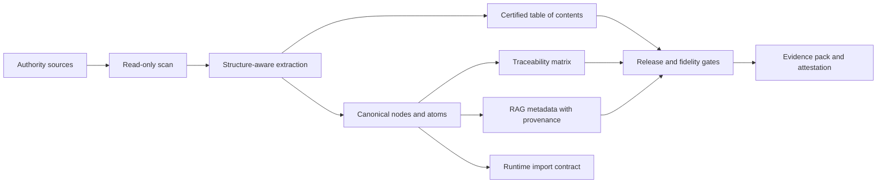

# Nomos

<p align="center">
  <strong>Authority-to-product intelligence for software and AI that must stay faithful to governed source material.</strong>
</p>

<p align="center">
  <a href="./README.md">Français</a>
  ·
  <a href="./README.en.md"><strong>English</strong></a>
  ·
  <a href="./README.de.md">Deutsch</a>
</p>

<p align="center">
  
  
  
  
</p>

Nomos transforms authority references into controlled, traceable, and auditable product assets. An authority reference can be a business knowledge base, standard, regulation, quality procedure, legal corpus, technical manual, rules book, product doctrine, or any document set that defines what a system is allowed to know, say, or do.

The short version: **Nomos helps teams prove what a software product or AI system knows, where that knowledge came from, how it was structured, how it changed, what was skipped, and whether the shipped output still matches the governed reference.**

Nomos does not replace domain experts, legal owners, quality owners, or the official source itself. It provides the transformation and evidence layer that keeps applications, automations, and AI/RAG systems aligned with approved references.

> Nomos does not make AI "authoritative". It makes the link between an authority source and the artifacts consumed by software or AI explicit, testable, and governable.

## At A Glance

| Dimension | Current position |
|---|---|
| Product | Authority-to-product engine for governed software, AI, and RAG. |
| Release | `v0.1.0-ALPHA`. |
| Current proof | Alpha POC on a real private corpus processed read-only. |
| Proven strength | Source -> structure -> canonical nodes -> TOC -> feed -> RAG metadata -> gates -> attestation. |
| Known limit | The alpha feed is not yet a perfect semantic reconstruction of all documents. |
| Next hardening | Feed Semantic Quality: useful chunks, explicit source coverage, coherent tables, modeled YAML, full ledger. |
| Claim boundary | Not a certified eQMS, not a validated GxP system, not a regulatory certification. |

## Why Nomos Exists

Many applications and AI systems are technically clean and still wrong. The failure mode is usually not the framework or the model. It is hidden drift between the delivered system and the reference material it claims to implement:

- business rules copied into code without a source;
- RAG chunks without provenance;
- UI or API behavior driven by samples instead of doctrine;
- LLM answers that summarize away a critical nuance;
- source documents updated without downstream traceability;
- tests proving code execution but not business authority.

Nomos addresses that gap by making the reference corpus a first-class product dependency.



## Product Positioning

Nomos is not just a document parser, and it is not just a RAG pipeline.

A conventional RAG pipeline indexes documents. Nomos controls and proves the transformation before software or AI consumes it:

- what authority sources were admitted;
- whether they were processed read-only;
- what structure was detected;
- which canonical units were extracted;
- which source ranges, lines, hashes, and locators support each unit;
- what was excluded, skipped, unsupported, or only partially covered;
- which chunks are fit for RAG and which are only source-ledger evidence;
- what public claim can safely be made from the available proof.

Nomos is therefore a governance and evidence layer for authority-grounded software and AI.

## Target Use Cases

Nomos is designed for teams that need source-backed software behavior, source-backed AI answers, or audit-ready evidence from complex reference material:

- converting business documentation into product rules and runtime contracts;
- governing AI/RAG systems so retrieved content is source-backed and versioned;
- building traceability matrices from standards, procedures, policies, laws, or business corpora;
- detecting drift between documentation, implementation, tests, and released output;
- preparing validation packs, supplier packs, or evidence packs for high-integrity environments;
- running read-only corpus assessments before importing customer references;
- documenting unsupported coverage instead of silently overclaiming fidelity.

## What v0.1.0-ALPHA Delivers

The current release provides a working CLI and evidence pipeline for canonical-first projects:

- repository diagnosis and project admission checks;
- `corpus scan`, `diff`, `manifest`, `validate-sidecar`, `feed`, and `attest` commands;
- read-only corpus processing guards;
- `rbok-lawbook` profile for structured Markdown reference corpora;
- certified table-of-contents generation;
- source spans and typed semantic nodes for tables, links, callouts, code blocks, and images;
- governed lexicon extraction;
- RAG metadata and runtime import artifacts;
- strict fidelity gate and release gate integration;
- in-toto style attestation output;
- regulated-by-design documentation skeleton, evidence templates, and control records;
- CI workflows for Go, CUE, corpus, RBOK lawbook E2E, runtime E2E, fidelity proof reports, regulated documentation, and evidence pack generation.

## Alpha POC Evidence

Nomos v0.1.0-ALPHA has been tested on the real private `realisons-business/01_rbok` corpus in read-only clones. RBOK is the first proof corpus; it is not the product scope.

Two proof records matter:

1. the historical alpha lawbook pipeline record; and
2. the newer source-to-feed integrity POC, which also exposed important semantic feed-quality gaps.

Historical alpha lawbook pipeline record:

| Evidence point | Result |
|---|---:|
| Corpus files scanned | 240 |
| Feed nodes generated | 7191 |
| Certified TOC entries | 1090 |
| Source-spanned nodes | 7191 / 7191 |
| Table nodes | 65 |
| Code block nodes | 25 |
| Link nodes | 137 |
| Strict fidelity gate | pass, 0 blocking findings, 0 findings |
| Fidelity proof | `full_fidelity_proven` |
| Source mutation check | no source mutation detected |

This record proves that the current pipeline can process a real structured business reference corpus without writing into the source repository. It does not prove universal fidelity for every document format or every regulated customer workflow.

Newer source-to-feed integrity POC record:

| Evidence point | Result |
|---|---:|
| Corpus sources declared | 240 |
| Feed units generated | 9500 |
| RAG chunks generated | 9500 |
| Source-backed feed units | 9500 / 9500 |
| Source-backed RAG chunks | 9500 / 9500 |
| Strict source/feed summary | `source_integrity=pass (0 findings); feed_quality=pass (0 findings)` |
| Source mutation check | no source mutation detected |

Direct inspection of the generated `feed.json` also showed that the current feed is not yet semantically ready as a final doctrinal/RAG body:

| Feed-quality observation | Result |
|---|---:|
| Sources with generated units | 88 / 240 |
| `table_cell` feed units | 3230 / 9500 |
| Units with <= 2 tokens | 3344 / 9500 |
| Units with <= 10 characters | 2195 / 9500 |
| Units in duplicated text groups | 3704 |

This distinction matters. The alpha proves meaningful source-to-artifact traceability, but it does not yet prove that every generated RAG chunk is semantically useful. The active hardening work is grouped under the **Feed Semantic Quality** epic: table rows instead of isolated table cells, explicit source-admission reasons, raw/decoded YAML modeling, a full source body ledger, a semantic feed quality gate, and context-rich RAG chunk composition.

## Regulated-Ready Posture

Nomos is built for teams operating near regulated, audited, or high-integrity IT environments. The repository contains a growing regulated-by-design operating structure covering:

- quality manual and SOP baselines;
- software development and validation lifecycle documents;
- ALCOA+ evidence metadata;
- electronic records and electronic signature policy baseline;
- GitHub-native evidence and QMS operating model;
- AI/RAG governance controls;
- validation-pack and supplier-pack templates;
- reference-basis management for licensed standards such as GAMP 5 and ISO references.

The honest status is:

- **implemented:** evidence-oriented tooling, regulated documentation skeletons, gates, templates, and RBOK POC evidence;
- **partially implemented:** reference-to-control closure, customer-facing validation pack maturity, long-term operational records;
- **not claimed:** formal regulatory certification, Part 11 validated platform status, GxP production validation, NASA/mission-critical qualification, or universal legal compliance.

See [docs/public-claim-boundary.md](docs/public-claim-boundary.md) and [docs/regulated/README.md](docs/regulated/README.md).

## Market Context

Nomos sits at the intersection of several established software categories:

| Market category | Why it matters |
|---|---|
| Regulated content and document control | Organizations pay for controlled, reviewable, audit-ready content lifecycle management. |
| QMS and validation lifecycle management | Regulated teams need evidence that software and processes remain fit for intended use. |
| AI governance and RAG governance | Enterprises need to prove what AI systems can use, cite, retain, and answer from. |
| Vertical SaaS for regulated industries | Specialized software gains strategic value when embedded in operating processes. |

Useful references:

- [Veeva QualityDocs](https://www.veeva.com/products/vault-qualitydocs/) positions regulated quality content management as a mature GxP software category.
- [Veeva Systems market capitalization](https://stockanalysis.com/stocks/veev/market-cap/) was reported around USD 28.03B on May 1, 2026. Veeva is not a direct comparable for Nomos, but it illustrates the potential value of quality, content, and life-sciences software.
- [ValGenesis](https://www.valgenesis.com/) illustrates the validation lifecycle management market for GxP and life-sciences organizations.
- [FDA Computer Software Assurance guidance](https://www.fda.gov/regulatory-information/search-fda-guidance-documents/computer-software-assurance-production-and-quality-system-software-0) formalizes a risk-based approach to establishing confidence in software used in production and quality systems.
- [21 CFR Part 11](https://www.law.cornell.edu/cfr/text/21/part-11) is a core reference for electronic records and electronic signatures in FDA-regulated contexts.
- [IAS 38 Intangible Assets](https://www.ifrs.org/issued-standards/list-of-standards/ias-38-intangible-assets/) and [Swiss GAAP FER 10](https://www.fer.ch/en/standards/swiss-gaap-fer-10-immaterielle-werte/) provide accounting context for recognizing internally generated intangible assets.

For valuation context, public and private SaaS benchmarks in 2026 commonly place median private SaaS businesses around 4-5x ARR, with wide dispersion based on growth, net revenue retention, gross margin, profitability, customer concentration, and strategic value. See [SaaS Valuation Multiples 2026](https://saasvaluationmultiple.com/). These multiples become useful only once recurring revenue exists; they do not justify valuing an alpha product as a mature SaaS company.

## Commercial And Asset Position

Nomos should be evaluated in two separate ways:

1. **Accounting capitalization.** An idea is not capitalized. Development costs may be capitalized only when the applicable accounting criteria are met: technical feasibility, intent to complete, ability to use or sell, probable future economic benefit, available resources, and reliable cost measurement. Eligible evidence may include development time, architecture, tests, documentation, CI, validation records, and directly attributable tooling or infrastructure.
2. **Business/IP valuation.** Economic value can exceed capitalized cost, but it must be supported by maturity, demos, customer pilots, usage, defensibility, reproducibility barriers, revenue, or letters of intent.

A realistic internal valuation frame for the current maturity is:

| Maturity stage | Defensible value frame |
|---|---:|
| Concept only | low; difficult to defend |
| Technical POC with limited evidence | CHF 50k-150k |
| Alpha POC with source-backed evidence, documentation, CI, and a real proof corpus | CHF 100k-300k |
| Alpha product usable across several complex corpora | CHF 300k-800k |
| Product integrated into a critical workflow or backed by a paid pilot / letter of intent | CHF 800k-1.5M+ |
| Product with recurring revenue | ARR multiplied by an appropriate SaaS multiple |

These ranges are not financial advice and should not be used as a formal valuation without an accountant, auditor, or corporate finance advisor. They are a pragmatic internal framing for product strategy, capitalization discussions, and roadmap prioritization.

## Core Concepts

- **Authority source:** a document, standard, regulation, contract, catalog, codebase, or corpus that has product authority.
- **Canonical node:** a structured unit extracted from a source with identity, source path, source hash, locator, parent chain, status, and domain.
- **Certified TOC:** a reconstructed document tree with a verifiable structure hash.
- **Traceability matrix:** the link between sources, canonical units, contracts, implementation, tests, and evidence.
- **RAG metadata:** retrieval metadata that preserves source identity and governance context.
- **Strict fidelity gate:** a release gate that fails on missing proof, missing spans, untyped critical structure, invalid TOC, or blocking evidence gaps.
- **Claim boundary:** the public statement of what the evidence supports and what it does not.

## CLI Quick Start

Build the CLI:

```bash
cd cli
go build -o ../nomos .
```

Print help:

```bash
./nomos help
./nomos corpus help
```

Diagnose a project:

```bash
./nomos diagnose --root . --format json
```

Run a corpus profile:

```bash
./nomos corpus diagnose --profile rbok-lawbook --root /path/to/01_rbok --format json
./nomos corpus feed \
  --profile rbok-lawbook \
  --root /path/to/01_rbok \
  --artifacts-dir /path/to/out \
  --corpus-id rbok-lawbook \
  --project-id rbok
```

Run the RBOK lawbook E2E script:

```bash
bash scripts/rbok-lawbook-e2e.sh \
  --corpus /path/to/01_rbok \
  --out /path/to/out
```

On Windows, the local E2E gate is:

```powershell
powershell -NoProfile -ExecutionPolicy Bypass -File scripts\e2e.ps1
```

## Repository Map

| Path | Purpose |
|---|---|
| `cli/` | Go CLI and corpus/fidelity/compliance engines. |
| `specs/` | CUE and JSON contracts for project manifests, corpus evidence, feed artifacts, TOC, AI/RAG controls, provenance, and validation inventory. |
| `docs/` | Method, architecture, operating model, regulated-readiness documents, ADRs, and validation dossiers. |
| `docs/regulated/` | Regulated-by-design operating structure and controlled-document baseline. |
| `templates/` | Copyable project, regulated, validation, evidence, and governance templates. |
| `examples/` | Domain examples for applying the canonical-first method. |
| `adapters/` | Adapter contract and early adapter profiles for Node/TypeScript, Python, and JVM ecosystems. |
| `ci/` | Reusable CI integration documentation. |
| `control-plane/` | Optional Go control-plane packages for dashboard, registry, and storage. |
| `scripts/` | E2E, evidence, regulated documentation, and automation helpers. |
| `reports/` | Generated local evidence artifacts. |
| `references/` | Methodological and external reference register material. |

## Quality Gates

The release process currently uses:

```bash
go test ./...                 # from cli/
powershell -File scripts/e2e.ps1
python -m unittest discover -s tests -v
```

GitHub Actions additionally run CI, corpus tests on Linux/macOS/Windows, RBOK lawbook E2E, RBOK runtime E2E, fidelity proof reports, regulated documentation gate, and regulated evidence pack jobs.

## What Nomos Does Not Claim

Nomos does not claim that a source is true, lawful, complete, licensed, or applicable. It records where source material came from, how it was transformed, what was covered, what was skipped, what evidence exists, and what still requires review.

Nomos does not make an LLM authoritative. In the intended architecture, deterministic contracts and source-backed artifacts remain authoritative; LLM and RAG layers cite, explain, retrieve, and assist under governance.

Nomos does not remove the need for validation. In regulated environments, customers still need intended-use definition, risk assessment, validation planning, test evidence, change control, supplier assessment, security review, and approval records.

Nomos does not currently claim that its alpha feed output is a perfect semantic reconstruction of every supported corpus. The feed-quality roadmap explicitly addresses table modeling, low-value chunks, source admission reasons, raw/decoded YAML modeling, full source body ledger output, and context-rich RAG chunk composition.

## Release Roadmap

| Version | Target |
|---|---|
| `v0.1.0-ALPHA` | Prove the canonical corpus pipeline, strict fidelity gate, RBOK POC, and regulated-readiness documentation baseline. |
| `v0.2.x` | Harden portable atomization beyond RBOK Markdown, improve structured YAML/JSON and document adapter coverage, expand validation packs. |
| `v0.3.x` | Stabilize adapter contracts, evidence export, customer validation workflow, and RAG governance interfaces. |
| `v1.0` | Production-grade release candidate with documented support model, compatibility policy, validation evidence, and audited claim boundary. |

## Governance

Changes that affect claims, release gates, corpus fidelity, regulated-readiness posture, or evidence format must be reviewed through issues, PRs, tests, and updated documentation. See [GOVERNANCE.md](GOVERNANCE.md) and [CONTRIBUTING.md](CONTRIBUTING.md).

## License And Commercial Use

This repository currently does not grant an open-source license. Treat the code, documentation, templates, and examples as proprietary unless a separate written license or commercial agreement says otherwise.
