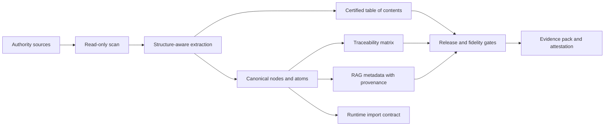

# Nomos

<p align="center">
  <strong>Authority-to-product intelligence for software and AI that must stay faithful to governed source material.</strong>
</p>

<p align="center">
  <a href="./README.md">Français</a>
  ·
  <a href="./README.en.md"><strong>English</strong></a>
  ·
  <a href="./README.de.md">Deutsch</a>
</p>

<p align="center">
  
  
  
  
</p>

Nomos transforms authority references into controlled, traceable, and auditable product assets. An authority reference can be a business knowledge base, standard, regulation, quality procedure, legal corpus, technical manual, rules book, product doctrine, or any document set that defines what a system is allowed to know, say, or do.

The short version: **Nomos helps teams prove what a software product or AI system knows, where that knowledge came from, how it was structured, how it changed, what was skipped, and whether the shipped output still matches the governed reference.**

Nomos does not replace domain experts, legal owners, quality owners, or the official source itself. It provides the transformation and evidence layer that keeps applications, automations, and AI/RAG systems aligned with approved references.

> Nomos does not make AI "authoritative". It makes the link between an authority source and the artifacts consumed by software or AI explicit, testable, and governable.

## At A Glance

| Dimension | Current position |
|---|---|
| Product | Authority-to-product engine for governed software, AI, and RAG. |
| Release | `v0.1.0-ALPHA`. |
| Current proof | Alpha POC on a real private corpus processed read-only. |
| Proven strength | Source -> structure -> canonical nodes -> TOC -> source-backed feed/RAG -> body ledger -> strict gate -> attestation; then, in the Go engine: cite-or-abstain gate (faithfulness recomputed from spans, never declared), RAG evaluation harness in CI, interoperable RAG export with provable staleness, reproducible public bench of the gate. |
| Capability registry | 40 capabilities declared in `scripts/vrc_wiring_matrix_registry.json`; their status is COMPUTED from the tree on every CI run (32 real, 7 sidecar, 1 absent, 0 mismatch) — [`.vrc-wiring-matrix/wiring-matrix.md`](./.vrc-wiring-matrix/wiring-matrix.md). |
| Roadmaps | Product, DevOps and regulated assurance advance independently (ADR-VRC-0004). Only `dispatch:autonomous` issues enter the dispatcher; calendar evidence, signatures, procurement and public writes block their claim, never development — [`docs/47`](./docs/47-roadmap-lanes-and-risk-based-validation.md). |
| Known limit | The alpha proves a bounded source-to-feed POC; it does not yet claim universal fidelity or customer regulatory validation. The public bench measures the gate on nine items, not a product. |
| Next hardening | Independent product and DevOps autonomous queues, ordered by `docs/roadmap-lanes.yaml` (table generated into `docs/47`, drift-checked in CI). The only `absent` capability is keyless Sigstore issuance: offline verify #637, non-production issuance #645, production/Rekor activation #638 separate. |
| Claim boundary | Not a certified eQMS, not a validated GxP system, not a regulatory certification. |

## Why Nomos Exists

Many applications and AI systems are technically clean and still wrong. The failure mode is usually not the framework or the model. It is hidden drift between the delivered system and the reference material it claims to implement:

- business rules copied into code without a source;
- RAG chunks without provenance;
- UI or API behavior driven by samples instead of doctrine;
- LLM answers that summarize away a critical nuance;
- source documents updated without downstream traceability;
- tests proving code execution but not business authority.

Nomos addresses that gap by making the reference corpus a first-class product dependency.



## Product Positioning

Nomos is not just a document parser, and it is not just a RAG pipeline.

A conventional RAG pipeline indexes documents. Nomos controls and proves the transformation before software or AI consumes it:

- what authority sources were admitted;
- whether they were processed read-only;
- what structure was detected;
- which canonical units were extracted;
- which source ranges, lines, hashes, and locators support each unit;
- what was excluded, skipped, unsupported, or only partially covered;
- which chunks are fit for RAG and which are only source-ledger evidence;
- what public claim can safely be made from the available proof.

Nomos is therefore a governance and evidence layer for authority-grounded software and AI.

## Target Use Cases

Nomos is designed for teams that need source-backed software behavior, source-backed AI answers, or audit-ready evidence from complex reference material:

- converting business documentation into product rules and runtime contracts;
- governing AI/RAG systems so retrieved content is source-backed and versioned;
- building traceability matrices from standards, procedures, policies, laws, or business corpora;
- detecting drift between documentation, implementation, tests, and released output;
- preparing validation packs, supplier packs, or evidence packs for high-integrity environments;
- running read-only corpus assessments before importing customer references;
- documenting unsupported coverage instead of silently overclaiming fidelity.

## What v0.1.0-ALPHA Delivers

The current release provides a working CLI and evidence pipeline for canonical-first projects:

- repository diagnosis and project admission checks;
- `strict`, `corpus scan`, `diff`, `manifest`, `validate-sidecar`, `feed`, `body-ledger`, and `attest` commands;
- read-only corpus processing guards;
- `rbok-lawbook` profile for structured Markdown reference corpora;
- generic YAML/JSON structured scanner with structured paths and exact source spans;
- certified table-of-contents generation;
- source spans and typed semantic nodes for tables, links, callouts, code blocks, and images;
- governed lexicon extraction;
- source-backed RAG metadata and runtime import artifacts;
- complete source body ledger separating semantic content, structure, coverage, unsupported, and binary bytes;
- strict fidelity gate and release gate integration;
- in-toto style attestation output;
- regulated-by-design documentation skeleton, evidence templates, and control records;
- CI workflows for Go, CUE, corpus, RBOK lawbook E2E, runtime E2E, fidelity proof reports, regulated documentation, and evidence pack generation.

Since the alpha, the engine has gained the capabilities below. Each is an entry of the capability registry whose status is computed in CI from tree anchors (engine, production caller, adversarial test, CI gate); an intentionally out-of-core capability counts as `sidecar`, never `real` — that is topology, not its delivery or regulated-validation state:

- **cite-or-abstain gate in the engine** (`nomos answer gate`, VRC-10): faithfulness recomputed from the retrieved span text, never taken from a declared score; a forged citation, a span without text or an answer without a source forces abstention; `trust_tier` per answer; pluggable NLI second judge (`--scorer-cmd`, strictest-wins, fail-closed, no model in the engine); the Python evidence sidecar consumes this verdict instead of producing one;
- **RAG evaluation harness** (`nomos answer eval`, VRC-13): golden corpus, versioned thresholds, `context_recall`, rank-weighted `context_precision` and `noise_sensitivity`; a regression below the floor blocks the PR;
- **public cite-or-abstain bench** (`nomos answer bench`, VRC-46): labelled corpus over the repository's public documents, dated results, reproduction gate in CI (sources verbatim and unmoved, references verified and dated, determinism, bounds, measurement identical to the published one);
- **interoperable RAG export** (`nomos rag export|manifest|delta|verify`): indexable, citable chunks for any RAG stack, per-source index fingerprint, exact reindexing plan, staleness gate, Knowledge-Lens-scoped export with a computed retrieval contract;
- **CKM atomization**: derived facets, Knowledge Lens in the engine and the CLI, canon promotion (never `certified`, confidentiality silo), point-in-time resolver, Canonical Knowledge Bundle, facet-ontology alignment rendered by the pack gate;
- **proof and attestation**: ECDSA P-256 DSSE signing, body-ledger Merkle proofs emitted and verified, `claim_coverage` computed in the attestation, in-toto supply-chain predicate, evidence packs as CycloneDX/SPDX BOMs cross-checked with the ledger;
- **domain packs and adapters**: `nomos pack validate` against a declarative contract, capability kits per adapter, born-digital PDF and DOCX adapters (explicit claim ladder), live Swiss connector (real fetch, real hash);
- **truth guards**: computed wiring matrix (VRC-00), claim-boundary guard on the words "signed / Sigstore / certified", core/pack coupling guard, HHEM sidecar and reference retrieval/conformance kits (counted `sidecar`).

## Alpha POC Evidence

Nomos v0.1.0-ALPHA has been tested on the real private `realisons-business/01_rbok` corpus in read-only clones. RBOK is the first proof corpus; it is not the product scope.

Three proof records matter:

1. the historical alpha lawbook pipeline record;
2. the initial source-to-feed audit, which exposed important semantic feed-quality gaps; and
3. the current structured source-to-feed POC, which removes those blocking gaps on the recorded run.

Historical alpha lawbook pipeline record:

| Evidence point | Result |
|---|---:|
| Corpus files scanned | 240 |
| Feed nodes generated | 7191 |
| Certified TOC entries | 1090 |
| Source-spanned nodes | 7191 / 7191 |
| Table nodes | 65 |
| Code block nodes | 25 |
| Link nodes | 137 |
| Strict fidelity gate | pass, 0 blocking findings, 0 findings |
| Fidelity proof | `full_fidelity_proven` |
| Source mutation check | no source mutation detected |

This record proves that the current pipeline can process a real structured business reference corpus without writing into the source repository. It does not prove universal fidelity for every document format or every regulated customer workflow.

Initial source-to-feed audit before FSQ hardening:

| Evidence point | Result |
|---|---:|
| Corpus sources declared | 240 |
| Feed units generated | 9500 |
| RAG chunks generated | 9500 |
| Source-backed feed units | 9500 / 9500 |
| Source-backed RAG chunks | 9500 / 9500 |
| Strict source/feed summary | `source_integrity=pass (0 findings); feed_quality=pass (0 findings)` |
| Source mutation check | no source mutation detected |

Direct inspection of the generated `feed.json` showed that this feed was not semantically ready as a final doctrinal/RAG body:

| Feed-quality observation | Result |
|---|---:|
| Sources with generated units | 88 / 240 |
| `table_cell` feed units | 3230 / 9500 |
| Units with <= 2 tokens | 3344 / 9500 |
| Units with <= 10 characters | 2195 / 9500 |
| Units in duplicated text groups | 3704 |

Current structured source-to-feed POC:

| Evidence point | Result |
|---|---:|
| Local evidence pack | `C:\Dev\nomos-rbok-poc-run-20260504-structured-universal-9` |
| Corpus commit | `ea003e8fe3c35993731c3708a3787df6a3a690df` |
| Corpus sources declared | 240 |
| Feed units generated | 3024 |
| RAG chunks generated | 3024 |
| Source-backed feed units | 3024 / 3024 |
| Source-backed RAG chunks | 3024 / 3024 |
| `table_cell` feed units | 0 |
| Units <= 10 characters | 0 |
| Blocking duplicate groups | 0 |
| Semantic quality | `warn`, 0 blocking findings, 6 reviewable warnings |
| Body ledger | 0 uncovered bytes |
| Strict gate | `pass`, exit code 0 |
| Source mutation check | no source mutation detected |

This distinction matters. The current alpha proves defensible source-to-artifact traceability and a source-backed feed/RAG POC, while keeping a strict claim boundary: remaining warnings are reviewable, and the proof is bounded to the recorded corpus, commit, and build (attestation `claim_coverage` is now wired — `corpus attest --corpus-body-ledger` verifies the ledger's Merkle proofs and computes coverage; the recorded POC run keeps its historical WARN). **Product** hardening targets additional formats and portable fidelity. In parallel, the regulated roadmap measures CI repeatability and customer validation without turning them into product dependencies: VRC-14 #560 measures 4 consecutive green runs of 8 on 2026-09-04, so its claim stays locked while the other lanes continue.

## Continuously Computed Proofs

Beyond the recorded POC, two proofs are recomputed on every CI run and fail on any drift:

| Proof | Current result | How it is held |
|---|---|---|
| Wiring matrix (VRC-00) | 40 capabilities, 0 mismatch between registry and tree, 0 phantom command | `scripts/vrc_wiring_matrix.py`; the generated file is compared with the commit |
| Public cite-or-abstain bench (VRC-46, result of 2026-09-05, lexical proxy) | 9 items: `must_cite_recall` 1.0 (3/3), `must_abstain_recall` 0.8333 (5/6), `false_cite_rate` 0.1667 — the single false cite is the negation, the documented blind spot of the proxy | `scripts/cite_or_abstain_bench.py`: sources verbatim and unmoved, references verified and dated, two byte-identical runs, versioned bounds, measurement identical to the published result |

Methodology, corpus, bounds and dated results: [`docs/regulated/ai-rag-governance/cite-or-abstain-bench/`](./docs/regulated/ai-rag-governance/cite-or-abstain-bench/README.md).

## Regulated-Ready Posture

Nomos is built for teams operating near regulated, audited, or high-integrity IT environments. The repository contains a growing regulated-by-design operating structure covering:

- quality manual and SOP baselines;
- software development and validation lifecycle documents;
- ALCOA+ evidence metadata;
- electronic records and electronic signature policy baseline;
- GitHub-native evidence and QMS operating model;
- AI/RAG governance controls;
- validation-pack and supplier-pack templates;
- reference-basis management for licensed standards such as GAMP 5 and ISO references.

The honest status is:

- **implemented:** evidence-oriented tooling, regulated documentation skeletons, gates, templates, and RBOK POC evidence;
- **partially implemented:** reference-to-control closure, customer-facing validation pack maturity, long-term operational records;
- **not claimed:** formal regulatory certification, Part 11 validated platform status, GxP production validation, NASA/mission-critical qualification, or universal legal compliance.

See [docs/public-claim-boundary.md](docs/public-claim-boundary.md) and [docs/regulated/README.md](docs/regulated/README.md).
See also [docs/release-v0.1.0-alpha.md](docs/release-v0.1.0-alpha.md) for release notes and the publication gate.

## Market Context And Valuation

Nomos sits at the intersection of several established software categories (regulated content/document control, QMS and validation lifecycle management, AI/RAG governance, vertical SaaS for regulated industries). To preserve the impartiality of an external assessment, this README offers no value range and no self-assessment.

The neutral frameworks (IAS 38 / Swiss GAAP FER 10 capitalization, category comparables, valuation-multiple context) and the actual product state (what is implemented, tested, proven) are provided as inputs for the analyst in the [external assessment pack](docs/external-assessment/):

- [docs/external-assessment/evidence-and-maturity.en.md](docs/external-assessment/evidence-and-maturity.en.md) — evidence and maturity;
- [docs/external-assessment/valuation-inputs.en.md](docs/external-assessment/valuation-inputs.en.md) — frameworks and comparables, no verdict.

## Core Concepts

- **Authority source:** a document, standard, regulation, contract, catalog, codebase, or corpus that has product authority.
- **Canonical node:** a structured unit extracted from a source with identity, source path, source hash, locator, parent chain, status, and domain.
- **Certified TOC:** a reconstructed document tree with a verifiable structure hash.
- **Traceability matrix:** the link between sources, canonical units, contracts, implementation, tests, and evidence.
- **RAG metadata:** retrieval metadata that preserves source identity and governance context.
- **Strict fidelity gate:** a release gate that fails on missing proof, missing spans, untyped critical structure, invalid TOC, or blocking evidence gaps.
- **Claim boundary:** the public statement of what the evidence supports and what it does not.

## CLI Quick Start

Build the CLI:

```bash
cd cli
go build -o ../nomos .
```

Print help:

```bash
./nomos help
./nomos corpus help
```

Run the cite-or-abstain gate, replay the harness and the public bench:

```bash
./nomos answer gate --fixtures docs/regulated/ai-rag-governance/rag-answer-fixtures.yaml
./nomos answer eval \
  --corpus docs/regulated/ai-rag-governance/rag-eval-corpus.yaml \
  --thresholds docs/regulated/ai-rag-governance/rag-eval-thresholds.yaml
./nomos answer bench \
  --corpus docs/regulated/ai-rag-governance/cite-or-abstain-bench/corpus.yaml \
  --thresholds docs/regulated/ai-rag-governance/cite-or-abstain-bench/bench-thresholds.yaml
python3 scripts/cite_or_abstain_bench.py --root . --nomos-bin ./nomos   # replays the published result, red on any drift
```

Export to a RAG stack, fingerprint the index and prove it is fresh:

```bash
./nomos rag export --feed /path/to/out/feed.json --format jsonl --strict --output chunks.jsonl
./nomos rag manifest --feed /path/to/out/feed.json --output index-manifest.json
./nomos rag delta --old index-manifest.json --new index-manifest.next.json      # exact plan: embed / update_metadata / delete
./nomos rag verify --feed /path/to/out/feed.json --manifest index-manifest.json --strict   # exit 1 when the index is stale
```

Diagnose a project:

```bash
./nomos diagnose --root . --format json
```

Run a corpus profile:

```bash
./nomos corpus diagnose --profile rbok-lawbook --root /path/to/01_rbok --format json
./nomos corpus feed \
  --profile rbok-lawbook \
  --root /path/to/01_rbok \
  --artifacts-dir /path/to/out \
  --corpus-id rbok-lawbook \
  --project-id rbok
```

Run the RBOK lawbook E2E script:

```bash
bash scripts/rbok-lawbook-e2e.sh \
  --corpus /path/to/01_rbok \
  --out /path/to/out
```

On Windows, the local E2E gate is:

```powershell
powershell -NoProfile -ExecutionPolicy Bypass -File scripts\e2e.ps1
```

## Repository Map

| Path | Purpose |
|---|---|
| `cli/` | Go CLI and corpus/fidelity/compliance engines. |
| `specs/` | CUE and JSON contracts for project manifests, corpus evidence, feed artifacts, TOC, AI/RAG controls, provenance, and validation inventory. |
| `docs/` | Method, architecture, operating model, regulated-readiness documents, ADRs, and validation dossiers. |
| `docs/regulated/` | Regulated-by-design operating structure and controlled-document baseline. |
| `templates/` | Copyable project, regulated, validation, evidence, and governance templates. |
| `examples/` | Domain examples for applying the canonical-first method. |
| `adapters/` | Adapter contracts and reference profiles for Node/TypeScript, Python, and JVM: specs and fixtures, with no executable implementation at this stage. |
| `ci/` | Reusable CI integration documentation. |
| `policies/` | Placeholder directory for a future policy framework; not operational at this stage. |
| `scripts/` | E2E, evidence, regulated documentation, and automation helpers; capability registry (`vrc_wiring_matrix_registry.json`), guards (wiring matrix, claim boundary, core/pack coupling), RAG and bench gates, sidecars (RAG evidence, HHEM scorer, reference kits). |
| `.vrc-wiring-matrix/` | GENERATED wiring matrix (JSON + Markdown): the status of every capability computed from the tree; any hand edit or drift is red in CI. |
| `attestations/` | CUE contracts of the in-toto attestations and the signed claim-boundary predicate. |
| `tests/` | Python tests of the workflows, sidecars, guards and gates (adversarial: the expected failure is the proof). |
| `reports/` | Generated local evidence artifacts. |
| `references/` | Methodological and external reference register material. |

## Quality Gates

The release process currently uses:

```bash
go vet ./... && go test -race ./...            # from cli/
python -m unittest discover -s tests -v        # Python tests (pyyaml required; builds the Go engine for the gates that consume it)
python scripts/claim_boundary_guard.py --root .          # no "signed / Sigstore / certified" without proof
python scripts/roadmap_lane_guard.py --root .             # no human/external wait in the autonomous queue
python scripts/vrc_wiring_matrix.py --root .             # wiring matrix: registry and tree in lockstep
python scripts/cite_or_abstain_bench.py --root .         # public bench: the published result replays
bash scripts/ckm-non-regression.sh             # CKM-00 harness: CLI, CUE, Python, e2e, RBOK, cite-or-abstain gate
powershell -File scripts/e2e.ps1
```

GitHub Actions run: CI (Go vet & test, domain pack gate, RAG eval harness, RAG export gate, public bench replay, corpus tests on Linux/macOS/Windows, CUE vet, YAML lint, Python tests with the claim-boundary guard and a drift-free wiring matrix), the CKM non-regression harness, RBOK lawbook E2E, RBOK runtime E2E, fidelity proof reports, the regulated documentation gate and the regulated evidence pack (whose RAG evidence consumes the verdict of the freshly built engine).

## What Nomos Does Not Claim

Nomos does not claim that a source is true, lawful, complete, licensed, or applicable. It records where source material came from, how it was transformed, what was covered, what was skipped, what evidence exists, and what still requires review.

Nomos does not make an LLM authoritative. In the intended architecture, deterministic contracts and source-backed artifacts remain authoritative; LLM and RAG layers cite, explain, retrieve, and assist under governance.

Nomos does not remove the need for validation. In regulated environments, customers still need intended-use definition, risk assessment, validation planning, test evidence, change control, supplier assessment, security review, and approval records.

Nomos does not currently claim that its alpha feed output is a perfect semantic reconstruction of every supported corpus. The product feed-quality roadmap covers unsupported formats and residual semantic warnings; the independent regulated roadmap covers customer validation packs and private-corpus repeatability (4/8), without blocking the first.

The cite-or-abstain gate and its public bench measure the gate, not an LLM: the faithfulness proxy is lexical and negation-blind (stated in every verdict, published as a false cite in the bench); the NLI second judge is a verified protocol, not a shipped model, and no CI run scores with a neural model. The bench says nothing about the quality of a retrieval, an embedding or an LLM, nor about the business correctness of an answer.

Nomos does not ship keyless Sigstore signing: attestations are signed locally (ECDSA P-256 DSSE) and the claim-boundary guard refuses any prose that would claim more.

## Release Roadmap

| Version | Target |
|---|---|
| `v0.1.0-ALPHA` | Prove the canonical corpus pipeline, strict fidelity gate, RBOK POC, and regulated-readiness documentation baseline. |
| `v0.2.x` | Harden portable atomization beyond RBOK Markdown, improve structured YAML/JSON and document adapter coverage, expand validation packs. |
| `v0.3.x` | Stabilize adapter contracts, evidence export, customer validation workflow, and RAG governance interfaces. |
| `v1.0` | Production-grade release candidate with documented support model, compatibility policy, validation evidence, and audited claim boundary. |

## Governance

Changes that affect claims, release gates, corpus fidelity, regulated-readiness posture, or evidence format must be reviewed through issues, PRs, tests, and updated documentation. See [GOVERNANCE.md](GOVERNANCE.md) and [CONTRIBUTING.md](CONTRIBUTING.md).

## License And Commercial Use

This repository currently does not grant an open-source license. Treat the code, documentation, templates, and examples as proprietary unless a separate written license or commercial agreement says otherwise.
