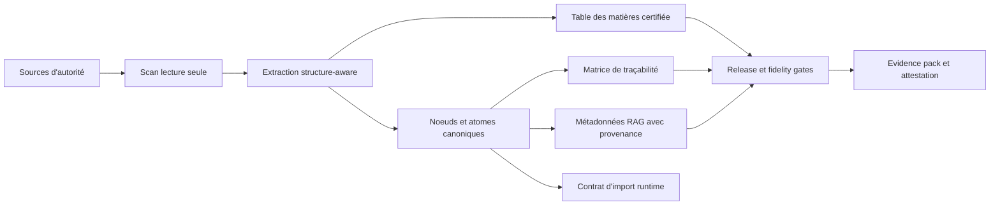

# Nomos

<p align="center">
  <strong>Le moteur authority-to-product pour les logiciels et les IA qui doivent rester fidèles à leurs sources gouvernées.</strong>
</p>

<p align="center">
  <a href="./README.md"><strong>Français</strong></a>
  ·
  <a href="./README.en.md">English</a>
  ·
  <a href="./README.de.md">Deutsch</a>
</p>

<p align="center">
  
  
  
  
</p>

Nomos transforme des références d'autorité en actifs produit contrôlés, traçables et auditables. Une référence d'autorité peut être une base de connaissance métier, une norme, une réglementation, une procédure qualité, un corpus juridique, un manuel technique, un livre de règles, une doctrine produit ou tout ensemble documentaire qui définit ce qu'un système a le droit de savoir, dire ou faire.

La version courte : **Nomos aide une équipe à prouver ce qu'un logiciel ou une IA sait, d'où vient ce savoir, comment il a été structuré, comment il a changé, ce qui a été ignoré, et si l'output livré reste aligné avec la référence gouvernée.**

Nomos ne remplace pas les experts métier, les responsables juridiques, les responsables qualité ou la source officielle. Il fournit la couche de transformation et de preuve qui maintient les applications, automatisations et systèmes IA/RAG alignés sur des références approuvées.

> Nomos ne rend pas une IA "autoritaire". Il rend explicite, testable et gouvernable le lien entre une source d'autorité et les artefacts que le logiciel ou l'IA consomme.

## Name

Nomos is named after the ancient Greek `nomos`: law, rule, custom, norm, and
the order that binds a community. In a Greco-Roman sense, it points to the
Canonical-First method: turning authoritative sources into traceable, testable,
and auditable product evidence before software or AI consumes them.

## En Un Coup D'oeil

| Dimension | Position actuelle |
|---|---|
| Produit | Moteur authority-to-product pour logiciels, IA et RAG gouvernés. |
| Release | `v0.1.0-ALPHA`. |
| Preuve actuelle | POC alpha sur un vrai corpus privé, traité en lecture seule. |
| Point fort déjà prouvé | Trajectoire source -> structure -> noeuds canoniques -> TOC -> feed/RAG source-backed -> body ledger -> strict gate -> attestation. |
| Limite assumée | L'alpha prouve un POC source-to-feed borné ; elle ne revendique pas encore une fidélité universelle ou une validation réglementaire client. |
| Prochain durcissement | Evidence CI répétée, formats documentaires additionnels, validation packs clients. |
| Claim boundary | Pas un eQMS certifié, pas un système GxP validé, pas une certification réglementaire. |

## Documentation Et Integration

Les guides d'exploitation et d'integration sont centralises dans [`docs/`](./docs/README.md):

- [`33-nomos-documentation-guide.md`](./docs/33-nomos-documentation-guide.md) : vue generale de NOMOS, audiences, artefacts, claim boundary et consommation downstream ;
- [`34-nomos-user-manual.md`](./docs/34-nomos-user-manual.md) : manuel utilisateur pour operer NOMOS, lire les outputs et verifier un run ;
- [`35-nomos-integration-manual.md`](./docs/35-nomos-integration-manual.md) : manuel d'integration GitHub/workflow/output/downstream application ;
- [`36-rbok-integration-recommendation-plan.md`](./docs/36-rbok-integration-recommendation-plan.md) : plan downstream RBOK, sans modification du repo RBOK depuis NOMOS ;
- [`37-rbok-nomos-recommendations-implementation-plan.md`](./docs/37-rbok-nomos-recommendations-implementation-plan.md) : plan d'implementation detaille des recommandations RBOK.
- [`38-domain-opportunity-roadmap.md`](./docs/38-domain-opportunity-roadmap.md) : analyse opportunites/domaines et backlog atomique pour GxP, medical, IA, finance, legal, Six Sigma, provenance, cyber et haute assurance.

## Pourquoi Nomos Existe

Beaucoup d'applications et de systèmes IA sont techniquement propres et pourtant faux. Le problème vient rarement du framework ou du modèle. Il vient d'une dérive invisible entre le système livré et la référence qu'il prétend appliquer :

- des règles métier copiées dans le code sans source ;
- des chunks RAG sans provenance ;
- des interfaces ou API pilotées par des exemples plutôt que par la doctrine ;
- des réponses LLM qui simplifient une nuance critique ;
- des documents sources modifiés sans traçabilité descendante ;
- des tests qui prouvent l'exécution technique mais pas l'autorité métier.

Nomos traite ce problème en faisant du corpus de référence une dépendance produit de premier ordre.



## Positionnement Produit

Nomos n'est ni un simple parseur documentaire, ni un pipeline RAG classique.

Un pipeline RAG conventionnel indexe des documents. Nomos contrôle et prouve la transformation avant que le logiciel ou l'IA la consomme :

- quelles sources d'autorité ont été admises ;
- si elles ont été traitées en lecture seule ;
- quelle structure a été détectée ;
- quelles unités canoniques ont été extraites ;
- quelles lignes, plages, hashes et locators supportent chaque unité ;
- ce qui a été exclu, ignoré, non supporté ou seulement partiellement couvert ;
- quels chunks sont utilisables pour le RAG et lesquels ne sont que de la preuve de ledger source ;
- quelle affirmation publique peut être défendue à partir de la preuve disponible.

Nomos est donc une couche de gouvernance et d'evidence pour les logiciels et IA ancrés dans des références d'autorité.

## Cas D'usage Cibles

Nomos est conçu pour les équipes qui ont besoin de comportements logiciels, réponses IA ou preuves d'audit appuyés par des sources :

- convertir une documentation métier en règles produit et contrats runtime ;
- gouverner des systèmes IA/RAG pour que chaque contenu exploité soit source-backed et versionné ;
- produire des matrices de traçabilité depuis des normes, procédures, politiques, lois ou corpus métier ;
- détecter la dérive entre documentation, implémentation, tests et output livré ;
- préparer des dossiers de validation, supplier packs ou evidence packs pour environnements exigeants ;
- exécuter des assessments de corpus en lecture seule avant import client ;
- documenter explicitement les limites au lieu de sur-vendre une fidélité non prouvée.

## Ce Que Livre v0.1.0-ALPHA

La release actuelle fournit une CLI et une chaîne d'evidence fonctionnelle pour les projets canonical-first :

- diagnostic de repository et contrôles d'admission projet ;
- commandes `strict`, `corpus scan`, `diff`, `manifest`, `validate-sidecar`, `feed`, `body-ledger` et `attest` ;
- guards de traitement corpus en lecture seule ;
- profil `rbok-lawbook` pour corpus Markdown structurés ;
- scanner structuré générique YAML/JSON avec chemins structurés et spans source exacts ;
- génération de table des matières certifiée ;
- spans source et noeuds sémantiques typés pour tables, liens, callouts, blocs de code et images ;
- extraction de lexique gouverné ;
- métadonnées RAG source-backed et artefacts d'import runtime ;
- ledger complet du corps source séparant contenu sémantique, structure, couverture, unsupported et binaire ;
- strict fidelity gate et intégration release gate ;
- sortie d'attestation de style in-toto ;
- squelette documentaire regulated-by-design, templates d'evidence et control records ;
- workflows CI pour Go, CUE, corpus, RBOK lawbook E2E, runtime E2E, fidelity proof reports, documentation régulée et evidence pack.

## Preuves Du POC Alpha

Nomos v0.1.0-ALPHA a été testé sur le vrai corpus privé `realisons-business/01_rbok`, dans des clones en lecture seule. RBOK est le premier corpus de preuve ; ce n'est pas le scope produit.

Trois enregistrements de preuve sont pertinents :

1. le record historique de la chaine lawbook alpha ;
2. l'audit source-to-feed initial, qui a exposé des gaps importants de qualité sémantique du feed ;
3. le POC source-to-feed structuré actuel, qui corrige ces gaps bloquants sur le run enregistré.

Record historique de la chaîne lawbook alpha :

| Point de preuve | Résultat |
|---|---:|
| Fichiers corpus scannés | 240 |
| Noeuds feed générés | 7191 |
| Entrées TOC certifiées | 1090 |
| Noeuds avec source span | 7191 / 7191 |
| Noeuds table | 65 |
| Noeuds bloc de code | 25 |
| Noeuds lien | 137 |
| Strict fidelity gate | pass, 0 blocking findings, 0 findings |
| Fidelity proof | `full_fidelity_proven` |
| Contrôle mutation source | aucune mutation détectée |

Ce record prouve que la chaîne actuelle peut traiter un vrai corpus de référence métier structuré sans écrire dans le repository source. Il ne prouve pas une fidélité universelle pour tous les formats documentaires ou tous les workflows clients régulés.

Audit source-to-feed initial, avant durcissement FSQ :

| Point de preuve | Résultat |
|---|---:|
| Sources corpus déclarées | 240 |
| Unités feed générées | 9500 |
| Chunks RAG générés | 9500 |
| Unités feed source-backed | 9500 / 9500 |
| Chunks RAG source-backed | 9500 / 9500 |
| Résumé strict source/feed | `source_integrity=pass (0 findings); feed_quality=pass (0 findings)` |
| Contrôle mutation source | aucune mutation détectée |

L'inspection directe du `feed.json` généré avait montré que le feed n'était pas sémantiquement prêt comme corps doctrinal/RAG final :

| Observation qualité feed | Résultat |
|---|---:|
| Sources avec unités générées | 88 / 240 |
| Unités `table_cell` | 3230 / 9500 |
| Unités avec <= 2 tokens | 3344 / 9500 |
| Unités avec <= 10 caractères | 2195 / 9500 |
| Unités dans des groupes de texte dupliqué | 3704 |

POC source-to-feed structuré actuel :

| Point de preuve | Résultat |
|---|---:|
| Evidence pack local | `C:\Dev\nomos-rbok-poc-run-20260504-structured-universal-9` |
| Commit corpus | `ea003e8fe3c35993731c3708a3787df6a3a690df` |
| Sources corpus déclarées | 240 |
| Unités feed générées | 3024 |
| Chunks RAG générés | 3024 |
| Unités feed source-backed | 3024 / 3024 |
| Chunks RAG source-backed | 3024 / 3024 |
| `table_cell` dans le feed | 0 |
| Unités <= 10 caractères | 0 |
| Groupes dupliqués bloquants | 0 |
| Semantic quality | `warn`, 0 finding bloquant, 6 warnings reviewables |
| Body ledger | 0 byte non couvert |
| Strict gate | `pass`, exit code 0 |
| Contrôle mutation source | aucune mutation détectée |

Cette distinction est essentielle. L'alpha actuelle prouve une traçabilité source-to-artifact défendable et un feed/RAG source-backed utilisable comme POC, tout en gardant une claim boundary stricte : les warnings restants sont reviewables, et cette preuve reste bornée au corpus, commit et build enregistrés (`claim_coverage` est désormais câblé dans l'attestation — `corpus attest --corpus-body-ledger` vérifie les preuves Merkle du ledger puis calcule la couverture ; le run POC enregistré garde son WARN historique). Le durcissement suivant vise la répétabilité CI, les formats documentaires additionnels, la validation client et l'extension de la fidélité universelle.

## Posture Regulated-Ready

Nomos est construit pour les équipes qui opèrent près d'environnements IT régulés, audités ou à haute intégrité. Le repository contient une structure operated-by-design couvrant :

- quality manual et bases SOP ;
- cycle de développement et validation logiciel ;
- métadonnées d'evidence ALCOA+ ;
- baseline electronic records / electronic signatures ;
- modele GitHub-native d'evidence et QMS operationnel ;
- contrôles de gouvernance IA/RAG ;
- templates validation pack et supplier pack ;
- gestion des références licenciées comme GAMP 5 et références ISO.

Le statut honnête :

- **implémenté :** outillage orienté evidence, squelettes documentaires régulés, gates, templates et preuves POC RBOK ;
- **partiellement implémenté :** fermeture reference-to-control, maturité des packs validation client, records opérationnels long terme ;
- **non revendiqué :** certification réglementaire formelle, plateforme Part 11 validée, validation GxP production, qualification mission-critical/NASA ou conformité légale universelle.

Voir [docs/public-claim-boundary.md](docs/public-claim-boundary.md) et [docs/regulated/README.md](docs/regulated/README.md).
Voir aussi [docs/release-v0.1.0-alpha.md](docs/release-v0.1.0-alpha.md) pour les notes de release et le gate de publication.

## Contexte Marché Et Valorisation

NOMOS recoupe plusieurs catégories logicielles établies (content/document control régulé, QMS et validation lifecycle management, gouvernance IA/RAG, vertical SaaS régulé). Pour préserver l'impartialité d'une évaluation externe, ce README ne propose ni fourchette de valeur ni auto-évaluation.

Les cadres neutres (capitalisation IAS 38 / Swiss GAAP RPC 10, comparables de catégorie, contexte des multiples) et l'état réel du produit (ce qui est implémenté, testé, prouvé) sont fournis comme intrants pour l'analyste dans le [pack d'évaluation externe](docs/external-assessment/) :

- [docs/external-assessment/evidence-and-maturity.md](docs/external-assessment/evidence-and-maturity.md) — preuves et maturité ;
- [docs/external-assessment/valuation-inputs.md](docs/external-assessment/valuation-inputs.md) — cadres et comparables, sans verdict.

## Concepts Clefs

- **Source d'autorité :** document, norme, réglementation, contrat, catalogue, codebase ou corpus ayant autorité produit.
- **Noeud canonique :** unité structurée extraite d'une source avec identité, source path, source hash, locator, parent chain, statut et domaine.
- **TOC certifiée :** arbre documentaire reconstruit avec hash de structure vérifiable.
- **Matrice de traçabilité :** lien entre sources, unités canoniques, contrats, implémentation, tests et preuves.
- **Métadonnées RAG :** métadonnées de retrieval préservant identité source et contexte de gouvernance.
- **Strict fidelity gate :** gate de release qui échoue sur absence de preuve, spans manquants, structure critique non typée, TOC invalide ou gaps bloquants.
- **Claim boundary :** énoncé public de ce que les preuves soutiennent et de ce qu'elles ne soutiennent pas.

## Quick Start CLI

Construire la CLI :

```bash
cd cli
go build -o ../nomos .
```

Afficher l'aide :

```bash
./nomos help
./nomos corpus help
```

Diagnostiquer un projet :

```bash
./nomos diagnose --root . --format json
```

Exécuter un profil corpus :

```bash
./nomos corpus diagnose --profile rbok-lawbook --root /path/to/01_rbok --format json
./nomos corpus feed \
  --profile rbok-lawbook \
  --root /path/to/01_rbok \
  --artifacts-dir /path/to/out \
  --corpus-id rbok-lawbook \
  --project-id rbok
```

Exécuter le script E2E RBOK lawbook :

```bash
bash scripts/rbok-lawbook-e2e.sh \
  --corpus /path/to/01_rbok \
  --out /path/to/out
```

Sur Windows, le gate E2E local est :

```powershell
powershell -NoProfile -ExecutionPolicy Bypass -File scripts\e2e.ps1
```

## Carte Du Repository

| Chemin | Role |
|---|---|
| `cli/` | CLI Go et moteurs corpus/fidelity/compliance. |
| `specs/` | Contrats CUE et JSON pour manifests projet, preuves corpus, feeds, TOC, contrôles IA/RAG, provenance et inventaire de validation. |
| `docs/` | Méthode, architecture, operating model, regulated-readiness, ADRs et dossiers de validation. |
| `docs/regulated/` | Structure regulated-by-design et baseline documentaire contrôlée. |
| `templates/` | Templates projet, réglementaires, validation, evidence et gouvernance. |
| `examples/` | Exemples de domaines appliquant la méthode canonical-first. |
| `adapters/` | Contrats adapter et profils de référence Node/TypeScript, Python et JVM : specs et fixtures, sans implémentation exécutable à ce stade. |
| `ci/` | Documentation d'intégration CI réutilisable. |
| `control-plane/` | Packages Go exploratoires archivés (dashboard, registry, storage) : zéro caller de production, gel acté par ADR-0006, réexamen au jalon portfolio v0.9.x. |
| `policies/` | Répertoire placeholder pour un futur cadre de policies ; non opérationnel à ce stade. |
| `scripts/` | Helpers E2E, evidence, documentation régulée et automatisation. |
| `reports/` | Artefacts locaux générés. |
| `references/` | Registre de références méthodologiques et externes. |

## Gates Qualité

Le processus de release utilise actuellement :

```bash
go test ./...                 # depuis cli/
powershell -File scripts/e2e.ps1
python -m unittest discover -s tests -v
```

GitHub Actions execute aussi CI, tests corpus Linux/macOS/Windows, RBOK lawbook E2E, RBOK runtime E2E, fidelity proof reports, regulated documentation gate et regulated evidence pack jobs.

## Ce Que Nomos Ne Revendique Pas

Nomos ne prétend pas qu'une source est vraie, légale, complète, licenciée ou applicable. Il enregistre d'où vient la source, comment elle a été transformée, ce qui est couvert, ce qui est ignoré, quelles preuves existent et ce qui doit encore être revu.

Nomos ne rend pas un LLM autoritaire. Dans l'architecture visée, les contrats déterministes et artefacts source-backed restent autoritaires ; les couches LLM et RAG citent, expliquent, récupèrent et assistent sous gouvernance.

Nomos ne supprime pas le besoin de validation. En environnement régulé, les clients doivent toujours définir intended use, risk assessment, validation plan, preuves de test, change control, supplier assessment, security review et approval records.

Nomos ne revendique pas aujourd'hui que son feed alpha est une reconstruction sémantique parfaite de tout corpus supporté. La roadmap feed-quality traite explicitement les formats documentaires non encore supportés, les warnings sémantiques résiduels, les validation packs clients et la répétabilité CI sur corpus privés.

## Roadmap Release

| Version | Cible |
|---|---|
| `v0.1.0-ALPHA` | Prouver la chaîne canonical corpus, le strict fidelity gate, le POC RBOK et la baseline documentaire regulated-readiness. |
| `v0.2.x` | Durcir l'atomisation portable au-delà du Markdown RBOK, améliorer la couverture YAML/JSON structurée et adapters documentaires, et étendre les validation packs. |
| `v0.3.x` | Stabiliser les contrats adapters, l'export evidence, le workflow validation client et les interfaces de gouvernance RAG. |
| `v1.0` | Release candidate production-grade avec support model, compatibility policy, evidence de validation et claim boundary audité. |

## Gouvernance

Les changements qui affectent les claims, release gates, corpus fidelity, posture regulated-readiness ou formats d'evidence doivent passer par issues, PRs, tests et documentation mise à jour. Voir [GOVERNANCE.md](GOVERNANCE.md) et [CONTRIBUTING.md](CONTRIBUTING.md).

## Licence Et Usage Commercial

Ce repository ne fournit actuellement pas de licence open source. Le code, la documentation, les templates et les exemples doivent être considérés propriétaires sauf licence écrite séparée ou accord commercial explicite.
