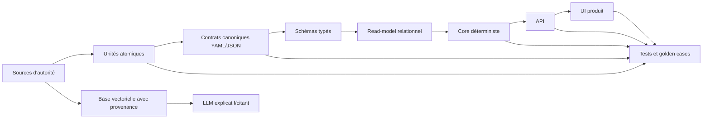

# Nomos

**Canonical Product Intelligence**

Méthode généralisable pour transformer des sources métier d'autorité en logiciel vérifiable, traçable et difficile à faire dériver par accident, y compris quand des agents IA participent au travail.

Nomos est née d'un constat simple : une application peut être techniquement propre et pourtant métier fausse si ses écrans, ses moteurs, ses catalogues ou ses réponses LLM consomment des données de démonstration, des interprétations cachées ou des fragments de règles non tracés. Le remède n'est pas "plus d'IA". Le remède est une chaîne d'autorité explicite, testée, gouvernée et auditée.

Nomos vient du grec `nomos` : loi, règle, norme. Le nom reflète l'objectif du projet : transformer les règles d'un domaine en preuves produit exécutables.

## Le Principe

Un projet Canonical-First traite les sources métier comme la première dépendance produit.



Règle dure : chaque couche consomme la couche précédente. Le LLM ne remplace jamais la donnée structurée. La base vectorielle sert à citer, expliquer et retrouver le contexte, pas à corriger le contrat produit. Le core métier ne dépend pas de l'UI, de la DB, du HTTP ou du LLM.

## Quand L'utiliser

La méthode est rentable quand au moins trois conditions sont vraies :

- Le métier dépend de sources externes d'autorité : lois, normes, contrats, PDF, catalogues, code legacy, procédures, données scientifiques, documentation propriétaire.
- Une décision produit doit pouvoir être rattachée à une source précise.
- Les ambiguïtés ou contradictions de sources sont probables.
- Un LLM ou un agent peut assister l'équipe et risque d'inventer, résumer trop fort ou écraser une nuance.
- Une régression métier silencieuse coûte plus cher que la friction d'une gate de conformité.
- Le projet a besoin d'un cycle d'évolution long, avec plusieurs humains et agents.

Domaines typiques : assurance, fiscalité, santé, pharma, banque, droit, RH, conventions collectives, normes industrielles, éducation, jeux à règles complexes, outillage scientifique, produit métier interne fortement réglementé.

## Les Invariants

- Une règle, une liste, un catalogue, une entité métier ou une exception existe dans le produit seulement si elle a une source ou un écart documenté.
- Une ligne de matrice sans preuve à chaque étape est non conforme.
- Les fixtures, samples et mocks ne peuvent pas alimenter une surface produit.
- Les ambiguïtés sont des objets gouvernés, pas des `if` cachés.
- Le core calcule ; le LLM explique, cite, reformule et assiste.
- Les sources ont un hash, un statut, une priorité, un propriétaire et une politique de changement.
- La promotion release nécessite une gate stricte verte ou une dérogation signée et tracée.

## Structure Du Dépôt

- `docs/01-method-overview.md` : vue complète et vocabulaire.
- `docs/02-source-registry.md` : inventaire, hash, priorité et statut des sources.
- `docs/03-atomization-and-matrix.md` : unité atomique et matrice de traçabilité fine.
- `docs/04-contracts-schemas-readmodels.md` : YAML/JSON, schémas, DB, loaders.
- `docs/05-knowledge-base-and-rag.md` : base vectorielle, chunks, metadata, citations.
- `docs/06-product-integration.md` : core, API, UI, agents, anti-contournement.
- `docs/07-tests-gates-release.md` : tests métier, gates CI, release.
- `docs/08-governance-and-change.md` : décisions, ambiguïtés, propriétaires, versions.
- `docs/09-adaptation-guide.md` : adapter à n'importe quelle stack et domaine.
- `docs/10-tools-and-projects-to-study.md` : outils et projets utiles à documenter ou évaluer.
- `docs/11-roadmap-and-issues.md` : plan v0.x vers v1.0 et issue list générique.
- `docs/12-operational-procedure.md` : procédure détaillée étape par étape.
- `docs/13-agent-skills-blueprint.md` : skills/agents généralisables.
- `docs/14-product-roadmap.md` : roadmap produit v0.1 -> v1.0 et architecture cible.
- `docs/15-product-backlog.md` : backlog concret d'epics/issues, dépendances et DoD.
- `docs/16-versioning-policy.md` : politique de versionning du coeur, des adapters et des schemas.
- `docs/21-regulated-quality-reference.md` : baseline qualité/compliance pour les marchés IT régulés.
- `docs/22-nomos-praxis-synergy-market-audit.md` : audit de synergie Nomos/Praxis, angles morts et positionnement marché.
- `docs/23-regulated-implementation-plan.md` : plan d'implémentation pour aligner Nomos avec ses exigences de conformité.
- `docs/verdict-taxonomy.md` : taxonomie des verdicts, niveaux de confiance et escalades.
- `references/methodological-references.md` : références méthodologiques et pourquoi elles comptent.
- `templates/` : fichiers copiables dans un projet.
- `examples/` : exemples courts par domaine.

## Product Layout

Le dépôt porte maintenant deux couches complémentaires :

- la couche méthode, dans `docs/`, `templates/`, `examples/` et `references/` ;
- la couche produit, dans `cli/`, `adapters/`, `policies/`, `attestations/`, `sdk/`, `control-plane/` et `specs/`.

Cette séparation permet de faire évoluer Nomos comme plateforme sans perdre la lisibilité méthodologique.

## Regulated-Grade Track

Nomos ne doit pas annoncer une posture régulée tant qu'il ne peut pas la prouver sur lui-même.

Le track régulé est maintenant gouverné par trois documents :

- `docs/21-regulated-quality-reference.md` définit les niveaux `NQ-0` à `NQ-6`, les familles de contrôles et les règles de non-surpromesse.
- `docs/22-nomos-praxis-synergy-market-audit.md` compare la thèse Nomos/Praxis aux attentes du marché ALM, validation lifecycle, test management et evidence/CAPA.
- `docs/23-regulated-implementation-plan.md` transforme l'audit en phases d'implémentation, dépendances GitHub, gates et règles d'alignement documentaire.

Le prochain seuil crédible est `NQ-3` : Nomos build/test green, références externes gouvernées, self-compliance exécutable, métadonnées ALCOA+, validation pack initial et claims publics limités au niveau de preuve réel.

## Quick Start

1. Créer `docs/canonical/source-manifest.yaml`.
2. Lister toutes les sources, même celles jugées mauvaises, doublons ou hors scope.
3. Attribuer hash, type, priorité, statut et propriétaire à chaque source.
4. Atomiser les sources en unités : règle, clause, compétence, acte médical, garantie, taxe, exception, formulaire, etc.
5. Créer `docs/canonical/<domain>-matrix.yaml` avec une ligne par unité.
6. Définir le contrat produit en YAML/JSON, puis le schéma typé.
7. Charger un read-model relationnel depuis le contrat, pas depuis l'UI.
8. Indexer tout le corpus en base vectorielle avec metadata de provenance.
9. Connecter une première surface produit end-to-end.
10. Installer les gates `canonical:check`, `canonical:check:strict` et `release:compliance`.

## Local Environment

Pour cette copie locale du repo, un toolchain minimal a ete installe dans `.tools/` :

- Go `1.26.2`
- CUE `0.16.1`

Activer le PATH local :

```bash
source scripts/nomos-env.sh
```

## Gates Standards

```text
validate
  typecheck + lint + tests + canonical:check

canonical:check
  manifest complet
  sources hashées
  matrice synchronisée
  contrats valides
  metadata source présente

canonical:check:strict
  aucune surface produit sur sample/mock
  aucune unité critique partielle
  aucune source active non indexée
  aucun écart non justifié

release:compliance
  strict vert
  rapport de couverture
  golden cases métier
  ADR/changelog
  plan rollback
```

## Phasage Recommandé

- `v0.1` : corpus, manifest, glossaire, premières unités.
- `v0.2` : devlab, core minimal, contrats et loaders.
- `v0.3` : matrice complète, suppression des données inventées, strict partiellement activé.
- `v0.4` : produit connecté uniquement aux read-models.
- `v0.5` : workflow d'édition contrôlé et résolution d'ambiguïtés.
- `v0.6` : assistant LLM cité, évalué et observable.
- `v1.0` : release durcie, audit, backup, rollback, documentation utilisateur.

## Ce Que Cette Méthode Ne Fait Pas

Elle ne garantit pas que les sources sont vraies. Elle garantit que le produit dit d'où vient ce qu'il applique, ce qui manque, ce qui est contesté, ce qui a été décidé et ce qui est testé.

Elle n'impose pas TypeScript, Python, Postgres ou un framework donné. Elle impose une séparation de responsabilité : source, contrat, schéma, read-model, core, RAG, API, UI, tests.
