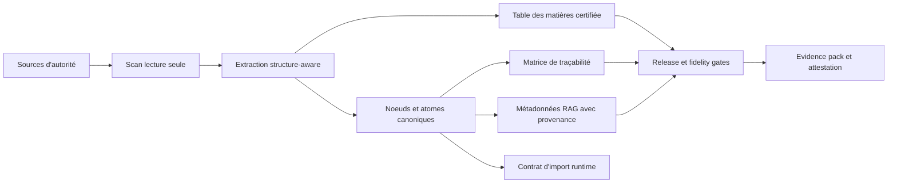

# Nomos

<p align="center">
  <strong>Le moteur authority-to-product pour les logiciels et les IA qui doivent rester fidèles à leurs sources gouvernées.</strong>
</p>

<p align="center">
  <a href="./README.md"><strong>Français</strong></a>
  ·
  <a href="./README.en.md">English</a>
  ·
  <a href="./README.de.md">Deutsch</a>
</p>

<p align="center">
  
  
  
  
</p>

Nomos transforme des références d'autorité en actifs produit contrôlés, traçables et auditables. Une référence d'autorité peut être une base de connaissance métier, une norme, une réglementation, une procédure qualité, un corpus juridique, un manuel technique, un livre de règles, une doctrine produit ou tout ensemble documentaire qui définit ce qu'un système a le droit de savoir, dire ou faire.

La version courte : **Nomos aide une équipe à prouver ce qu'un logiciel ou une IA sait, d'où vient ce savoir, comment il a été structuré, comment il a changé, ce qui a été ignoré, et si l'output livré reste aligné avec la référence gouvernée.**

Nomos ne remplace pas les experts métier, les responsables juridiques, les responsables qualité ou la source officielle. Il fournit la couche de transformation et de preuve qui maintient les applications, automatisations et systèmes IA/RAG alignés sur des références approuvées.

> Nomos ne rend pas une IA "autoritaire". Il rend explicite, testable et gouvernable le lien entre une source d'autorité et les artefacts que le logiciel ou l'IA consomme.

## Name

Nomos is named after the ancient Greek `nomos`: law, rule, custom, norm, and
the order that binds a community. In a Greco-Roman sense, it points to the
Canonical-First method: turning authoritative sources into traceable, testable,
and auditable product evidence before software or AI consumes them.

## En Un Coup D'oeil

| Dimension | Position actuelle |
|---|---|
| Produit | Moteur authority-to-product pour logiciels, IA et RAG gouvernés. |
| Release | `v0.2.0-ALPHA` (2026-09-06, pre-release ; décision enregistrée dans `docs/regulated/lifecycle/release-records/`). |
| Preuve actuelle | POC alpha sur un vrai corpus privé, traité en lecture seule. |
| Point fort déjà prouvé | Trajectoire source -> structure -> noeuds canoniques -> TOC -> feed/RAG source-backed -> body ledger -> strict gate -> attestation ; puis, dans le moteur Go : gate cite-or-abstain (fidélité recalculée depuis les spans, jamais déclarée), harnais d'évaluation RAG en CI, export RAG interopérable à staleness prouvable, bench public reproductible du gate. |
| Registre de capacités | 57 capacités déclarées dans `scripts/vrc_wiring_matrix_registry.json` ; leur statut est CALCULÉ depuis l'arbre à chaque CI (44 réelles, 11 sidecar, 2 absentes par conception, 0 écart) — [`.vrc-wiring-matrix/wiring-matrix.md`](./.vrc-wiring-matrix/wiring-matrix.md). Le statut de portefeuille (`nomos portfolio status|findings`) est calculé depuis les sources machine et publié en artefact CI. |
| Roadmaps | Produit, DevOps et assurance régulée avancent indépendamment (ADR-VRC-0004). Seules les issues `dispatch:autonomous` entrent dans le dispatcher ; calendrier, signatures, achats et écritures publiques bloquent leur claim, jamais le développement — [`docs/47`](./docs/47-roadmap-lanes-and-risk-based-validation.md). |
| Limite assumée | L'alpha prouve un POC source-to-feed borné ; elle ne revendique pas encore une fidélité universelle ou une validation réglementaire client. Le bench public mesure le gate sur neuf items, pas un produit. |
| Prochain durcissement | Vague v1.0 ouverte (#676–#681) : registre de stabilité des contrats, matrice de compatibilité générée, processus sécurité exécutable, modèle de support vérifié, guide d'intégration rejoué, verdict de readiness calculé — jamais « released » ; la release reste un acte régulé (#561). Les deux capacités `absent` sont l'émission Sigstore production (#638) et le control-plane retiré (ADR-0007). |
| Claim boundary | Pas un eQMS certifié, pas un système GxP validé, pas une certification réglementaire. |

## Documentation Et Integration

Les guides d'exploitation et d'integration sont centralises dans [`docs/`](./docs/README.md):

- [`33-nomos-documentation-guide.md`](./docs/33-nomos-documentation-guide.md) : vue generale de NOMOS, audiences, artefacts, claim boundary et consommation downstream ;
- [`34-nomos-user-manual.md`](./docs/34-nomos-user-manual.md) : manuel utilisateur pour operer NOMOS, lire les outputs et verifier un run ;
- [`35-nomos-integration-manual.md`](./docs/35-nomos-integration-manual.md) : manuel d'integration GitHub/workflow/output/downstream application ;
- [`36-rbok-integration-recommendation-plan.md`](./docs/36-rbok-integration-recommendation-plan.md) : plan downstream RBOK, sans modification du repo RBOK depuis NOMOS ;
- [`37-rbok-nomos-recommendations-implementation-plan.md`](./docs/37-rbok-nomos-recommendations-implementation-plan.md) : plan d'implementation detaille des recommandations RBOK.
- [`38-domain-opportunity-roadmap.md`](./docs/38-domain-opportunity-roadmap.md) : analyse opportunites/domaines et backlog atomique pour GxP, medical, IA, finance, legal, Six Sigma, provenance, cyber et haute assurance ;
- [`05-knowledge-base-and-rag.md`](./docs/05-knowledge-base-and-rag.md) : base de connaissance et RAG gouvernés — gate cite-or-abstain, harnais d'évaluation, scorer NLI enfichable, export interopérable, bench public ;
- [`43-development-doctrine.md`](./docs/43-development-doctrine.md) : doctrine de développement — résultat calculé, preuve adversariale ; un sidecar décrit une topologie hors core, tandis que livraison et validation sont suivies séparément ;
- [`45-vision-reality-closure-plan.md`](./docs/45-vision-reality-closure-plan.md) et [`46-vrc-epic-issue-list.md`](./docs/46-vrc-epic-issue-list.md) : plan de fermeture vision/réalité et ses issues VRC ;
- [`47-roadmap-lanes-and-risk-based-validation.md`](./docs/47-roadmap-lanes-and-risk-based-validation.md) et [`roadmap-lanes.yaml`](./docs/roadmap-lanes.yaml) : roadmaps produit/DevOps/régulée indépendantes, dispatcher autonome et validation des outils régulés basée sur le risque ;
- [`public-claim-boundary.md`](./docs/public-claim-boundary.md) : ce que les preuves soutiennent et ce qu'elles ne soutiennent pas, capacité par capacité ;
- [`.vrc-wiring-matrix/wiring-matrix.md`](./.vrc-wiring-matrix/wiring-matrix.md) : la matrice de câblage générée, statut calculé de chaque capacité.

## Pourquoi Nomos Existe

Beaucoup d'applications et de systèmes IA sont techniquement propres et pourtant faux. Le problème vient rarement du framework ou du modèle. Il vient d'une dérive invisible entre le système livré et la référence qu'il prétend appliquer :

- des règles métier copiées dans le code sans source ;
- des chunks RAG sans provenance ;
- des interfaces ou API pilotées par des exemples plutôt que par la doctrine ;
- des réponses LLM qui simplifient une nuance critique ;
- des documents sources modifiés sans traçabilité descendante ;
- des tests qui prouvent l'exécution technique mais pas l'autorité métier.

Nomos traite ce problème en faisant du corpus de référence une dépendance produit de premier ordre.



## Positionnement Produit

Nomos n'est ni un simple parseur documentaire, ni un pipeline RAG classique.

Un pipeline RAG conventionnel indexe des documents. Nomos contrôle et prouve la transformation avant que le logiciel ou l'IA la consomme :

- quelles sources d'autorité ont été admises ;
- si elles ont été traitées en lecture seule ;
- quelle structure a été détectée ;
- quelles unités canoniques ont été extraites ;
- quelles lignes, plages, hashes et locators supportent chaque unité ;
- ce qui a été exclu, ignoré, non supporté ou seulement partiellement couvert ;
- quels chunks sont utilisables pour le RAG et lesquels ne sont que de la preuve de ledger source ;
- quelle affirmation publique peut être défendue à partir de la preuve disponible.

Nomos est donc une couche de gouvernance et d'evidence pour les logiciels et IA ancrés dans des références d'autorité.

## Cas D'usage Cibles

Nomos est conçu pour les équipes qui ont besoin de comportements logiciels, réponses IA ou preuves d'audit appuyés par des sources :

- convertir une documentation métier en règles produit et contrats runtime ;
- gouverner des systèmes IA/RAG pour que chaque contenu exploité soit source-backed et versionné ;
- produire des matrices de traçabilité depuis des normes, procédures, politiques, lois ou corpus métier ;
- détecter la dérive entre documentation, implémentation, tests et output livré ;
- préparer des dossiers de validation, supplier packs ou evidence packs pour environnements exigeants ;
- exécuter des assessments de corpus en lecture seule avant import client ;
- documenter explicitement les limites au lieu de sur-vendre une fidélité non prouvée.

## Ce Que Livre v0.2.0-ALPHA

La baseline v0.1.0-ALPHA (2026-05-03) fournit une CLI et une chaîne d'evidence fonctionnelle pour les projets canonical-first :

- diagnostic de repository et contrôles d'admission projet ;
- commandes `strict`, `corpus scan`, `diff`, `manifest`, `validate-sidecar`, `feed`, `body-ledger` et `attest` ;
- guards de traitement corpus en lecture seule ;
- profil `rbok-lawbook` pour corpus Markdown structurés ;
- scanner structuré générique YAML/JSON avec chemins structurés et spans source exacts ;
- génération de table des matières certifiée ;
- spans source et noeuds sémantiques typés pour tables, liens, callouts, blocs de code et images ;
- extraction de lexique gouverné ;
- métadonnées RAG source-backed et artefacts d'import runtime ;
- ledger complet du corps source séparant contenu sémantique, structure, couverture, unsupported et binaire ;
- strict fidelity gate et intégration release gate ;
- sortie d'attestation de style in-toto ;
- squelette documentaire regulated-by-design, templates d'evidence et control records ;
- workflows CI pour Go, CUE, corpus, RBOK lawbook E2E, runtime E2E, fidelity proof reports, documentation régulée et evidence pack.

Depuis la première alpha, le moteur a gagné les capacités suivantes (v0.2.0-ALPHA, 2026-09-06). Chacune est une entrée du registre de capacités dont le statut est calculé en CI depuis les ancres de l'arbre (moteur, appelant de production, test adversarial, gate CI) ; une capacité volontairement hors core est comptée `sidecar`, jamais `real` — c'est une topologie, pas son état de livraison ou de validation régulée :

- **gate cite-or-abstain dans le moteur** (`nomos answer gate`, VRC-10) : fidélité recalculée depuis le texte des spans retrouvés, jamais prise d'un score déclaré ; citation falsifiée, span sans texte ou réponse sans source → abstention forcée ; `trust_tier` par réponse ; second juge NLI enfichable (`--scorer-cmd`, le plus strict gagne, fail-closed, aucun modèle dans le moteur) ; le sidecar d'évidence Python consomme ce verdict au lieu d'en produire un ;
- **harnais d'évaluation RAG** (`nomos answer eval`, VRC-13) : corpus doré, seuils versionnés, `context_recall`, `context_precision` pondérée par le rang et `noise_sensitivity` ; une régression sous le plancher bloque la PR ;
- **bench public cite-or-abstain** (`nomos answer bench`, VRC-46) : corpus étiqueté sur les documents publics du dépôt, résultats datés, porte de reproduction en CI (sources verbatim et non déplacées, références vérifiées et datées, déterminisme, bornes, mesure identique au publié) ;
- **export RAG interopérable** (`nomos rag export|manifest|delta|verify`) : chunks indexables et citables pour n'importe quelle pile RAG, empreinte de l'index par source, plan de réindexation exact, gate de staleness, export scopé par Knowledge Lens avec contrat de retrieval calculé ;
- **atomisation CKM** : facettes dérivées, Knowledge Lens dans le moteur et la CLI, promotion de canon (jamais `certified`, silo de confidentialité), résolveur point-in-time, Canonical Knowledge Bundle, alignement d'ontologie de facettes rendu par le gate de pack ;
- **preuve et attestation** : signature ECDSA P-256 DSSE, preuves Merkle du body ledger émises et vérifiées, `claim_coverage` calculée dans l'attestation, prédicat supply-chain in-toto, evidence packs en BOM CycloneDX/SPDX recoupés avec le ledger ;
- **packs de domaine et adaptateurs** : `nomos pack validate` sur contrat déclaratif, kits de capacité par adaptateur, adaptateurs PDF et DOCX nés numériques (échelle de claims explicite), connecteur suisse live (fetch réel, hash réel) ;
- **gardes de vérité** : matrice de câblage calculée (VRC-00), guard claim-boundary sur les mots « signé / Sigstore / certifié », guard de couplage core/pack, sidecar HHEM et kits de retrieval/conformité de référence (comptés `sidecar`).
- **sources externes** : contrat web-source (#610), snapshot externe immuable vérifié et importé (#611), E2E hors ligne Recursio → NOMOS avec attestation portant le type web et la couverture du snapshot (#612) ; vraies références publiques capturées hash-only avec artefacts retenus hors dépôt (#644) ; revue de licence et no-full-text réel (#641) ;
- **release et Sigstore** : bundle candidat vérifié sur contenu et statuts, approbation jamais inventée, rehearsal CI sans publication (#639) ; vérification hors ligne de bundles Sigstore fournis et émission keyless contre services injectés non-production, derrière une frontière de process (ADR-0005, #637, #645) ; l'émission production reste interdite (#638) ;
- **Nomos/Praxis** : contrat d'echange d'evidence, fixture de mapping d'atomes, gate d'activation calculé — `blocked` aujourd'hui, jamais `activated` (#660–#662) ;
- **gouvernance de portefeuille** : `nomos portfolio status|findings|reviews|projects` calculés depuis les sources machine, index des records de revue, control-plane tranché par ADR-0007 (#667–#670) ; vocabulaires SKOS authored et distribués de façon déterministe (#643).

## Preuves Du POC Alpha

Nomos v0.1.0-ALPHA a été testé sur le vrai corpus privé `realisons-business/01_rbok`, dans des clones en lecture seule. RBOK est le premier corpus de preuve ; ce n'est pas le scope produit.

Trois enregistrements de preuve sont pertinents :

1. le record historique de la chaine lawbook alpha ;
2. l'audit source-to-feed initial, qui a exposé des gaps importants de qualité sémantique du feed ;
3. le POC source-to-feed structuré actuel, qui corrige ces gaps bloquants sur le run enregistré.

Record historique de la chaîne lawbook alpha :

| Point de preuve | Résultat |
|---|---:|
| Fichiers corpus scannés | 240 |
| Noeuds feed générés | 7191 |
| Entrées TOC certifiées | 1090 |
| Noeuds avec source span | 7191 / 7191 |
| Noeuds table | 65 |
| Noeuds bloc de code | 25 |
| Noeuds lien | 137 |
| Strict fidelity gate | pass, 0 blocking findings, 0 findings |
| Fidelity proof | `full_fidelity_proven` |
| Contrôle mutation source | aucune mutation détectée |

Ce record prouve que la chaîne actuelle peut traiter un vrai corpus de référence métier structuré sans écrire dans le repository source. Il ne prouve pas une fidélité universelle pour tous les formats documentaires ou tous les workflows clients régulés.

Audit source-to-feed initial, avant durcissement FSQ :

| Point de preuve | Résultat |
|---|---:|
| Sources corpus déclarées | 240 |
| Unités feed générées | 9500 |
| Chunks RAG générés | 9500 |
| Unités feed source-backed | 9500 / 9500 |
| Chunks RAG source-backed | 9500 / 9500 |
| Résumé strict source/feed | `source_integrity=pass (0 findings); feed_quality=pass (0 findings)` |
| Contrôle mutation source | aucune mutation détectée |

L'inspection directe du `feed.json` généré avait montré que le feed n'était pas sémantiquement prêt comme corps doctrinal/RAG final :

| Observation qualité feed | Résultat |
|---|---:|
| Sources avec unités générées | 88 / 240 |
| Unités `table_cell` | 3230 / 9500 |
| Unités avec <= 2 tokens | 3344 / 9500 |
| Unités avec <= 10 caractères | 2195 / 9500 |
| Unités dans des groupes de texte dupliqué | 3704 |

POC source-to-feed structuré actuel :

| Point de preuve | Résultat |
|---|---:|
| Evidence pack local | `C:\Dev\nomos-rbok-poc-run-20260504-structured-universal-9` |
| Commit corpus | `ea003e8fe3c35993731c3708a3787df6a3a690df` |
| Sources corpus déclarées | 240 |
| Unités feed générées | 3024 |
| Chunks RAG générés | 3024 |
| Unités feed source-backed | 3024 / 3024 |
| Chunks RAG source-backed | 3024 / 3024 |
| `table_cell` dans le feed | 0 |
| Unités <= 10 caractères | 0 |
| Groupes dupliqués bloquants | 0 |
| Semantic quality | `warn`, 0 finding bloquant, 6 warnings reviewables |
| Body ledger | 0 byte non couvert |
| Strict gate | `pass`, exit code 0 |
| Contrôle mutation source | aucune mutation détectée |

Cette distinction est essentielle. L'alpha actuelle prouve une traçabilité source-to-artifact défendable et un feed/RAG source-backed utilisable comme POC, tout en gardant une claim boundary stricte : les warnings restants sont reviewables, et cette preuve reste bornée au corpus, commit et build enregistrés (`claim_coverage` est désormais câblé dans l'attestation — `corpus attest --corpus-body-ledger` vérifie les preuves Merkle du ledger puis calcule la couverture ; le run POC enregistré garde son WARN historique). Le durcissement **produit** vise les formats documentaires et la fidélité portable. En parallèle, la roadmap régulée mesure la répétabilité CI et la validation client sans les transformer en dépendances produit : VRC-14 #560 compte 4 runs verts consécutifs sur 8 au 2026-09-04, donc son claim reste verrouillé pendant que les autres lanes continuent.

## Preuves Calculées En Continu

Au-delà du POC enregistré, deux preuves sont recalculées à chaque CI et échouent sur toute dérive :

| Preuve | Résultat courant | Comment il est tenu |
|---|---|---|
| Matrice de câblage (VRC-00) | 40 capacités, 0 écart entre registre et arbre, 0 commande fantôme | `scripts/vrc_wiring_matrix.py` ; le fichier généré est comparé au commit |
| Bench public cite-or-abstain (VRC-46, résultat du 2026-09-05, proxy lexical) | 9 items : `must_cite_recall` 1.0 (3/3), `must_abstain_recall` 0.8333 (5/6), `false_cite_rate` 0.1667 — le seul faux « cite » est la négation, angle mort documenté du proxy | `scripts/cite_or_abstain_bench.py` : sources verbatim et non déplacées, références vérifiées et datées, deux runs octet pour octet identiques, bornes versionnées, mesure identique au résultat publié |

Méthodologie, corpus, seuils et résultats datés : [`docs/regulated/ai-rag-governance/cite-or-abstain-bench/`](./docs/regulated/ai-rag-governance/cite-or-abstain-bench/README.md).

## Posture Regulated-Ready

Nomos est construit pour les équipes qui opèrent près d'environnements IT régulés, audités ou à haute intégrité. Le repository contient une structure operated-by-design couvrant :

- quality manual et bases SOP ;
- cycle de développement et validation logiciel ;
- métadonnées d'evidence ALCOA+ ;
- baseline electronic records / electronic signatures ;
- modele GitHub-native d'evidence et QMS operationnel ;
- contrôles de gouvernance IA/RAG ;
- templates validation pack et supplier pack ;
- gestion des références licenciées comme GAMP 5 et références ISO.

Le statut honnête :

- **implémenté :** outillage orienté evidence, squelettes documentaires régulés, gates, templates et preuves POC RBOK ;
- **partiellement implémenté :** fermeture reference-to-control, maturité des packs validation client, records opérationnels long terme ;
- **non revendiqué :** certification réglementaire formelle, plateforme Part 11 validée, validation GxP production, qualification mission-critical/NASA ou conformité légale universelle.

Voir [docs/public-claim-boundary.md](docs/public-claim-boundary.md) et [docs/regulated/README.md](docs/regulated/README.md).
Voir aussi [docs/release-v0.1.0-alpha.md](docs/release-v0.1.0-alpha.md) pour les notes de release et le gate de publication.

## Contexte Marché Et Valorisation

NOMOS recoupe plusieurs catégories logicielles établies (content/document control régulé, QMS et validation lifecycle management, gouvernance IA/RAG, vertical SaaS régulé). Pour préserver l'impartialité d'une évaluation externe, ce README ne propose ni fourchette de valeur ni auto-évaluation.

Les cadres neutres (capitalisation IAS 38 / Swiss GAAP RPC 10, comparables de catégorie, contexte des multiples) et l'état réel du produit (ce qui est implémenté, testé, prouvé) sont fournis comme intrants pour l'analyste dans le [pack d'évaluation externe](docs/external-assessment/) :

- [docs/external-assessment/evidence-and-maturity.md](docs/external-assessment/evidence-and-maturity.md) — preuves et maturité ;
- [docs/external-assessment/valuation-inputs.md](docs/external-assessment/valuation-inputs.md) — cadres et comparables, sans verdict.

## Concepts Clefs

- **Source d'autorité :** document, norme, réglementation, contrat, catalogue, codebase ou corpus ayant autorité produit.
- **Noeud canonique :** unité structurée extraite d'une source avec identité, source path, source hash, locator, parent chain, statut et domaine.
- **TOC certifiée :** arbre documentaire reconstruit avec hash de structure vérifiable.
- **Matrice de traçabilité :** lien entre sources, unités canoniques, contrats, implémentation, tests et preuves.
- **Métadonnées RAG :** métadonnées de retrieval préservant identité source et contexte de gouvernance.
- **Strict fidelity gate :** gate de release qui échoue sur absence de preuve, spans manquants, structure critique non typée, TOC invalide ou gaps bloquants.
- **Claim boundary :** énoncé public de ce que les preuves soutiennent et de ce qu'elles ne soutiennent pas.

## Quick Start CLI

Construire la CLI :

```bash
cd cli
go build -o ../nomos .
```

Afficher l'aide :

```bash
./nomos help
./nomos corpus help
```

Diagnostiquer un projet :

```bash
./nomos diagnose --root . --format json
```

Passer le gate cite-or-abstain, rejouer le harnais et le bench public :

```bash
./nomos answer gate --fixtures docs/regulated/ai-rag-governance/rag-answer-fixtures.yaml
./nomos answer eval \
  --corpus docs/regulated/ai-rag-governance/rag-eval-corpus.yaml \
  --thresholds docs/regulated/ai-rag-governance/rag-eval-thresholds.yaml
./nomos answer bench \
  --corpus docs/regulated/ai-rag-governance/cite-or-abstain-bench/corpus.yaml \
  --thresholds docs/regulated/ai-rag-governance/cite-or-abstain-bench/bench-thresholds.yaml
python3 scripts/cite_or_abstain_bench.py --root . --nomos-bin ./nomos   # rejoue le résultat publié, rouge sur toute dérive
```

Exporter vers une pile RAG, empreinter l'index et prouver sa fraîcheur :

```bash
./nomos rag export --feed /path/to/out/feed.json --format jsonl --strict --output chunks.jsonl
./nomos rag manifest --feed /path/to/out/feed.json --output index-manifest.json
./nomos rag delta --old index-manifest.json --new index-manifest.next.json      # plan exact : embed / update_metadata / delete
./nomos rag verify --feed /path/to/out/feed.json --manifest index-manifest.json --strict   # exit 1 si l'index est périmé
```

Exécuter un profil corpus :

```bash
./nomos corpus diagnose --profile rbok-lawbook --root /path/to/01_rbok --format json
./nomos corpus feed \
  --profile rbok-lawbook \
  --root /path/to/01_rbok \
  --artifacts-dir /path/to/out \
  --corpus-id rbok-lawbook \
  --project-id rbok
```

Exécuter le script E2E RBOK lawbook :

```bash
bash scripts/rbok-lawbook-e2e.sh \
  --corpus /path/to/01_rbok \
  --out /path/to/out
```

Sur Windows, le gate E2E local est :

```powershell
powershell -NoProfile -ExecutionPolicy Bypass -File scripts\e2e.ps1
```

## Carte Du Repository

| Chemin | Role |
|---|---|
| `cli/` | CLI Go et moteurs corpus/fidelity/compliance. |
| `specs/` | Contrats CUE et JSON pour manifests projet, preuves corpus, feeds, TOC, contrôles IA/RAG, provenance et inventaire de validation. |
| `docs/` | Méthode, architecture, operating model, regulated-readiness, ADRs et dossiers de validation. |
| `docs/regulated/` | Structure regulated-by-design et baseline documentaire contrôlée. |
| `templates/` | Templates projet, réglementaires, validation, evidence et gouvernance. |
| `examples/` | Exemples de domaines appliquant la méthode canonical-first. |
| `adapters/` | Contrats adapter et profils de référence Node/TypeScript, Python et JVM : specs et fixtures, sans implémentation exécutable à ce stade. |
| `ci/` | Documentation d'intégration CI réutilisable. |
| `policies/` | Répertoire placeholder pour un futur cadre de policies ; non opérationnel à ce stade. |
| `scripts/` | Helpers E2E, evidence, documentation régulée et automatisation ; registre de capacités (`vrc_wiring_matrix_registry.json`), guards (matrice de câblage, claim boundary, couplage core/pack), gates RAG et bench, sidecars (evidence RAG, scorer HHEM, kits de référence). |
| `.vrc-wiring-matrix/` | Matrice de câblage GÉNÉRÉE (JSON + Markdown) : statut de chaque capacité calculé depuis l'arbre ; toute édition manuelle ou dérive est rouge en CI. |
| `attestations/` | Contrats CUE des attestations in-toto et prédicat signé de claim boundary. |
| `tests/` | Tests Python des workflows, sidecars, guards et gates (adversariaux : la preuve est l'échec attendu). |
| `reports/` | Artefacts locaux générés. |
| `references/` | Registre de références méthodologiques et externes. |

## Gates Qualité

Le processus de release utilise actuellement :

```bash
go vet ./... && go test -race ./...            # depuis cli/
python -m unittest discover -s tests -v        # tests Python (pyyaml requis ; construit le moteur Go pour les gates qui le consomment)
python scripts/claim_boundary_guard.py --root .          # aucun « signé / Sigstore / certifié » sans preuve
python scripts/roadmap_lane_guard.py --root .             # aucune attente humaine/externe dans la file autonome
python scripts/vrc_wiring_matrix.py --root .             # matrice de câblage : registre et arbre en lockstep
python scripts/cite_or_abstain_bench.py --root .         # bench public : le résultat publié se rejoue
python scripts/security_process_gate.py --root . --check --scan govulncheck,pip-audit   # processus sécurité : scans réels, allowlist à expiration
python scripts/support_model_guard.py --root . --check     # modèle de support : matrice CI, go.mod, tags, sections générées
bash scripts/ckm-non-regression.sh             # harnais CKM-00 : CLI, CUE, Python, e2e, RBOK, gate cite-or-abstain
powershell -File scripts/e2e.ps1
```

GitHub Actions exécute : CI (Go vet & test, gate de pack de domaine, harnais RAG eval, gate d'export RAG, replay du bench public, tests corpus Linux/macOS/Windows, CUE vet, YAML lint, tests Python avec guard claim-boundary et matrice de câblage sans dérive), harnais CKM non-régression, RBOK lawbook E2E, RBOK runtime E2E, fidelity proof reports, regulated documentation gate et regulated evidence pack (dont l'évidence RAG consommant le verdict du moteur construit).

## Ce Que Nomos Ne Revendique Pas

Nomos ne prétend pas qu'une source est vraie, légale, complète, licenciée ou applicable. Il enregistre d'où vient la source, comment elle a été transformée, ce qui est couvert, ce qui est ignoré, quelles preuves existent et ce qui doit encore être revu.

Nomos ne rend pas un LLM autoritaire. Dans l'architecture visée, les contrats déterministes et artefacts source-backed restent autoritaires ; les couches LLM et RAG citent, expliquent, récupèrent et assistent sous gouvernance.

Nomos ne supprime pas le besoin de validation. En environnement régulé, les clients doivent toujours définir intended use, risk assessment, validation plan, preuves de test, change control, supplier assessment, security review et approval records.

Nomos ne revendique pas aujourd'hui que son feed alpha est une reconstruction sémantique parfaite de tout corpus supporté. La roadmap produit feed-quality traite les formats documentaires non supportés et les warnings sémantiques ; la roadmap régulée indépendante traite validation packs clients et répétabilité privée (4/8), sans bloquer la première.

Le gate cite-or-abstain et son bench public mesurent le gate, pas un LLM : le proxy de fidélité est lexical et aveugle à la négation (dit dans chaque verdict, publié comme faux « cite » dans le bench) ; le second juge NLI est un protocole vérifié, pas un modèle livré, et aucun run CI ne score avec un modèle neuronal. Le bench ne dit rien sur la qualité d'un retrieval, d'un embedding ou d'un LLM, ni sur la justesse métier d'une réponse.

Nomos n'embarque pas de signature keyless Sigstore : l'attestation est signée localement (ECDSA P-256 DSSE) et le guard claim-boundary refuse toute prose qui prétendrait plus.

## Roadmap Release

| Version | Cible |
|---|---|
| `v0.1.0-ALPHA` (2026-05-03) | Livrée : chaîne canonical corpus, strict fidelity gate, POC RBOK, baseline documentaire regulated-readiness. |
| `v0.2.0-ALPHA` (2026-09-06) | Livrée : clôture vision/réalité (`docs/45`), vagues v0.2–v0.6 et v0.9 de `docs/29` (fidélité portable, références, bundle candidat, contrat Praxis, gouvernance de portefeuille), Sigstore hors production. |
| `v1.0` | Ouverte (#676–#681) : registre de stabilité des contrats, matrice de compatibilité, processus sécurité, modèle de support, guide d'intégration rejoué, verdict de readiness calculé. La release elle-même reste un acte régulé (#561). |

## Support

Le support est déclaré dans `docs/support-model.yaml` et vérifié en CI par `scripts/support_model_guard.py` (plateformes = matrice CI, Go = `cli/go.mod`, versions = tags ou candidat courant, dates = CHANGELOG) ; la section ci-dessous est générée depuis ce modèle.

<!-- support-model:begin -->
<!-- GENERATED from docs/support-model.yaml by scripts/support_model_guard.py --write; do not edit by hand, CI fails on drift -->

| Version | Released | State | Security support | End of support |
|---|---|---|---|---|
| `v0.2.0-ALPHA` | 2026-09-06 | supported | best-effort alpha triage (current release) | until the next tagged release |
| `v0.1.0-ALPHA` | 2026-05-03 | superseded | none — superseded by v0.2.0-ALPHA | 2026-09-06 |

- Current candidate: `v0.2.0-ALPHA` (the CLI `Version` constant).
- Channels: github_issues — https://github.com/decarvalhoe/NOMOS/issues (bugs, questions, integration); github_private_advisory — https://github.com/decarvalhoe/NOMOS/security/advisories/new (vulnerabilities (docs/security/security-process.yaml)); support_guide — SUPPORT.md (what alpha support covers and what requires project-specific work).
- Response targets (declared, not, measured): github_issues — first response within 10 days; github_private_advisory — per docs/security/security-process.yaml.
- Tested platforms (CI matrix): ubuntu-latest, macos-latest, windows-latest.
- Toolchain: Go 1.24.1 (language) / go1.26.6 (toolchain) from cli/go.mod; CUE v0.16.1; Python 3.12.
- Not supported: hosted service (Nomos is a CLI and an evidence toolchain; no hosted endpoint exists or is operated.); control plane (archived by ADR-0006 and decided by ADR-0007 — `nomos portfolio projects` is a view over committed files, not a production control plane.); GitHub App (readiness boundary only (docs/32-github-app-readiness-boundary.md); no app is published or operated.); production deployment (customer-owned (docs/regulated/customer-integration); the alpha proves the method, not a deployment.); regulated validation package approval (regulated lane, human and external acts (docs/28-regulated-compliance-closure-plan.md).).
- End of support: An alpha version is supported until the next tagged release; only the newest tag receives security triage. No version outside this list is supported, and no version becomes supported by being listed here without a tag.
- Supported contracts (15 stable, per specs/contract-registry.yaml): `canon-promotion`, `canonical-knowledge-bundle`, `canonical-matrix`, `corpus-body-ledger`, `corpus-integrity-report`, `domain-pack`, `external-snapshot`, `facets`, `knowledge-lens`, `nomos-praxis-evidence-schema`, `nomos-project`, `nomos-report.schema`, `point-in-time`, `source-manifest`, `verdicts`. Contracts registered as experimental in specs/contract-registry.yaml may change without a MAJOR notice (docs/16); they are listed as such where a guide relies on them and are not part of the supported surface.
- Covered commands: `nomos version`, `nomos contracts status`, `nomos init`, `nomos validate`, `nomos diagnose`, `nomos strict`, `nomos corpus scan`, `nomos corpus feed`, `nomos corpus body-ledger`, `nomos corpus attest`, `nomos corpus snapshot`, `nomos github plan`, `nomos portfolio status`, `nomos portfolio release-readiness`, `nomos bundle`, `nomos rag export`, `nomos rag manifest`, `nomos rag delta`, `nomos rag verify`, `nomos answer gate`, `nomos answer eval`.
- Guides replayed in CI: docs/48-customer-integration-guide.md, docs/50-cross-consumption-proof-kit.md.
<!-- support-model:end -->

## Gouvernance

Les changements qui affectent les claims, release gates, corpus fidelity, posture regulated-readiness ou formats d'evidence doivent passer par issues, PRs, tests et documentation mise à jour. Voir [GOVERNANCE.md](GOVERNANCE.md) et [CONTRIBUTING.md](CONTRIBUTING.md).

## Licence Et Usage Commercial

Ce repository ne fournit actuellement pas de licence open source. Le code, la documentation, les templates et les exemples doivent être considérés propriétaires sauf licence écrite séparée ou accord commercial explicite.
