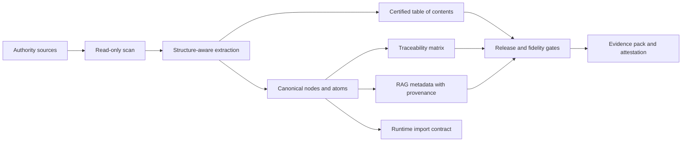

# Nomos

**Canonical Product Intelligence for systems that must stay faithful to their source of authority.**

Nomos turns business, legal, regulatory, procedural, or technical reference material into traceable product evidence: structured source inventories, canonical units, document trees, typed artifacts, release gates, RAG metadata, attestations, and validation records.

The short version: Nomos helps teams prove what a product knows, where it came from, how it changed, and whether the shipped output still matches the governed reference.

## Release Status

Current release: **v0.1.0-ALPHA**.

This is an alpha release. It is suitable for pilots, corpus assessment, architecture validation, regulated-readiness work, and internal proof-of-concept pipelines. It is not a certified quality-management system, not an eQMS, not a validated GxP system, and not a substitute for customer-side validation, legal review, security review, or regulated supplier qualification.

## Why Nomos Exists

Many business applications are technically clean and still wrong. The failure mode is usually not the framework. It is hidden drift between the product and the reference material:

- business rules copied into code without a source;
- RAG chunks without provenance;
- UI or API behavior driven by samples or demos;
- LLM answers that summarize away a critical nuance;
- source documents updated without downstream traceability;
- tests proving code execution but not business authority.

Nomos addresses that gap by making the reference corpus the first-class product dependency.



## What v0.1.0-ALPHA Delivers

The current release provides a working CLI and evidence pipeline for canonical-first projects:

- repository diagnosis and project admission checks;
- corpus scan, manifest, diff, sidecar validation, feed, and attestation commands;
- read-only corpus processing guards;
- RBOK lawbook profile for structured Markdown reference corpora;
- certified table-of-contents generation;
- source spans and typed semantic nodes for tables, links, callouts, code blocks, and images;
- governed lexicon extraction;
- RAG metadata and runtime import artifacts;
- strict fidelity gate and release gate integration;
- in-toto style attestation output;
- regulated-by-design documentation skeleton, evidence templates, and control records;
- CI workflows for Go, CUE, corpus, RBOK lawbook E2E, runtime E2E, fidelity proof reports, regulated documentation, and evidence pack generation.

## Evidence From The Alpha POC

Nomos v0.1.0-ALPHA was tested on the real `realisons-business/01_rbok` corpus in a read-only clone.

Observed POC output:

| Evidence point | Result |
|---|---|
| Corpus files scanned | 240 |
| Feed nodes generated | 7191 |
| Certified TOC entries | 1090 |
| Source-spanned nodes | 7191 / 7191 |
| Table nodes | 65 |
| Code block nodes | 25 |
| Link nodes | 137 |
| Strict fidelity gate | pass, 0 blocking findings, 0 findings |
| Fidelity proof | `full_fidelity_proven` |
| Source mutation check | no source mutation detected |

This proves the current pipeline can process a real structured business reference corpus without writing into the source repository. It does not prove universal fidelity for every document format or every regulated customer workflow.

## Regulated-Readiness Position

Nomos is built for teams that operate near regulated, audited, or high-integrity IT environments. The repository contains a growing regulated-by-design operating structure covering:

- quality manual and SOP baselines;
- software development and validation lifecycle documents;
- ALCOA+ evidence metadata;
- electronic records and signature policy baseline;
- GitHub-native evidence and QMS operating model;
- AI/RAG governance controls;
- validation-pack and supplier-pack templates;
- reference-basis management for licensed standards such as GAMP 5 and ISO references.

The honest status is:

- **implemented:** evidence-oriented tooling, regulated documentation skeletons, gates, templates, and RBOK POC evidence;
- **partially implemented:** reference-to-control closure, customer-facing validation pack maturity, long-term operational records;
- **not claimed:** formal regulatory certification, Part 11 validated platform status, GxP production validation, NASA/mission-critical qualification, or universal legal compliance.

See [docs/public-claim-boundary.md](docs/public-claim-boundary.md) and [docs/regulated/README.md](docs/regulated/README.md).

## Core Concepts

- **Authority source:** a document, standard, regulation, contract, catalog, codebase, or corpus that has product authority.
- **Canonical node:** a structured unit extracted from a source with identity, source path, source hash, locator, parent chain, status, and domain.
- **Certified TOC:** a reconstructed document tree with verifiable structure hash.
- **Traceability matrix:** the link between sources, canonical units, contracts, implementation, tests, and evidence.
- **RAG metadata:** retrieval metadata that preserves source identity and governance context.
- **Strict fidelity gate:** a release gate that fails on missing proof, missing spans, untyped critical structure, invalid TOC, or other blocking evidence gaps.
- **Claim boundary:** the public statement of what the evidence supports and what it does not.

## CLI Quick Start

Build the CLI:

```bash
cd cli
go build -o ../nomos .
```

Print help:

```bash
./nomos help
./nomos corpus help
```

Diagnose a project:

```bash
./nomos diagnose --root . --format json
```

Run a corpus profile:

```bash
./nomos corpus diagnose --profile rbok-lawbook --root /path/to/01_rbok --format json
./nomos corpus feed \
  --profile rbok-lawbook \
  --root /path/to/01_rbok \
  --artifacts-dir /path/to/out \
  --corpus-id rbok-lawbook \
  --project-id rbok
```

Run the RBOK lawbook E2E script:

```bash
bash scripts/rbok-lawbook-e2e.sh \
  --corpus /path/to/01_rbok \
  --out /path/to/out
```

On Windows, the local E2E gate is:

```powershell
powershell -NoProfile -ExecutionPolicy Bypass -File scripts\e2e.ps1
```

## Repository Map

| Path | Purpose |
|---|---|
| `cli/` | Go CLI and corpus/fidelity/compliance engines. |
| `specs/` | CUE and JSON contracts for project manifests, corpus evidence, feed artifacts, TOC, AI/RAG controls, provenance, and validation inventory. |
| `docs/` | Method, architecture, operating model, regulated-readiness documents, ADRs, and validation dossiers. |
| `docs/regulated/` | Regulated-by-design operating structure and controlled-document baseline. |
| `templates/` | Copyable project, regulated, validation, evidence, and governance templates. |
| `examples/` | Domain examples for applying the canonical-first method. |
| `adapters/` | Adapter contract and early adapter profiles for Node/TypeScript, Python, and JVM ecosystems. |
| `ci/` | Reusable CI integration documentation. |
| `control-plane/` | Optional Go control-plane packages for dashboard, registry, and storage. |
| `scripts/` | E2E, evidence, regulated documentation, and automation helpers. |
| `reports/` | Generated local evidence artifacts. |
| `references/` | Methodological and external reference register material. |

## Quality Gates

The release process currently uses:

```bash
go test ./...                 # from cli/
powershell -File scripts/e2e.ps1
python -m unittest discover -s tests -v
```

GitHub Actions additionally run CI, corpus tests on Linux/macOS/Windows, RBOK lawbook E2E, RBOK runtime E2E, fidelity proof reports, regulated documentation gate, and regulated evidence pack jobs.

## What Nomos Does Not Claim

Nomos does not claim that a source is true, lawful, complete, licensed, or applicable. It records where source material came from, how it was transformed, what was covered, what was skipped, what evidence exists, and what still requires review.

Nomos does not make an LLM authoritative. In the intended architecture, deterministic contracts and source-backed artifacts remain authoritative; LLM and RAG layers cite, explain, retrieve, and assist under governance.

Nomos does not remove the need for validation. In regulated environments, customers still need intended-use definition, risk assessment, validation planning, test evidence, change control, supplier assessment, security review, and approval records.

## Release Roadmap

| Version | Target |
|---|---|
| `v0.1.0-ALPHA` | Prove the canonical corpus pipeline, strict fidelity gate, RBOK POC, and regulated-readiness documentation baseline. |
| `v0.2.x` | Harden portable atomization beyond RBOK Markdown, improve structured YAML/JSON and document adapter coverage, expand validation packs. |
| `v0.3.x` | Stabilize adapter contracts, evidence export, customer validation workflow, and RAG governance interfaces. |
| `v1.0` | Production-grade release candidate with documented support model, compatibility policy, validation evidence, and audited claim boundary. |

## Governance

Changes that affect claims, release gates, corpus fidelity, regulated-readiness posture, or evidence format must be reviewed through issues, PRs, tests, and updated documentation. See [GOVERNANCE.md](GOVERNANCE.md) and [CONTRIBUTING.md](CONTRIBUTING.md).

## License And Commercial Use

This repository currently does not grant an open-source license. Treat the code, documentation, templates, and examples as proprietary unless a separate written license or commercial agreement says otherwise.
