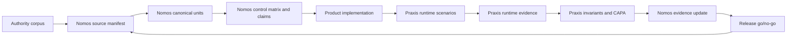

# 22 - Nomos/Praxis Synergy, Regulated Market, And Blind-Spot Audit

Date: 2026-05-02

Scope:

- Nomos current documentation and regulated baseline PR #148.
- Praxis current documentation and project status.
- Existing Nomos issues #124-#147 and Praxis issues #247-#253.
- Public references from regulated software, ALM, validation lifecycle, test management, and software assurance markets.

This report is intentionally action-oriented. It is written to be converted into epics/issues.

## Executive Verdict

Nomos and Praxis have a credible combined product thesis, but not yet a credible regulated product chain.

The strongest positioning is:

```text
Nomos = source authority and canonical product law.
Praxis = runtime conformance evidence and CAPA loop.
Nomos + Praxis = canonical-to-runtime regulated evidence chain.
```

This is materially different from classical ALM or validation tools, because Nomos starts from messy business authority corpora and attempts to transform them into governed executable law. Praxis then tests whether implemented products actually obey that law.

The current weakness is the seam between them. The products are separately promising, but the joint evidence model, regulatory parity, validation lifecycle, e-signature/audit-trail controls, and independent review model are not yet implemented.

Current state:

- Nomos: strong method and product roadmap; current main is red; self-compliance and regulated controls are not yet operational.
- Praxis: stronger runtime evidence/CAPA primitives; not yet qualified as regulated evidence tooling; current documentation presents known gaps and prior RBOK smoke findings.
- Joint chain: conceptually strong; contract and gates not yet real.

Immediate recommendation:

1. Keep Nomos #138 as the parent regulated-grade epic.
2. Keep Praxis #247 as the compatibility epic.
3. Keep Praxis #253 as deferred but mandatory parity boundary.
4. Add issue candidates from this report only after PR #148 is merged or explicitly accepted as the reference baseline.

## Product Claims Versus Current Documentation

### Nomos Announced Product Claim

Nomos documentation claims a "Canonical Product Intelligence" method and platform: transform authoritative business sources into traceable, verifiable product behavior, with fail-closed gates, machine-readable evidence, attestations, and admission boundaries.

Local evidence:

- `README.md`: "transformer des sources metier d'autorite en logiciel verifiable, tracable..."
- `docs/01-method-overview.md`: source -> unit -> canonical contract -> schema -> read-model -> deterministic core -> API/UI/tests.
- `docs/14-product-roadmap.md`: Nomos should admit/refuse projects, run reproducible checks, produce machine-readable evidence, block promotion when evidence is insufficient.
- `docs/21-regulated-quality-reference.md`: now defines NQ levels, ALCOA+, Part 11/Annex 11/NASA/NIST alignment, and Nomos/Praxis boundary.

Current gap:

Nomos has the right doctrine but not enough operational proof. The red CI state after PR #123 makes any regulated-grade claim indefensible until the baseline is green.

### Praxis Announced Product Claim

Praxis documentation claims a universal product testing engine: analyze a codebase, reconcile feature catalogs, execute API/browser/UAT scenarios, capture runtime evidence, compute coverage, and produce CAPA-style reports.

Local evidence:

- `README.md`: analyzer -> specifier -> tester -> reporter.
- `docs/ARCHITECTURE.md`: evidence before narrative, contracts over heuristics, runtime evidence, invariant framework, evidence-backed coverage.
- `docs/RBOK_SMOKE_TEST.md`: monotonic smoke test against a real RBOK clone.
- `praxis/audit/*`: CAPA report, standards references, gap analysis, evidence hash.

Current gap:

Praxis is closer to runtime proof than Nomos, but it is not yet itself a regulated evidence system. If Praxis outputs become release/CAPA/validation evidence, Praxis must be validated and governed with the same discipline as Nomos.

### Combined Claim

The combined claim is not "Nomos plus a test runner." It is stronger:

```text
authoritative corpus
  -> canonical product law
  -> implementation
  -> runtime proof
  -> CAPA
  -> controlled law/product update
```

This is the product thesis worth defending.

## Synergy Model



Nomos owns:

- source authority;
- source read-only policy;
- canonical unit identity;
- lawbook/feed/schema contracts;
- provenance and attestations;
- control matrix;
- claim governance;
- release evidence boundaries.

Praxis owns:

- product surface reconstruction;
- project packs;
- personas and auth;
- UAT/API/browser execution;
- runtime evidence;
- invariants;
- coverage tiers;
- regression history;
- CAPA reports.

Shared ownership:

- evidence IDs;
- severity and verdict taxonomy;
- release go/no-go;
- deviations/waivers;
- traceability from claim to product behavior;
- controlled feedback loop.

## Regulated Market Baseline

Regulated products and regulated tooling converge on the same hard requirements:

- requirements and risk traceability;
- review and approval workflows;
- baselines and versioned records;
- electronic signatures where records are used for regulated decisions;
- audit trail with previous values preserved;
- risk-based validation;
- objective evidence and test execution records;
- data integrity metadata;
- supplier/tool qualification;
- secure SDLC and supply-chain provenance.

Primary regulatory anchors:

- FDA 21 CFR 11.10 requires closed-system controls such as validation, record protection, audit trails, authority checks, device checks, training, policies, and documentation controls: https://www.ecfr.gov/current/title-21/chapter-I/subchapter-A/part-11/subpart-B/section-11.10
- FDA Computer Software Assurance recommends a risk-based approach to establish confidence in production/quality system automation: https://www.fda.gov/regulatory-information/search-fda-guidance-documents/computer-software-assurance-production-and-quality-system-software
- EudraLex Annex 11 frames computerized systems around validation, risk management, suppliers, security, audit trails, data, business continuity, and periodic evaluation: https://health.ec.europa.eu/system/files/2016-11/annex11_01-2011_en_0.pdf
- NASA software engineering requirements cover acquisition, development, maintenance, retirement, operations, and management; NASA also points to formal inspections and software assurance guidance: https://www.nasa.gov/intelligent-systems-division/software-management-office/nasa-software-engineering-procedural-requirements-standards-and-related-resources/
- NIST SSDF defines secure software development practices and a supplier/customer vocabulary: https://csrc.nist.gov/pubs/sp/800/218/final
- NIST SP 800-53 provides the broad control families relevant to security/privacy assurance: access control, audit/accountability, configuration management, risk assessment, system integrity, supply chain, etc.: https://csrc.nist.gov/Pubs/sp/800/53/r5/upd1/Final

Implication for Nomos/Praxis:

The bar is not "produce a nice traceability report." The bar is "maintain a validated, reconstructible evidence system with controlled records and governance."

## Equivalent Product Landscape

### ALM / Requirements / Risk / Test Traceability

Examples:

- Siemens Polarion ALM: requirements, test cases, individual test records, electronic signatures, uniquely identifiable document paragraphs, review/approval before production: https://www.siemens.com/en-us/products/polarion/application-lifecycle-management-alm/
- IBM DOORS / DOORS Next: requirements management, traceability through testing and lifecycle artifacts, audit compliance, electronic signatures/baselines in mature DOORS: https://www.ibm.com/products/requirements-management
- PTC Codebeamer: requirements, risk, test management, end-to-end traceability, baselines, review histories, audit-ready documentation; supports safety-critical standards and AI inside controlled workflows: https://www.ptc.com/en/products/codebeamer
- Jama Connect: industry-standard to requirement/test traceability, risk workflows, live traceability, and test case generation with human oversight/audit readiness: https://support.jamasoftware.com/hc/en-us/articles/29067096619149-Managing-Industry-Standards-in-Jama-Connect

How they position:

- central source of requirements/risk/tests;
- workflow, approval, and baseline authority;
- enterprise collaboration;
- traceability and audit reports.

Nomos/Praxis difference:

- Nomos can start from unstructured or semi-structured authority corpora and derive product law.
- Praxis can prove product runtime behavior against that law.
- Existing ALM tools usually assume requirements are already authored in the tool or imported into a structured model.

Nomos/Praxis weakness versus them:

- no mature multi-user workflow;
- no e-signatures;
- no baselined approval lifecycle;
- no ReqIF/ALM import/export;
- no role-based review/approval model;
- no mature variant/configuration management.

### Validation Lifecycle Management / QMS Tools

Examples:

- Veeva Vault Validation Management: validation inventory, requirements, validation deliverables, paperless test execution, traceability and summary reports, roles such as system owner, approver, independent reviewer, quality unit: https://quality.veevavault.help/en/lr/50533904/
- ValGenesis VLMS: validation lifecycle management for GxP validation, digital validation platform, CSA/GxP positioning: https://www.valgenesis.com/about
- MasterControl validation services/tools: risk assessment, testing recommendations, usage testing summary, final validation report: https://www.mastercontrol.com/validation

How they position:

- manage validation inventory;
- author requirements/protocols/scripts;
- execute paperless validation;
- capture exceptions/discrepancies;
- route approvals and quality unit review;
- produce validation summary.

Nomos/Praxis difference:

- Nomos/Praxis can become more developer-native and source-controlled.
- They can connect business authority, code, runtime, and CAPA at a finer engineering granularity.

Nomos/Praxis weakness versus them:

- no validation inventory item/version model;
- no protocol authoring/execution workflow;
- no discrepancy lifecycle;
- no periodic review;
- no quality unit approval role;
- no formal validation summary workflow;
- no electronic execution/signature controls.

### Software Testing / Traceability / Compliance Tools

Examples:

- Parasoft: requirements traceability down to tests, source files, quality metrics; used for standards such as ISO 26262, DO-178C, IEC 62304, IEC 61508, EN 50128: https://www.parasoft.com/learning-center/requirements-traceability/
- OpenText ALM/Quality Center: requirements-driven, risk-based quality management and traceability matrix: https://www.opentext.com/products/alm-quality-center
- Tricentis qTest: governance and traceability for testing, releases, and AI initiatives: https://www.tricentis.com/products/unified-test-management-qtest

How they position:

- connect requirements to tests and defects;
- execute/manage tests;
- report test status and coverage;
- integrate with ALM/DevOps;
- support audit evidence.

Nomos/Praxis difference:

- Praxis is closer to product behavior reconstruction and UAT packs than raw test management.
- Nomos gives Praxis a stronger source-of-truth model than ordinary test case catalogs.

Nomos/Praxis weakness versus them:

- Praxis has no mature test management UI;
- no broad integration to ALM/test result ecosystems;
- no structural coverage or safety-critical code metrics;
- no certified tool qualification story;
- no mature defect lifecycle beyond CAPA concepts.

## Positioning Opportunity

Nomos/Praxis should not try to become "another Polarion" immediately.

The sharper category is:

**Canonical Evidence Lifecycle for regulated software.**

Position:

- upstream of ALM when authority sources are not yet structured requirements;
- adjacent to ALM when canonical units need to sync with requirements, tests, issues, and releases;
- downstream into runtime through Praxis;
- evidence-native for AI-assisted, corpus-heavy, brownfield products.

Market message that can be defended after implementation:

> Nomos turns authoritative domain references into governed product law. Praxis proves whether the running product obeys that law. Together they produce a reconstructible evidence chain for regulated software teams.

Do not claim:

- certified;
- Part 11 compliant;
- GxP ready;
- NASA-grade;
- ALM replacement;
- validation lifecycle replacement;
- any-domain fully automatic conversion.

Until evidence exists, the defensible wording is:

- regulated-grade candidate;
- validation-pack ready after NQ-5/PQ parity;
- supports regulated evidence workflows when deployed with validated controls.

## Blind Spots

### BS-01: The Joint Evidence Contract Is The Main Missing Product

Nomos and Praxis need a shared schema before synergy is real.

Missing:

- canonical `claim_id`;
- mapping from Nomos units to Praxis feature specs;
- stable `scenario_id` and `test_id`;
- CAPA-to-control update path;
- shared artifact hash model;
- verdict/severity compatibility;
- release evidence bundle.

Existing tracking:

- Nomos #144.
- Praxis #250.

### BS-02: Regulatory Parity Is Currently One-Sided

Nomos now has a regulated baseline. Praxis has a parity note (#253), but no actual parity plan.

Risk:

If Praxis reports are used for release/CAPA evidence while Praxis itself is unqualified, the whole chain becomes weak.

Needed:

- Praxis regulated reference;
- Praxis-on-Praxis self-compliance;
- Praxis ALCOA evidence model;
- Praxis validation pack;
- Praxis claim governance.

Existing tracking:

- Praxis #253.

### BS-03: No Electronic Signature / Approval / Authority Model

Regulated systems need defined authority checks and approvals.

Missing:

- owner roles;
- independent reviewer role;
- quality unit/release authority;
- e-signature semantics;
- approval workflow history;
- record locking after approval;
- dual approval for waivers/deviations.

This is a major gap versus Polarion, DOORS, Veeva, and Codebeamer.

### BS-04: No Formal Validation Inventory And Intended-Use Model

Nomos and Praxis need inventory and intended-use records for themselves and for each deployment.

Missing:

- tool inventory item;
- versioned validation entity;
- deployment intended use;
- regulated/non-regulated mode boundary;
- risk class;
- validation status;
- periodic review schedule.

This is a major gap versus Veeva/ValGenesis style validation lifecycle systems.

### BS-05: Source Change Impact Is Not Closed Through Runtime

Nomos can detect source/corpus changes conceptually. Praxis can test product behavior conceptually. The missing part is automated impact propagation.

Needed flow:

```text
source hash changed
  -> impacted units
  -> impacted claims
  -> impacted product surfaces
  -> impacted Praxis scenarios/invariants
  -> required re-test set
  -> release block until passed or waived
```

### BS-06: AI Governance Is Under-Specified

Both products use or plan AI-assisted steps. Regulated use requires boundaries.

Missing:

- deterministic-first extraction rule enforced;
- model/version/prompt traceability;
- prompt injection fixtures;
- hallucination/citation evals;
- low-confidence escalation;
- human review workflow;
- audit trail for AI suggestions accepted/rejected.

### BS-07: Tool Qualification Is Missing

If Nomos/Praxis are used to create or verify regulated records, users will need confidence that the tools themselves are fit for intended use.

Missing:

- tool classification;
- supplier assessment pack;
- release validation certificate or equivalent evidence;
- known limitations per version;
- installation qualification / operational qualification / performance qualification guidance where applicable;
- environment compatibility matrix.

### BS-08: Enterprise Integrations Are Missing

The market expects interoperability.

Important formats/interfaces:

- ReqIF for requirements exchange;
- OpenAPI for API contracts;
- JUnit/xUnit for test results;
- SARIF for static findings;
- CycloneDX/SPDX for dependencies;
- SLSA/in-toto for provenance;
- OpenLineage or PROV-O mapping for lineage;
- GitHub/GitLab/Jira/Azure DevOps links.

Nomos mentions several of these, but the operational adoption story is incomplete.

### BS-09: Runtime Evidence In Praxis Still Needs Hardening

Praxis docs show the right direction, but existing findings and limitations show gaps:

- weak backend analysis in prior RBOK run due to file extension/path detection bugs;
- weak frontend API-call detection for dynamic wrappers;
- auth endpoint configurability issues;
- UI action coverage counts reachability more than actual clicks;
- strict schema validation historically loose;
- project packs are intentionally focused, not full production catalogs.

This does not invalidate Praxis. It means Praxis is not yet ready to be used as regulated evidence without parity hardening.

### BS-10: Control Plane And Evidence Retention Are Not Mature

Regulated evidence must be retained and retrievable.

Missing:

- immutable evidence store;
- report retention policy;
- audit-trail export;
- historical trend and periodic review;
- access control;
- backup/restore verification;
- disaster recovery and business continuity evidence.

## Strategic Architecture Recommendation

Create three layers, not two:

```text
Layer 1 - Nomos Canonical Authority
  source manifest, corpus feed, unit law, control matrix, claims, provenance

Layer 2 - Praxis Execution Evidence
  project pack, scenarios, runtime evidence, invariants, coverage, CAPA

Layer 3 - Joint Regulated Evidence Ledger
  approved records, signatures, waivers, deviations, validation summaries, release decisions, retention
```

Without Layer 3, Nomos/Praxis stay developer tools. With Layer 3, they can become a regulated evidence system.

Do not put all of Layer 3 into Nomos or Praxis prematurely. Define it as a shared contract first, then decide whether it lives in Nomos control plane, Praxis reports, or a separate evidence ledger.

## Actionable Issues

These rows were materialized as GitHub issues on 2026-05-02.

| ID | Repo | Priority | Title | Issue | Done when |
|---|---|---|---|---|---|
| SYN-001 | Nomos | P0 | Define joint evidence ledger contract | Nomos #149 | Schema covers claim/control/unit/scenario/finding/CAPA/release IDs and validates fixtures. |
| SYN-002 | Praxis | P0 | Consume joint evidence ledger contract | Praxis #250 | Praxis validates Nomos evidence fixtures and emits compatible CAPA/runtime evidence. |
| SYN-003 | Nomos | P0 | Add release evidence bundle format | Nomos #150 | Bundle includes Nomos report, control matrix, ALCOA report, Praxis evidence link, CAPA status, waivers, provenance, go/no-go. |
| SYN-004 | Praxis | P1 | Define Praxis regulated parity reference | Praxis #253 | Praxis doc defines PQ levels, intended use, parity triggers, controls, artifacts, and non-claims. |
| SYN-005 | Praxis | P1 | Implement Praxis-on-Praxis self-compliance gate | Praxis #254 | Praxis can audit itself and produce ALCOA/CAPA/provenance evidence. |
| SYN-006 | Nomos | P1 | Add impact analysis from source change to required Praxis tests | Nomos #154 | Source hash change produces impacted units, claims, scenarios, and required re-test set. |
| SYN-007 | Nomos/Praxis | P1 | Add scenario selection from Nomos impacted claims | Nomos #155 | Praxis can run only scenarios linked to changed Nomos claims and report residual gaps. |
| SYN-008 | Nomos | P1 | Add e-signature and approval semantics to evidence records | Nomos #152 | Controls define signer identity, meaning, timestamp, locked record, prior-value preservation. |
| SYN-009 | Nomos | P1 | Define independent review and quality-unit roles | Nomos #153 | Release cannot pass regulated gate without reviewer/quality decision records. |
| SYN-010 | Nomos | P1 | Build validation inventory/intended-use model | Nomos #151 | Each Nomos/Praxis deployment has inventory item, versioned validation entity, risk class, validation status. |
| SYN-011 | Praxis | P1 | Add validated project pack certification status | Praxis #255 | Project packs declare draft/validated/retired status, reviewer, version, scope, evidence hash. |
| SYN-012 | Nomos | P1 | Add ReqIF/export/import compatibility decision | Nomos #156 | Decide support level for external ALM tools and add fixture/export mapping. |
| SYN-013 | Nomos | P2 | Add market positioning and non-claim governance page | Nomos #157 | README/website claims map to evidence levels and explicitly avoid unsupported claims. |
| SYN-014 | Praxis | P2 | Add runtime evidence retention and trend model | Praxis #256 | Reports have retention metadata, run lineage, comparison history, and immutable hash chain. |
| SYN-015 | Nomos | P2 | Define regulated demo reference architecture | Nomos #158 | RBOK demo shows Nomos lawbook -> product -> Praxis runtime evidence -> CAPA -> release gate. |

## Issue Bundle Recommendation

Do not create all issues at once unless the team is ready to execute. The clean backlog split is:

### Bundle A - Joint Evidence MVP

- SYN-001 / Nomos #149
- SYN-002 / Praxis #250
- SYN-003 / Nomos #150
- SYN-006 / Nomos #154
- SYN-007 / Nomos #155

Goal: make the Nomos/Praxis seam real.

### Bundle B - Regulated Parity

- SYN-004 / Praxis #253
- SYN-005 / Praxis #254
- SYN-008 / Nomos #152
- SYN-009 / Nomos #153
- SYN-010 / Nomos #151
- SYN-011 / Praxis #255

Goal: make the evidence chain defensible in a regulated context.

### Bundle C - Market And Interop

- SYN-012 / Nomos #156
- SYN-013 / Nomos #157
- SYN-014 / Praxis #256
- SYN-015 / Nomos #158

Goal: make the product legible against ALM/QMS/validation competitors.

## Product Strategy Decision

The best path is not to compete head-on with Polarion, DOORS, Veeva, or Codebeamer as full enterprise systems.

The better path:

1. Start as a developer-native canonical evidence layer.
2. Integrate with ALM/QMS systems instead of replacing them.
3. Own the hard corpus-to-law-to-runtime chain where existing tools are weaker.
4. Use RBOK as the first reference corpus and product proof.
5. Only claim regulated-grade after Nomos and Praxis both have self-compliance and joint evidence gates.

## Final Assessment

Nomos/Praxis has a real differentiated market angle:

- canonical authority extraction from living business corpora;
- runtime proof against that authority;
- CAPA feedback into product law;
- developer-native evidence artifacts.

But the regulated market will judge the chain, not the idea. The chain currently has known breaks:

- Nomos CI/build/schema gaps;
- no self-compliance;
- no joint evidence contract;
- no Praxis regulated parity;
- no approval/e-signature/validation lifecycle;
- no enterprise interoperability;
- no independent review model.

The next decisive milestone is not another feature. It is a green, reproducible evidence loop:

```text
Nomos self-compliance green
  + Nomos/Praxis evidence contract green
  + Praxis Nomos pack green
  + RBOK lawbook E2E green
  + release evidence bundle generated
```

Only after that loop exists should the project defend a regulated-grade candidate claim.
