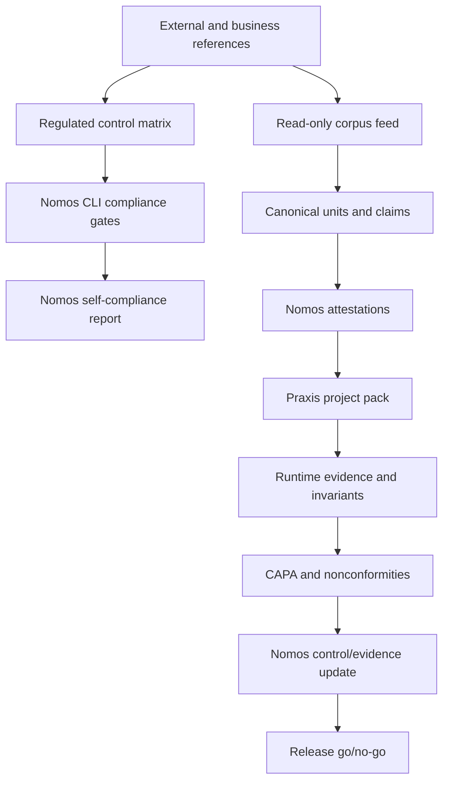

# 23 - Regulated-Grade Implementation Plan

Date: 2026-05-02

## Purpose

This document turns the hard audit in `docs/21-regulated-quality-reference.md` and the Nomos/Praxis synergy audit in `docs/22-nomos-praxis-synergy-market-audit.md` into an implementation plan.

It should be read together with `docs/24-regulated-client-compliance-evidence.md`, which defines what regulated clients typically expect during supplier qualification, validation, and operational integration.

It should also be read with `docs/25-regulated-by-design-structure.md`, which installs the shared Nomos/Praxis folder structure, product profiles, evidence templates, and status model used by this plan.

The objective is not to make a stronger claim. The objective is to build enough implementation, evidence, documentation, and governance that the claim becomes defensible:

```text
Nomos can transform an authoritative business corpus into governed product law,
and Nomos itself follows the same compliance discipline it asks of other projects.
```

## Current Verdict

Nomos is not yet regulated-grade.

Current quality level is `NQ-0/NQ-1 boundary`:

- the method is documented;
- the regulated baseline has been defined;
- GitHub issues exist for the main gaps;
- CI and core CLI behavior are still not green enough to defend the product claim;
- Nomos-on-Nomos self-compliance is not yet executable;
- the Nomos/Praxis evidence contract is not yet implemented.

Until the plan below reaches at least `NQ-3`, public wording must stay at "method draft" or "operational prototype" level.

## Implementation Principles

1. No claim without evidence.
2. No evidence without stable schema.
3. No schema without a CLI gate.
4. No regulated release with red main or waived critical controls.
5. No source corpus write access unless an explicit controlled update process is opened.
6. Praxis evidence can support Nomos only after the shared contract and Praxis parity controls are defined.
7. Documentation is part of the product: each implementation issue must update the relevant docs, examples, and validation pack.

## Execution Order

Nomos is the critical path.

Praxis work is intentionally downstream. Praxis issues may stay open as interface targets, but they must not be treated as implementation blockers for the first Nomos recovery sprint.

Execution order:

1. **Nomos baseline**: #125, #126, #127, #136, #137.
2. **Nomos regulated self-compliance**: #139, #140, #141, #142, #143, #145, #146, #147.
3. **Nomos RBOK lawbook proof**: #124, #128, #129, #130, #131, #132, #133, #134, #135.
4. **Nomos evidence interface**: #144, #149, #150, #151, #152, #153, #154, #155, #156, #157, #158.
5. **Praxis implementation**: RBOKproject/PRAXIS#247 through #256, only after Nomos has green producer artifacts and schemas.

Praxis cannot consume what Nomos cannot yet produce. Therefore the first implementation wave must stay in Nomos until:

- CLI and CUE are green;
- Nomos-on-Nomos self-compliance runs;
- RBOK lawbook feed is generated read-only;
- Nomos/Praxis schema fixtures exist and validate;
- Nomos release evidence bundle can carry an explicit "Praxis evidence absent/not yet qualified" status.

The regulated-by-design structure is already installed under `docs/regulated/` and `templates/regulated/`. Those files are the operating frame for all remaining issues: every issue that changes claim scope, validation scope, evidence, corpus handling, release behavior, or Praxis integration must update the relevant profile, control, validation, supplier, release, AI/RAG, operations, customer-integration, or decision record.

## Target Architecture



Nomos owns:

- authority references;
- source registry and read-only corpus policy;
- canonical units, claims, control matrix, and attestations;
- CLI gates and release evidence bundle;
- claim governance.

Praxis owns:

- project packs;
- runtime scenario execution;
- invariant results;
- runtime evidence retention;
- CAPA reports.

Shared contract:

- evidence IDs;
- canonical claim IDs;
- severity and verdict taxonomy;
- deviations, waivers, and CAPA references;
- release evidence bundle.

## Phase 0 - Recover A Credible Baseline

Goal: reach `NQ-2` by making the current product buildable and executable before adding more regulated claims.

Blocking issues:

- Nomos #125: restore CLI build.
- Nomos #126: fix CUE schema validation.
- Nomos #127: wire real RBOK lawbook CLI.
- Nomos #136: release gate for RBOK lawbook profile.
- Nomos #137: Nomos-on-Nomos self-compliance.

Implementation work:

1. Repair Go build failures in `cli/`.
2. Repair `specs/rbok-lawbook-feed.cue` validation.
3. Make unknown CLI commands exit non-zero.
4. Expose real corpus commands:
   - `nomos corpus scan`;
   - `nomos corpus diff`;
   - `nomos corpus manifest`;
   - `nomos corpus validate-sidecar`;
   - `nomos corpus feed`;
   - `nomos corpus attest`.
5. Remove dummy workflow fallbacks that can produce green reports with no real corpus artifacts.
6. Add Windows smoke coverage for the same CLI surface.

Exit gate:

```powershell
cd C:\Dev\nomos-viability-audit\cli
go test ./...
go vet ./...

cd C:\Dev\nomos-viability-audit
cue vet ./...
```

Expected result:

- main development branch can be used as evidence again;
- generated corpus artifacts are real;
- unknown commands fail closed;
- no regulated claim is made yet.

## Phase 1 - Regulated Control Matrix And Reference Governance

Goal: make every external reference and every public product claim governed.

Blocking issues:

- Nomos #138: regulated-grade parent epic.
- Nomos #139: regulated control matrix/reference registry.
- Nomos #140: external reference alignment gate.
- Nomos #145: public claims governance.

Implementation work:

1. Add `specs/regulated-control-matrix.cue`.
2. Add `specs/examples/regulated-control-matrix.nomos.yaml`.
3. Add a compliance package in `cli/internal/compliance/`.
4. Add CLI commands:
   - `nomos compliance references`;
   - `nomos compliance self-check`;
   - `nomos compliance export`.
5. Scan docs/specs for URLs and product claims.
6. Fail when a URL or claim is not mapped to:
   - owner;
   - applicability;
   - control;
   - implementation reference;
   - test reference;
   - evidence or expiring waiver.
7. Classify placeholder/future links as blocked or explicitly future endpoint.

Exit gate:

```powershell
cd C:\Dev\nomos-viability-audit\cli
go test ./internal/compliance ./internal/app -run Compliance -v

cd C:\Dev\nomos-viability-audit
nomos compliance references --root . --matrix specs/examples/regulated-control-matrix.nomos.yaml --output reports/reference-alignment.json
```

Expected result:

- decorative references disappear;
- product wording becomes release-gated;
- every cited regulation or framework has traceable implementation status.

## Phase 2 - Nomos-On-Nomos Self-Compliance

Goal: reach `NQ-3` by proving Nomos can evaluate itself.

Blocking issues:

- Nomos #137: self-compliance parent.
- Nomos #141: regulated self-compliance expansion.
- Nomos #142: ALCOA+ evidence model.
- Nomos #143: validation lifecycle pack.

Implementation work:

1. Add `mode: nomos_product` support in `nomos.project.yaml`.
2. Create `docs/validation/`:
   - intended use;
   - risk assessment;
   - URS/SRS;
   - validation protocol;
   - challenge cases;
   - deviation log;
   - validation summary;
   - rollback/recovery procedure.
3. Emit ALCOA+ metadata on every compliance report:
   - actor;
   - tool;
   - command;
   - timestamp;
   - repo;
   - commit;
   - source hashes;
   - artifact hash.
4. Add deterministic report generation with stable IDs and stable ordering.
5. Add self-compliance GitHub Action.
6. Fail when critical controls are missing, stale, waived without expiry, or contradicted by CI state.

Exit gate:

```powershell
cd C:\Dev\nomos-viability-audit
nomos compliance self-check --root . --matrix specs/examples/regulated-control-matrix.nomos.yaml --output reports/nomos-self-compliance.json
git status --porcelain
```

Expected result:

- Nomos can produce a self-compliance report from its own repository;
- report generation does not mutate protected source paths;
- release claim can move from `NQ-2` to `NQ-3` only when this gate is green.

## Phase 3 - RBOK Lawbook As Real Business Corpus

Goal: prove the method on `realisons-business/01_rbok` as a canonical business reference, chunked like a lawbook.

Blocking issues:

- Nomos #124: RBOK lawbook viability epic.
- Nomos #128: real RBOK E2E.
- Nomos #129: contract normalization.
- Nomos #130: Markdown extraction.
- Nomos #131: parcours YAML governance.
- Nomos #132: source policy.
- Nomos #133: multi-doc feed/RAG/engine.
- Nomos #134: read-only hardening.
- Nomos #135: Windows confidence.

Implementation work:

1. Admit `realisons-business` as `mode: canonical_corpus`.
2. Treat `01_rbok` as read-only source authority.
3. Produce source manifest and sidecar manifest outside the corpus repo.
4. Extract canonical units with stable IDs and source offsets/headings.
5. Preserve existing governance metadata instead of flattening it.
6. Generate lawbook chunks:
   - canonical section ID;
   - source path;
   - hash;
   - heading hierarchy;
   - paragraph/rule span;
   - governance fields;
   - applicability and review status.
7. Generate RAG metadata and corpus index.
8. Emit attestation and lockfile.
9. Prove `git status` before/after on the source repo.
10. Fail on any source mutation, push, or output path inside the protected corpus.

Exit gate:

```powershell
nomos corpus feed --profile rbok-lawbook --source C:\Dev\realisons-business\01_rbok --out C:\Dev\nomos-rbok-feed
nomos corpus attest --feed C:\Dev\nomos-rbok-feed --out C:\Dev\nomos-rbok-feed\attestation.json
```

Expected result:

- RBOK becomes a real reference corpus, not a fixture;
- Nomos proves read-only behavior;
- the feed can be consumed by downstream products without touching source documents.

## Phase 4 - Nomos/Praxis Evidence Contract

Goal: define the Nomos-side evidence interface first, then reach `NQ-4` later by connecting canonical product law to Praxis runtime evidence and CAPA.

Execution rule:

- Nomos #144, #149, #154, #155 must be implemented first as producer-side schemas, fixtures, and reports.
- Praxis #247-#252 remain downstream until Nomos emits valid artifacts.
- NQ-4 is not claimable until the Praxis side later consumes those artifacts and returns valid evidence.

Blocking issues:

- Nomos #144: shared evidence contract.
- Nomos #149: joint evidence ledger contract.
- Praxis #247: compatibility epic.
- Praxis #248: Nomos project pack.
- Praxis #249: Nomos compliance invariants.
- Praxis #250: consume shared evidence contract.
- Praxis #251: feed CAPA back into Nomos controls.
- Praxis #252: cross-repo compatibility smoke test.

Implementation work:

1. Add `specs/nomos-praxis-evidence.schema.json`.
2. Add valid and invalid examples.
3. Map:
   - `source_id`;
   - `canonical_unit_id`;
   - `claim_id`;
   - `control_id`;
   - `praxis_scenario_id`;
   - `runtime_evidence_id`;
   - `invariant_result_id`;
   - `capa_id`.
4. Create a Praxis project pack for Nomos.
5. Add Praxis invariants for Nomos:
   - source read-only;
   - no dummy evidence;
   - CLI fail-closed;
   - evidence hash stability;
   - reference alignment completeness.
6. Add cross-repo CI smoke:
   - Nomos generates evidence;
   - Praxis consumes it;
   - Praxis returns runtime/invariant/CAPA evidence;
   - Nomos links it back to controls.

Exit gate:

```text
Nomos report -> Praxis project pack -> Praxis evidence -> Nomos control update
```

Expected result:

- Praxis can strengthen Nomos instead of being only an adjacent tool;
- the two products share an evidence vocabulary;
- CAPA becomes actionable input for Nomos release decisions.

## Phase 5 - Validation Lifecycle And Regulated Evidence Bundle

Goal: reach `NQ-5` for a scoped intended use.

Blocking issues:

- Nomos #143: validation lifecycle pack.
- Nomos #147: SLSA/in-toto provenance gate.
- Nomos #150: release evidence bundle format.
- Nomos #151: validation inventory/intended-use model.
- Nomos #152: e-signature/approval semantics.
- Nomos #153: independent review/quality-unit roles.

Implementation work:

1. Define validation inventory item for Nomos CLI and RBOK lawbook profile.
2. Add risk classification per command/profile.
3. Map URS -> FRS/SRS -> tests -> evidence -> release decision.
4. Add scripted and challenge tests for critical commands.
5. Generate release evidence bundle:
   - control matrix snapshot;
   - self-compliance report;
   - reference alignment report;
   - RBOK lawbook feed attestation;
   - Praxis runtime evidence;
   - CAPA/deviation log;
   - SLSA/in-toto provenance;
   - SBOM;
   - approval record.
6. Add independent review status and waiver expiry checks.

Exit gate:

```text
release bundle can be reconstructed by an independent reviewer from repository state,
CI artifacts, hashes, and documented approvals.
```

Expected result:

- Nomos can be described as validation-pack ready for the declared intended use;
- still not "certified" unless an external regulated customer or assessor performs that process.

## Phase 6 - Praxis Regulatory Parity

Goal: prevent Praxis from weakening the joint regulated chain.

Execution rule:

Do not start Praxis parity implementation until Nomos has reached at least NQ-3 and has validated the Nomos-side evidence interface. Praxis parity is required before release-grade use of Praxis evidence, but it is not the first recovery priority.

Blocking issues:

- Praxis #253: regulated parity baseline.
- Praxis #254: Praxis-on-Praxis self-compliance gate.
- Praxis #255: validated project pack certification status.
- Praxis #256: runtime evidence retention/trend model.

Implementation work:

1. Define Praxis quality levels aligned to Nomos NQ levels.
2. Define when Praxis evidence is advisory versus release-grade.
3. Add Praxis-on-Praxis self-compliance.
4. Add retention and reconstruction rules for runtime evidence.
5. Add project pack certification status:
   - draft;
   - reviewed;
   - validated;
   - expired;
   - superseded.
6. Make Nomos release bundles record Praxis evidence quality level.

Exit gate:

```text
Nomos cannot use Praxis evidence as release-grade if Praxis is below the required parity level.
```

Expected result:

- Praxis can become a regulated counterpart rather than an unqualified dependency;
- joint product claims become auditable.

## Phase 7 - Market Interoperability And Claims Discipline

Goal: position the product against regulated ALM, validation, and test-management ecosystems without overclaiming.

Implementation issues from `docs/22-nomos-praxis-synergy-market-audit.md`:

- Nomos #149 / SYN-001: joint evidence ledger contract.
- Praxis #250 / SYN-002: Praxis consume shared evidence contract.
- Nomos #154 / SYN-006: source change impact analysis for required Praxis tests.
- Nomos #155 / SYN-007: Praxis scenario selection from impacted Nomos claims.
- Nomos #156 / SYN-012: ReqIF/export/import compatibility decision.
- Nomos #157 / SYN-013: market positioning/non-claim governance.
- Nomos #158 / SYN-015: regulated demo reference architecture.

Implementation work:

1. Decide whether ReqIF import/export is required for the regulated market entry.
2. Define ALM/QMS integration boundaries:
   - export only;
   - bidirectional sync;
   - evidence bridge;
   - no integration in v1.
3. Create a regulated demo reference architecture using RBOK lawbook and a scoped Realisons product.
4. Add public claims matrix:
   - allowed wording;
   - blocked wording;
   - evidence required;
   - quality level required.
5. Add docs that compare Nomos/Praxis to ALM/QMS/test-management products without implying certification.

Exit gate:

```text
marketing, README, roadmap, and release notes cannot claim beyond current NQ/Praxis parity level.
```

Expected result:

- the product can be positioned in regulated IT without weakening its credibility;
- future enterprise integrations are planned from a controlled boundary.

## Dependency Tree

```text
#125 + #126 + #127
  -> #136
  -> #137
  -> #138

#138
  -> #139
  -> #140
  -> #141
  -> #142
  -> #143
  -> #145
  -> #146
  -> #147

#124
  -> #128
  -> #129 + #130 + #131 + #132
  -> #133
  -> #134
  -> #135

#144
  -> #149
  -> Praxis #247
  -> Praxis #248 + #249 + #250 + #251
  -> Praxis #252
  -> Praxis #253
  -> Praxis #254 + #255 + #256

#150 + #151 + #152 + #153
  -> NQ-5 release evidence bundle

#154 + #155 + #156 + #157 + #158
  -> RG-6 market interoperability and regulated demo

NQ-2 = #125 + #126 + #127 + #136 green
NQ-3 = NQ-2 + #137 + #139 + #140 + #141 + #142 + #143 + #145 green
NQ-4 = NQ-3 + RBOK lawbook proof + #144 + #149 + Praxis #247-#252 green
NQ-5 = NQ-4 + #150 + #151 + #152 + #153 + #147 + Praxis #254-#256 green
NQ-6 = NQ-5 + independent review reconstruction successful
```

Immediate Nomos-only chain:

```text
#125 + #126
  -> #127
  -> #136
  -> #137
  -> #139 + #140
  -> #141 + #142 + #143 + #145 + #146 + #147
  -> #124 + #128-#135
  -> #144 + #149-#158
  -> Praxis #247-#256
```

## Documentation Alignment Rules

Each implementation PR must update documentation in the same PR when behavior or claims change.

Required documentation updates by work type:

| Work type | Required docs |
|---|---|
| CLI command or verdict behavior | `README.md`, `docs/14-product-roadmap.md`, command reference when added |
| Regulated control or external reference | `docs/21-regulated-quality-reference.md`, control matrix example |
| Client qualification or validation deliverable | `docs/24-regulated-client-compliance-evidence.md`, validation pack docs |
| Nomos/Praxis evidence link | `docs/22-nomos-praxis-synergy-market-audit.md`, schema examples |
| Implementation sequencing or issue dependency | `docs/23-regulated-implementation-plan.md`, `docs/15-product-backlog.md` |
| Validation lifecycle artifact | `docs/validation/*`, regulated release checklist |
| Public claim or wording | public claims matrix and README |

Documentation must not imply:

- certification;
- validated status;
- any-stack support;
- regulated-grade readiness;
- electronic-record/signature compliance;
- autonomous AI authority creation.

Unless the corresponding gate is green.

## Release Gates By Quality Level

| Level | Required green gates |
|---|---|
| NQ-2 | Go build/test, CUE vet, CLI fail-closed, real corpus commands, no dummy evidence |
| NQ-3 | NQ-2 plus reference alignment, self-compliance, ALCOA report metadata, validation docs |
| NQ-4 | NQ-3 plus Nomos/Praxis shared evidence contract and cross-repo smoke |
| NQ-5 | NQ-4 plus validation pack, release evidence bundle, SLSA/in-toto gate, review/approval records |
| NQ-6 | NQ-5 plus independent reconstruction and audit-ready evidence retention |

## First Execution Sprint

The first sprint is Nomos-only. It should not implement Praxis yet. It should make Nomos executable and able to emit valid artifacts for Praxis to consume later:

1. Fix current CLI/CUE build blockers.
2. Implement compliance matrix schema and example.
3. Implement `nomos compliance references`.
4. Implement `nomos compliance self-check`.
5. Add `docs/validation/` skeleton and link it to generated evidence.
6. Add the first self-compliance CI workflow.
7. Run RBOK lawbook feed in read-only mode and archive the evidence outside `realisons-business`.
8. Create Nomos-side evidence fixtures for the future Praxis contract.
9. Record Praxis evidence as absent/not-yet-qualified in release bundle fixtures until Praxis implementation starts.

Definition of done:

- all generated evidence is real and schema-valid;
- source repos remain unmodified unless explicitly checked out for product code changes;
- docs and issue dependencies match the implemented behavior;
- README claim level matches the achieved NQ level.
